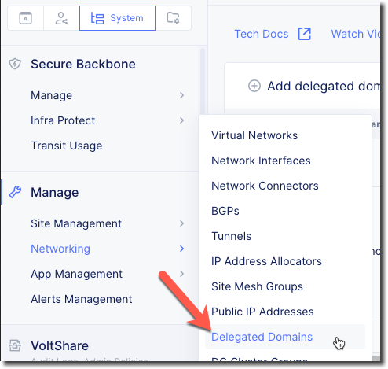

Delegated Domains
=================

During this lab you will make use of a Public DNS name that has been delegated
to your Volterra Tenant.  The following is how to find the name of that domain.

Exercise 1: Find the domain
~~~~~~~~~~~~~~~~~~~~~~~~~~~

From the System namespace go to Manage -> Networking -> Delegated Domains

|delegated_domains|

Record the value of the domain that is under "f5demos.com". (i.e. "amer-ent.f5demos.com").

