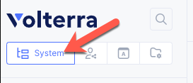
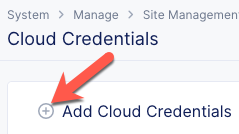

Create AWS Volt Site
====================
In this section we will VoltConsole to create an AWS VPC and a new Volterra Site in that VPC.

Terminology
~~~~~~~~~~~

VPC
    VPC is a Virtual Private Cloud.
Volterra Site
    A Volterra Site is a physical or cloud location where Volterra Nodes are deployed. 

Exercise 1: Create Cloud Credentials
~~~~~~~~~~~~~~~~~~~~~~~~~~~~~~~~~~~~
In your UDF deployment there is a *Cloud Accounts* tab that contains releative information about the ephemeral AWS account created for you. Take note of your *API Key* and *API Secret*.

|cloud_creds|

#. In VoltConsole switch to the *System* context.

    |system_context|

#. Navigate the menu to go to "Manage"->"Site Management" and click on "Cloud Credentials".

    |cloud_creds_menu|

#. Click on the *Add Cloud Credentials* button

    |cloud_creds_add|

#. Enter the following variables, substituting your information:

    ==========  =====
    Variable    Value
    ==========  =====
    Name        your_namespace_udf
    Access Key  ID Access Key from the UDF Cloud Accounts tab
    ==========  =====

#. Under the *Secret Access Key* section, click the *Configure* link.
#. Enter the following variables:

    ========= =====
    Variable  Value
    ========= =====
    Type      Paste your API Key from the UDF Cloud Accounts tab
    ========= =====

#. Click the *Blindfold* button
#. Click the *Apply* button
#. Click the *Save and Exit* button

.. |cloud_creds| image:: ./images/cloud_creds.png

.. |cloud_creds_menu| image:: ./images/cloud_creds_menu.png
