Create AWS Volterra Site
========================
In this section we will use VoltConsole to create an AWS VPC and a new Volterra Site in that VPC.
Before building the Volterra Sites, we will create a VPC and associated network policies.

Exercise 1: Create Cloud Credentials
------------------------------------

.. note:: 
  
  Based on the selected region for your UDF deployment we recommend that you use the following
  AWS region and Availability Zone during this lab.

  ==================== ================
  Variable             Value
  ==================== ================
  Region               |aws_region|
  Availability Zone    |aws_zone|
  ==================== ================

  When you access the AWS Console (not required during this lab) make sure that you select 
  the same region to view any resources created by Volterra.
 

In your UDF deployment there is a *Cloud Accounts* tab that contains related information about the 
ephemeral AWS account created for you. Take note of your *API Key* and *API Secret*.  If you are 
using a UDF Course to access this lab the information will be at the bottom of the "Documentation" tab.

|cloud_creds|

#. In VoltConsole switch to the *System* context.

    |system_context|

#. Navigate the menu to *Manage* -> *Site Management* -> *Cloud Credentials*

    |cloud_creds_menu|

#. Click on the *Add Cloud Credentials* button.

    |cloud_creds_add|

#. Enter the following variables, substituting your information:

    ==========  =====
    Variable    Value
    ==========  =====
    Name        your_namespace-aws
    Access Key  API Key from your UDF Cloud Accounts tab
    ==========  =====

#. Under the *Secret Access Key* section, click the *Configure* link.
#. Select *Text* type *DO NOT SELECT* Blindfold type 
#. Enter the following variables:

    ========= =====
    Variable  Value
    ========= =====
    Type      Paste your API Secret from the UDF Cloud Accounts tab
    ========= =====

    |blind| 
    
    .. warning:: Click on the "Blindfold" button, do not click on the radio button!
    
    |apply| |save|

#. Click the *Blindfold* BLUE button. This encrypts your AWS cloud account API key.
#. Click the *Apply* button. This saves the Secret configuration.
#. Click the *Save and Exit* button.

.. note:: 
  
  By design you will not be able to extract the cleartext value of the blindfolded secret.  
  If you need to change the API secret, you can delete the Cloud Credential and create a new one.

Exercise 2: Create Network Policy
---------------------------------

#. Navigate the menu to *Security* -> *Firewall* -> *Network Policies*.

    |network_policy_menu|

#. Click the *Add network policy* button.
#. Enter the following variables:

    ========= =====
    Variable  Value
    ========= =====
    Name      your_namespace-aws
    ========= =====

#. Under the *IPv4 Prefix List*.
#. For the prefix, enter: "10.0.0.0/8".

    |network_policy_config|

#. Under the *Connections to Policy Endpoints* section, click the *Configure* link.
#. Click the *Add item* button under Ingress Rules.
#. Enter the following variables:

    ======================= =====
    Variable                Value
    ======================= =====
    Name                    your_namespace-mongodb
    Action                  Allow
    Select Other Endpoint   IPv4 Prefix List
    ======================= =====

#. Under the *IPv4 Prefix List* section.
#. For the prefix, enter: "10.0.0.0/8".
#. Click the *Apply* button to exit the *Ingress Rules* dialogue.
#. Click the *Save and Exit* button to exit the *Network policy* dialogue.

    |ingress_rules|

Exercise 3: Create AWS VPC via Terraform
-----------------------------------------

Using the "Web Shell" or "ssh" from the Client UDF component run the following commands.

.. code-block::
  
  $ cd ~/f5-volterra-labs-101/application/terraform/
  $ terraform apply -auto-approve

After a few minutes you should get output similar to the following.

.. code-block::
      
    Apply complete! Resources: 18 added, 0 changed, 0 destroyed.

    Outputs:

    AWS_CONSOLE = "https://123456789.signin.aws.amazon.com/console?region=us-east-1"
    AWS_INSTANCE = "192.0.2.10"
    EXTERNAL_SUBNET_ID = "subnet-abcd"
    _VPC_ID = "vpc-1234"

Take note of the VPC_ID and EXTERNAL_SUBNET_ID values.  You will use those next to create an 
AWS Site in the Volterra Console.

Exercise 4: Create AWS VPC Site
-------------------------------

#. Navigate the menu to *Manage* -> *Site Management* -> *AWS VPC Sites*.

    |aws_vpc_site_menu|

#. Click on the *Add AWS VPC Site* button.

    |aws_vpc_site_add|

#. Enter the following variables, substituting your information:

      ================================= =====
      Variable                          Value
      ================================= =====
      Name                              your_namespace-aws
      AWS Region                        |aws_region|
      Select Existing or create new VPC Select Existing VPC
      Existing VPC ID                   [output from terraform]
      Select Ingress Gateway            Voltstack Cluster
      Automatic deployment              The Cloud Credentials created in Exercise 1
      ================================= =====

      .. note:: 
  
        The maximum site name length is 16 characters. If your namespace is long adjust your site name accordingly.

    |aws_vpc_site|

#. Under the *Voltstack Cluster (One Interface)* section, click the *Configure* link.

#. Enter the following variables:

    ======================= =====
    Variable                Value
    ======================= =====
    AWS AZ Name             |aws_zone|
    Select Existing or ..   Select Existing Subnet
    Existing Subnet ID      [output from terraform]
    Manage Network Policy   Active Network Policies
    Network Policy          your_namespace-aws
    ======================= =====

    |aws_vpc_site_interface|

#. Click *Apply*.

#. Under the *Site Node Parameters* enter the following variables:

    .. Note:: This step is optional for the lab unless you would like to SSH into the node.

    =============== =====
    Variable        Value
    =============== =====
    Pulbic SSH key  Paste your public key
    =============== =====

#. Click *Save and Exit*.

#. Refresh the page. Once present, click the *Apply* button.

    |aws_vpc_site_apply|

The creation of the AWS site may take up to 10 or 15 minutes.  
You can proceed to the next section and we will verify the AWS site was created later in the lab.

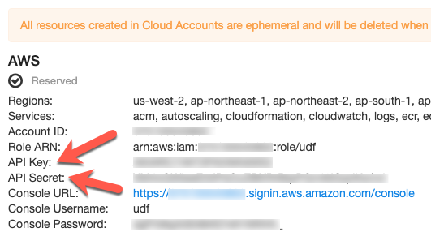
.. |system_context| image:: ../_static/system_context.png
.. |cloud_creds_menu| image:: ../_static/cloud_creds_menu.png
.. |cloud_creds_add| image:: ../_static/cloud_creds_add.png
.. |aws_vpc_site_menu| image:: ../_static/aws_vpc_site_menu.png
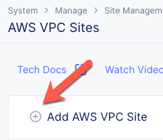
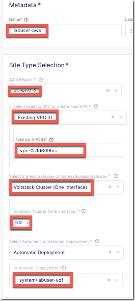
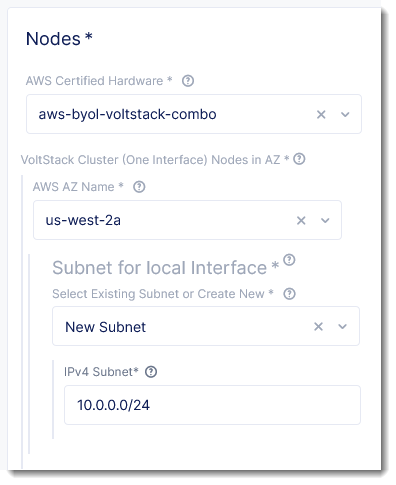
.. |aws_vpc_site_apply| image:: ../_static/aws_vpc_site_apply.png
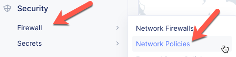
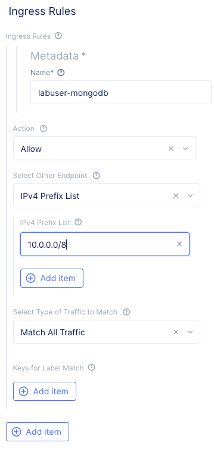
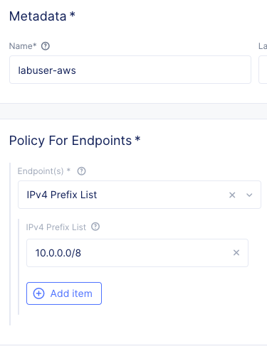
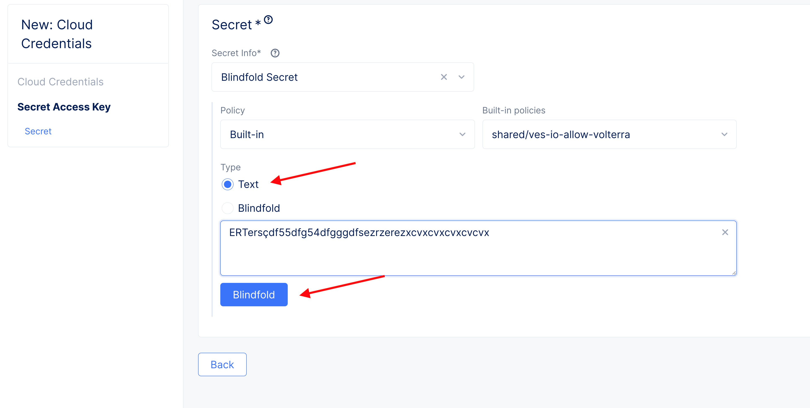
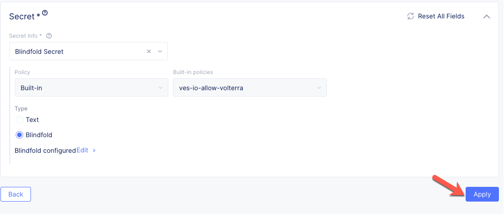
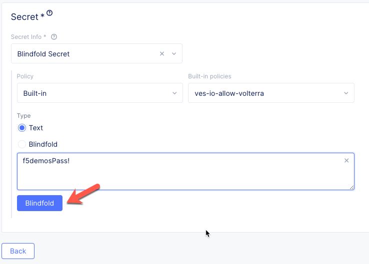
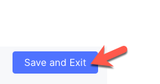
