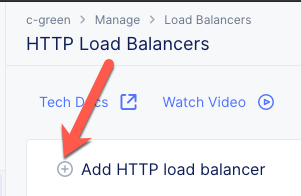
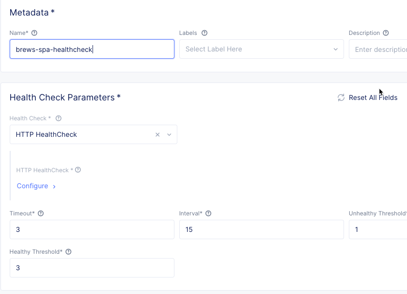
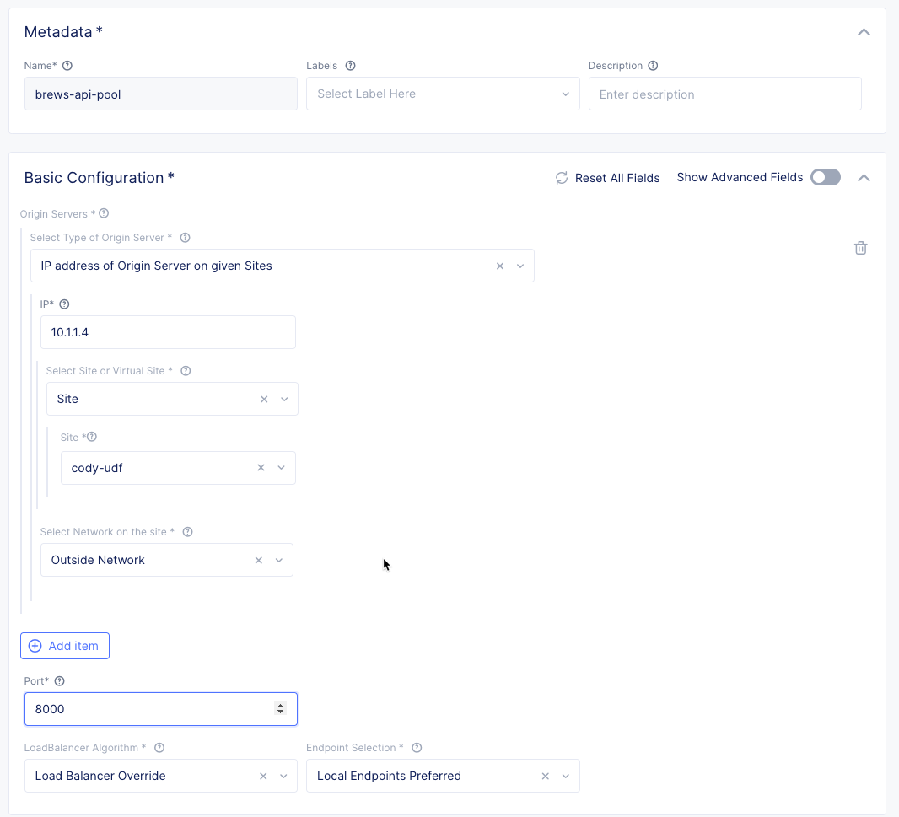
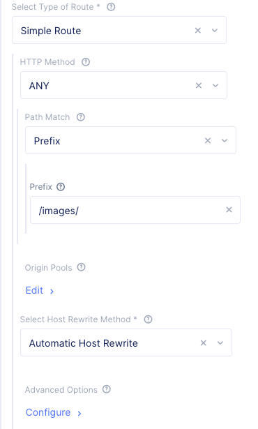
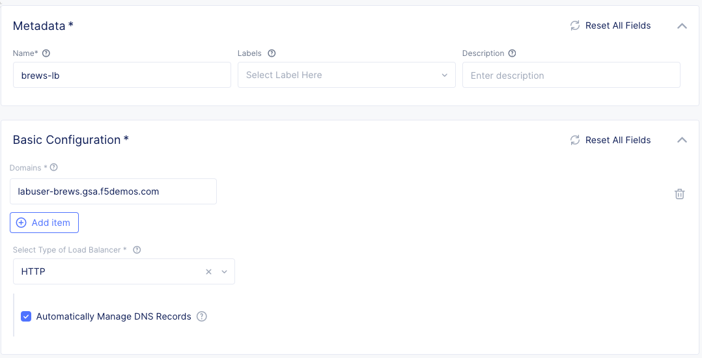
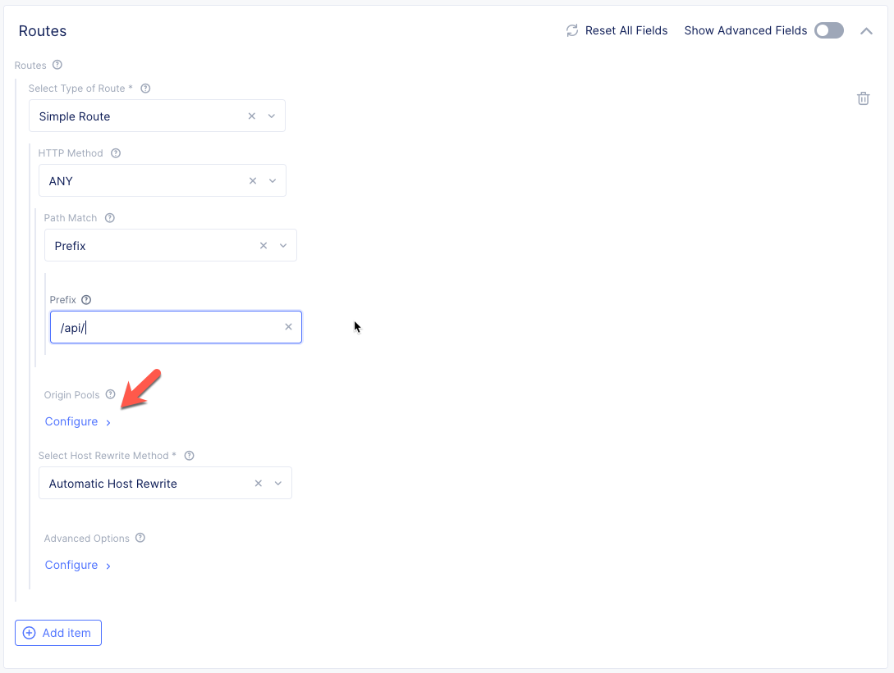
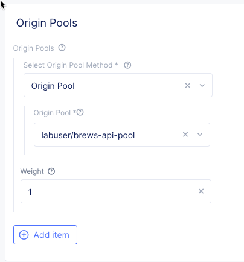
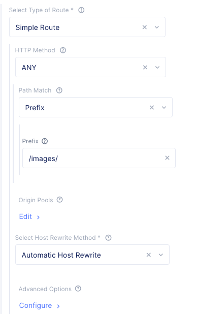
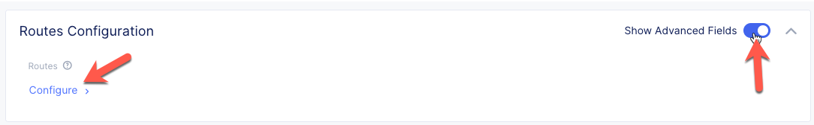

Create HTTP Loadbalancer
=========================
Now that we've defined our Origin Pools for the SPA and API service, we need to attach the pools to an HTTP Load Balancer.
The HTTP Load Balancer will direct traffic to our pools based on URI through the concept of "Routes". 

Terminology
~~~~~~~~~~~~~

HTTP Load Balancer
    Volterra's reverse proxy and HTTP load balancer concepts allow for flow control of
    application and API traffic between services, to the internet, and from clients on the internet.
    HTTP Load Balancers allow for steering decisions based on URI or other HTTP based criteria.

Exercise 1: HTTP Load Balancer Basic Configuration
~~~~~~~~~~~~~~~~~~~~~~~~~~~~~~~~~~~~~~~~~~~~~~~~~~~

#. Start in VoltConsole and switch to the Application context. 

    |app-context|

#. Navigate the menu to go to "Manage"->"HTTP Load Balancers" and click on "Add HTTP Load Balancers".

    |http_lb_menu| |http_lb_add|

#. Enter the following variables:

    ================================= =====
    Variable                          Value
    ================================= =====
    Name                              brews-lb
    Domains                           [unique name]-brews.[supplied domain name for your tenant]
    Select type of Load Balancer      HTTP
    Automatically Manage DNS Records  Yes/Check 
    ================================= =====

    |lb-basic|

    .. note::
      If your tenant does not use a delegated domain you can disable the option to automatically manage DNS records.
      You can supply an arbitrary domain (example.com) and later you can use the following
      command to verify.

      .. code-block::
        
        $ curl --resolve [unique-name]-brews.example.com:80:[IP address of ves.io name created by LB] http://[unique-name]-brews.example.com

Exercise 2: Configure Default Origin Server
~~~~~~~~~~~~~~~~~~~~~~~~~~~~~~~~~~~~~~~~~~~
We'll next configure the "Default Origin Servers". These are the Origin Servers that will be used for requests without a more specific route.
For the DemoBrews application, we want to send traffic not related to the API service (or images) to the SPA service.  
    
#. Click on the *Configure* link under the *Default Origin Servers* section.

#. Click the *Add Item* button.

#. The "Select Origin Pool Method" will be set to "Origin Pool". Under the "Origin Pool" dropdown menu select the "brews-spa-pool" you created earlier.

      |lb-default-origin|
 
#. Click the *Apply* button to exit the "Origin Pools" dialogue.

Exercise 3: Configure Routes
~~~~~~~~~~~~~~~~~~~~~~~~~~~~~~~~~~~~~~~~~~~
Now we're ready to configure URL-based pool selection for the API service and static images.
We will need 2 separate routes to send traffic to the API service -- "/api/" and "/images/".
    
#. In the *Routes Configuration* section toggle the *Show Advanced Fields* button. Click the *Configure* link.

    |lb-route-advanced|

#. Click the *Add item* button

#. Enter the following variables:

    =====================   =====
    Variable                Value
    =====================   =====
    Select Type of Route    Simple Route
    HTTP Method             ANY
    Path Match              Prefix
    Prefix                  /api/
    =====================   =====

#. Under the *Origin Pools* section Click the *Configure* link.

    |lb-route1|

#. Click the *Add item* button.

#. Under the *Origin Pool* section select the dropdown and choose the "brews-api-pool" you created earlier.

    |lb-op-api|

#. Click the *Apply* button to exit the "Origin Pool" dialogue and return to the "Routes" dialogue.

#. Click *Add item* to add a second route. Create a route for "ANY" HTTP Methods with a prefix of "/images/" that points to the "brews-api-pool" you created earlier.

    |lb-route2|

    .. note:: You should now have 2 routes created in the "Routes" dialogue.

#. Click *Apply* to exit the "Routes" dialogue.

#. Notice that in the "VIP Creation" section *Advertise On Internet* has been selected by default.

    |lb-vip|

#. Click "*Save and Exit* to create the HTTP Load Balancer.

Once the HTTP Load Balancer has been deployed, you should now be able to go to the DNS name that you entered 
previously in a web browser.

.. |app-context| image:: ../_static/app-context.png
.. |http_lb_menu| image:: ../_static/http_lb_menu.png

.. |http_lb| image:: ../_static/http_lb.png
.. |http_lb_origin_pool_config| image:: ../_static/http_lb_origin_pool_config.png

.. |http_lb_origin_pool_health_check2| image:: ../_static/http_lb_origin_pool_health_check2.png
.. |http_lb_routes| image:: ../_static/http_lb_routes.png
.. |http_lb_routes_prefix_1| image:: ../_static/http_lb_routes_prefix_1.png

.. |http_lb_routes_prefix_pool_health| image:: ../_static/http_lb_routes_prefix_pool_health.png

.. |lb-default-origin| image:: ../_static/lb-default-origin.png

.. |lb-vip| image:: ../_static/lb-vip.png

