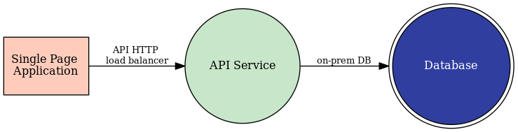

State 1
=======
The DemoBrews app is currently running in an on-prem data center (the lab's UDF deployment). After attending a retreat
hosted by local AWS account executives, the company's CTO has decided to start migrating assets into AWS. We want to start
using the company's current cloud presence before the CTO attends another retreat from a competing CSP.

<move to prework?, tell story that we'll first exposing the app?>

About the App
-------------
The app is made up of multiple services.

Single Page Application (SPA)
^^^^^^^^^^^^^^^^^^^^^^^^^^^^^
The customer has built a `single page application <https://en.wikipedia.org/wiki/Single-page_application>`_ (SPA).
A client's browser or mobile app retrieves all relevant assets (javascript, css, html) during an initial page load.

API Service
^^^^^^^^^^^^
The client's SPA retrieves contents by interacting with the API service. This includes retrieving product images,
product descriptions, shopping cart data, etc.

Database Service
^^^^^^^^^^^^^^^^
The customer's database site on-prem. The API service makes queries to the database in order to retrieve assets like
product descriptions and shopping cart data.

Section Goals
-------------
The customer's application is only available through their on-prem data center.
In this step, we will publish the application through VoltConsole so all web traffic comes 
through the Volterra Global Network. This will help us prepare for future states of the project.  

In this state we will configure the following VoltConsole components:

- HTTP Load Balancer
- 2 x Origin Pools

App Data Flow and Architecture
------------------------------
The client retrieves static content for the SPA from an HTTP load balancer (not pictured below). 
The SPA interacts with an HTTP load balancer to retrieve application data from the API service. 
The API service queries the on-prem database.

|state1|

The hosting assets are confined to the customer's on-prem data center. The app will be exposed to
the internet through the Volterra Global Network.

|arch1|

.. toctree::
   :maxdepth: 1
   :caption: Contents:

   httplb

.. |arch1| image:: ../_static/arch1.png