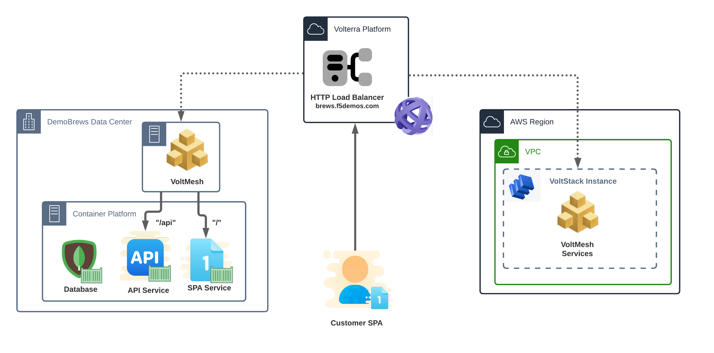

Preparation
===========
The DemoBrews app is currently running in an on-premise data center (the lab's UDF deployment).

About the App
-------------
The app is made up of multiple services.

Single Page Application (SPA)
^^^^^^^^^^^^^^^^^^^^^^^^^^^^^
The customer has built a `single page application <https://en.wikipedia.org/wiki/Single-page_application>`_ (SPA).
A client's browser or mobile app retrieves all relevant assets (javascript, css, html) during an initial page load.

API Service
^^^^^^^^^^^^
The client's SPA retrieves application content by interacting with the API service. This includes retrieving product images,
product descriptions, shopping cart data, etc.

Database Service
^^^^^^^^^^^^^^^^
The customer's database site on-premise. The API service makes queries to the database in order to retrieve assets like
product descriptions and shopping cart data.

In its current state, the app's components are restricted to services running in the customer's legacy data center. 
This makes the application hard to scale and makes consuming resources at other locations impossible.

|state0|

Section Goals
-------------
The customer's application is only available through their on-premise data center.
In this step, we will publish the application through VoltConsole so all web traffic comes 
through the Volterra global network. This will help us prepare for future states of the project.  

In this state we will configure the following VoltConsole components:

- 2 x Origin Pools
- HTTP Load Balancer

App Data Flow and Architecture
------------------------------
Clients will retrieve static content for the Single Page Application (SPA) from an HTTP load balancer (not pictured). 
The SPA will interact with an HTTP load balancer to retrieve application data from the API service.
The API service queries the on-premise database.

|state1|

The hosting assets are confined to the customer's on-premise data center. The app will be exposed to
the internet through the Volterra Global Network.

.. note:: The AWS site you previously created is not yet used.

|arch1|

.. toctree::
   :maxdepth: 1
   :caption: Contents:

   originPools
   HTTPlb2

