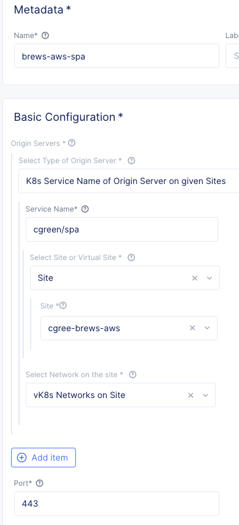
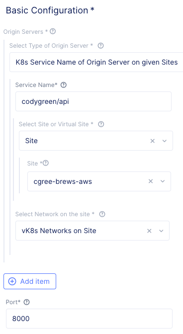
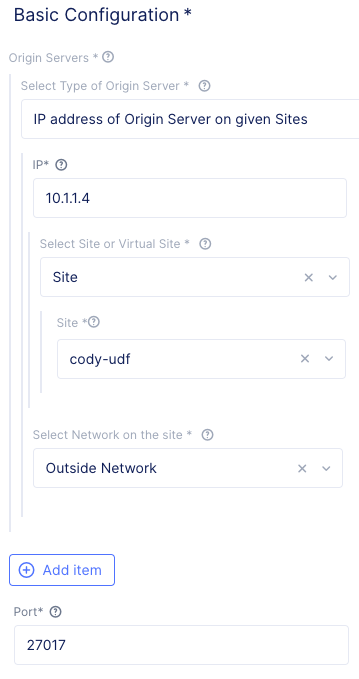
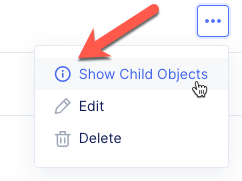
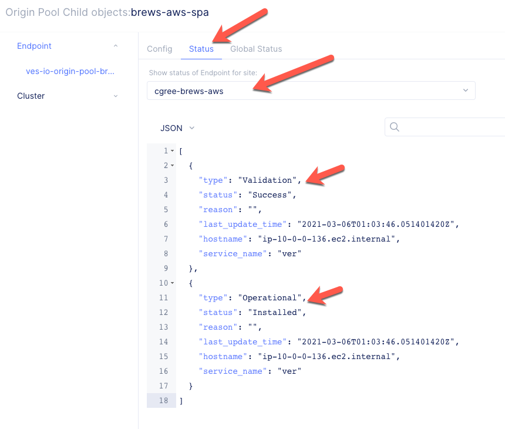
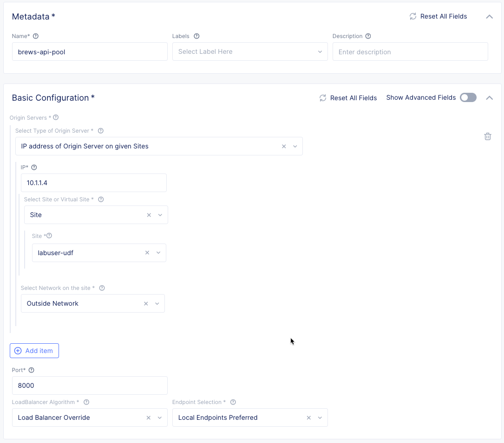
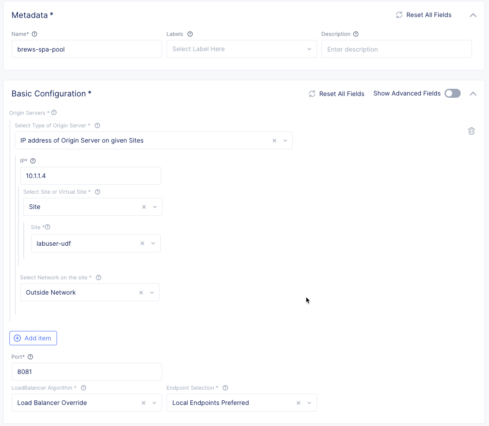
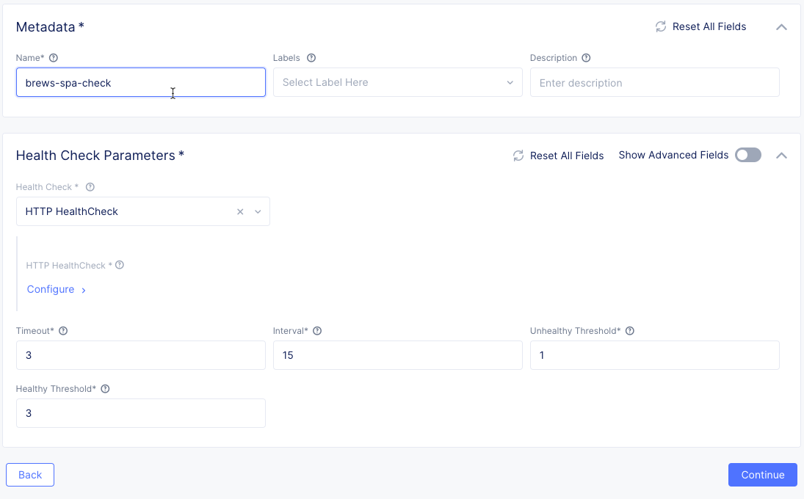
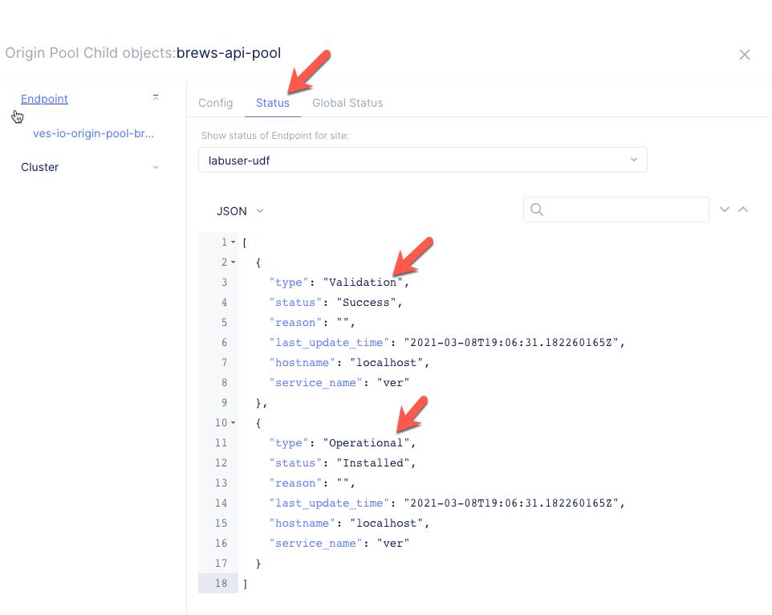

Create Origin Pools
====================

Before we create an HTTP load balancer to expose our services on the internet, 
we'll define Origin Pools for our application's services.

Terminology
~~~~~~~~~~~~~

Origin Pool
  An origin pool is a mechanism to configure a set of application endpoints grouped together into a resource pool.
  These endpoints could be IP:port tuples within a give site or a service as discovered by one of Volterra's many supported service discovery methods.
  This object is used in a load balancer configuration.
  

Exercise 1: Create SPA Origin Pool
~~~~~~~~~~~~~~~~~~~~~~~~~~~~~~~~~~~

#. Start in VoltConsole and switch to the Application context. 

    |app-context|

#. Navigate the menu to go to "Manage"->"Load Balancers"->"Origin Pools". Click on *Add Origin Pool*.
 
    |op-add-pool|

#. Enter the following variables:

    ================================= =====
    Variable                          Value
    ================================= =====
    Name                              brews-spa-pool
    Select Type of Origin Server      IP address of Origin Server on given Sites
    IP                                10.1.1.4
    Site                              the UDF site name configured in the previous lab
    Select Network on the site        Outside Network
    Port                              8081
    ================================= =====

    |op-pool-basic|

#. Under the *List of Health Check(s)* section, click the *Add item* button.

#. Click the *Health Check object* dropdown list. Click the *Create new healthcheck* button.

#. Enter the following variables:

    ========= =====
    Variable  Value
    ========= =====
    name      brews-spa-check
    ========= =====

    |op-spa-check|

#. Click the *configure* button under "HTTP Health Check" and enter the following variables:

    ========= =====
    Variable  Value
    ========= =====
    path      /products
    ========= =====

    |http_lb_origin_pool_health_check2|

#. Click *Apply* to exit the "Health Check HTTP Parameters" dialogue.
#. Click *Continue* to return to the "Origin Pool" configuration.
#. Click the *Save and Exit* button to create the Origin Pool.

Exercise 2: Create API Origin Pool
~~~~~~~~~~~~~~~~~~~~~~~~~~~~~~~~~~~

In this exercise, you will repeat the steps from exercise one but for the API service.

Use the following variables:

================================= =====
Variable                          Value
================================= =====
Name                              brews-api-pool
Select Type of Origin Server      IP address of Origin Server on given Sites
IP                                10.1.1.4
Site                              the UDF site name configured in the previous lab
Select Network on the site        Outside Network
Port                              8000
================================= =====

|op-api-pool|

In the *List of Health Check(s)* section, create a new "HTTP healthcheck" name "brews-api-check" targeting the path "/api/stats".

Exercise 3: Troubleshoot Origin Pools
~~~~~~~~~~~~~~~~~~~~~~~~~~~~~~~~~~~~~

#. Click on the *...* link for the pool you would like to troubleshoot

#. Click the *Show Child Objects* button

    |origin_pools_show_child_objects|

#. Click on the *Status* tab

#. Select your UDF Site

#. Validate that the JSON payload shows that *Validation* is *Successful* and *Operational* is *Installed*

    |origin_pools_show_child_objects_status|

.. |app-context| image:: ../_static/app-context.png
.. |origin_pools_menu| image:: ../_static/origin_pools_menu.png
.. |origin_pools_add| image:: ../_static/origin_pools_add.png

.. |http_lb_origin_pool_health_check| image:: ../_static/http_lb_origin_pool_health_check.png
.. |http_lb_origin_pool_health_check2| image:: ../_static/http_lb_origin_pool_health_check2.png

.. |op-add-pool| image:: ../_static/op-add-pool.png

