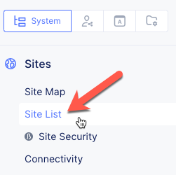
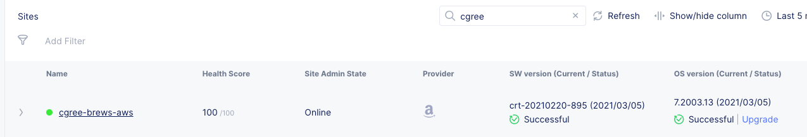
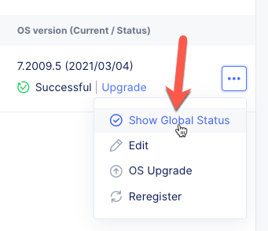
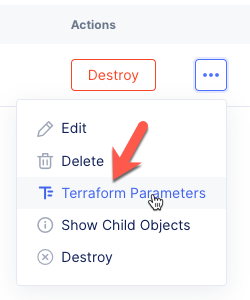
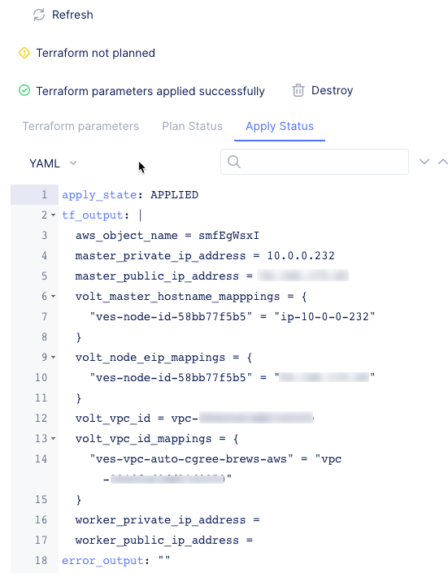
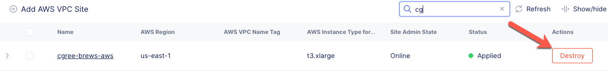
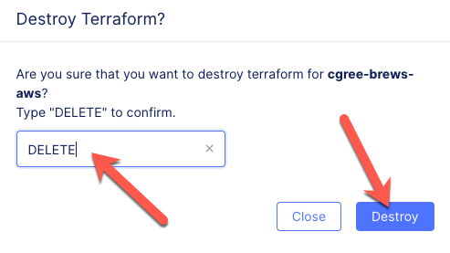
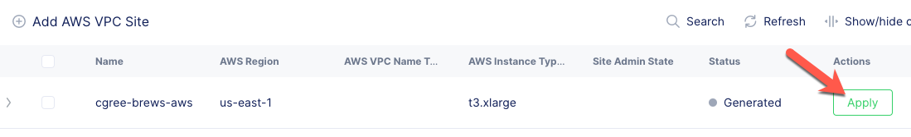

AWS Site
========

Previously for the "on-premise" site you needed to manually provision and configure 
a node for use with VoltConsole.  As you discovered in the "Pre-Work" section, deploying 
a site in AWS, Azure, and Google Cloud Platform can be done in an automated fashion in VoltConsole
(you can also use Terraform to deploy a site, but that will be covered in a separate lab).

Exercise 1: Verify your AWS Site
~~~~~~~~~~~~~~~~~~~~~~~~~~~~~~~~

In the lab pre-work you should have deployed a new AWS site into your UDF ephemeral AWS account.  Let's check that the site is ready.

#. In VoltConsole switch to the *System* context

    |system-context|

#. Navigate the menu to *Site List*

    |site_list_menu|

#. Find your site created in the pre-work step.  It should have a green status indicator next to the name.

    |site_list_search|

If your site is green, you can skip to *Next* page.

Exercise 2: Troubleshooting your AWS Site
~~~~~~~~~~~~~~~~~~~~~~~~~~~~~~~~~~~~~~~~~

If you're site deployment was not successful there are a few steps we can take to determine why.

#. View the Site's Global Status by 

    #. clicking the *...* link on your site 
    #. Click the *Show Global Status* button

    |show_global_status|

#. Verify the Site Tunnel Status in the JSON payload

    |site_tunnel_status|

#. Navigate to *Site Management* -> *AWS VPC Sites*
 
    |aws_vpc_site_menu|

#. Open the Terraform Parameters by

    #. clicking the *...* link on your site 
    # Click the *Terraform Parameters* button

    |aws_vpc_site_tf_params|

#. Evaluate the Terraform output by Clicking the *Apply Status* tab

    |aws_vpc_site_tf_apply_status|

#. Close the *AWS VPC Site Terraform Parameters* pop-out by click the *X* in the top right corner

#. Destroy and Apply Terraform 

    If your site did not deploy correctly you may need to destroy the site and create it again.

    #. In the *AWS VPC Sites* list, click on the *Destroy* button

        |aws_vpc_site_destroy|

    #. Type *DELETE* then click the *DELETE* button in the *Destroy Terraform* prompt

        |aws_vpc_site_destroy_prompt|

    #. Once the site has been destroyed in AWS, you can click the *Apply* button to try the deployment again.

        |aws_vpc_site_apply|

.. |system-context| image:: ../_static/system_context.png

.. |site_tunnel_status| image:: ../_static/site_tunnel_status.png
.. |aws_vpc_site_menu| image:: ../_static/aws_vpc_site_menu.png

