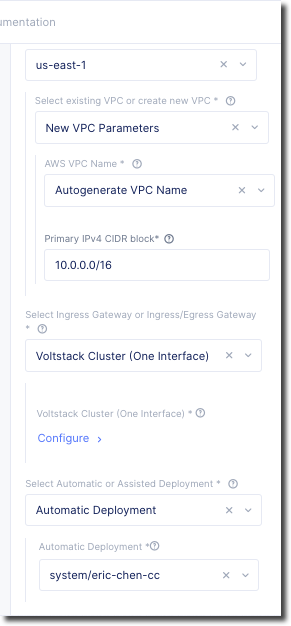

AWS Site
========

Previously for the "on-prem" site you needed to manually provision and configure 
a node for use with VoltConsole.  Deploying a site in AWS, Azure, and Google Cloud Platform
uses a process that automates the steps of deploying the site.  This enables VoltConsole
to perform the deployment on behalf of the end-user (you can also use Terraform to deploy a 
site, but that will be covered in a separate lab).

Exercise 1: Deploy AWS Site
~~~~~~~~~~~~~~~~~~~~~~~~~~~

From the UDF interface click on the "Cloud Accounts" tab.  Copy down the value of API Key/Secret.
You will use these values later to provision the Volterra node from VoltConsole.

.. image:: udf-cloud-accounts-api-key.png

From VoltConsole go to the "System" namespace, "Site Management" -> "AWS VPC Sites".

.. image:: voltconsole-aws-site.png

Under "New AWS Site" you will need to provide the following information:

- AWS Region: |aws_region|
- Primary IPv4 CIDR block: 10.0.0.0/16 
- Change "Ingress Gateway" to "Ingress/Egress Gateway (Two Interface)"
- Click on "Configure" (appears after "Select Ingress Gateway...)

Under the section for "Nodes" provide the following information

- AWS AZ Name: |aws_zone|
- Subnet Choices for Inside Interface change to "Subnet for Inside Interface"
- Internal IPv4 Subnet: 10.0.3.0/24
- Under "Workload Subnet" 
- Workload IPv4 Subnet: 10.0.2.0/24
- Under "Subnet for Outside Interface" 
- External IPv4 Subnet: 10.0.0.0/24

Click on "Apply"

Under "Automatic Deployment" use the select list to click on the "Create new aws cred".  Give 
the credential a name (i.e. [unique namespace]-cc)  Enter 
the API Key/Secret that you captured earlier from the UDF Cloud Accounts.  After you fill in the
Secret Key you will need to click on "Blindfold" then "Apply" and then "Continue"

The resulting inputs should look something like the following (do not copy these values, yours will
differ).

Then click on "Save and Exit"

In this state the site is ready to be deployed.  You will need to click on "Apply" to start the 
provisioning of the resource.  You can also use this interface to decommission the resource as well.

.. image:: voltconsole-aws-site-apply.png

In VoltConsole browse to "Sites->Site List" under the "System" namespace to view your sites.

If you see the following error

  .. code-block::

    Error: Error launching source instance: PendingVerification: Your request for accessing resources in this region is being validated, and you will not be able to launch additional resources in this region until the validation is complete. We will notify you by email once your request has been validated. While normally resolved within minutes, please allow up to 4 hours for this process to complete. If the issue still persists, please let us know by writing to aws-verification@amazon.com for further assistance.
          status code: 400, request id: 99a5736b-02c4-4aff-9781-4b559e337375

  You may need to retry the Apply again.  This is due to the AWS account not having used that particular region before.

After several minutes you should see both your UDF and AWS sites appear green in VoltConsole.

.. image:: voltconsole-site-list.png

