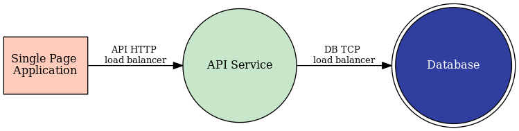

State 2
========
We just learned the DemoBrews marketing division launched an effective gorilla marketing campaign which included several references 
to the client application and website. The on-prem infrastructure is already running at capacity so we need to help 
the dev team move the application to the AWS site ASAP.

Section Goals
-------------
In this section we'll make the first strides to spanning the customer's application between sites.
Initially, we will deploy the SPA and API services to the AWS site. 
Next, we will expose the front-end (SPA) service and API services to the internet using both on-prem 
and AWS origin servers. Since the database must stay on-prem we will also need to ensure the API server 
in AWS can securely communicate with the database.

In this section we will configure the following VoltConsole components:
- Virtual Site
- Virtual k8s (vk8s)
- 2 x vk8s Workloads
- editing existing Origin Pools

Data Flow and Architecture
--------------------------
The logical application data flow has not changed.
The difference from the flow's initial state is the SPA and API services will now 
target services presented to each respective site by Volterra.

|state2|

The architecture will now be spread across Customer Edge (CE) sites -- the on-prem and AWS sites. Each site will 
host the SPA and API services while the on-prem site will solely host the database.

|arch2|

.. toctree::
   :maxdepth: 1
   :caption: Contents:

   awssite
   vsite
   vk8s
   deployPods
   updateHttpLb

.. |arch2| image:: ../_static/arch2.png
