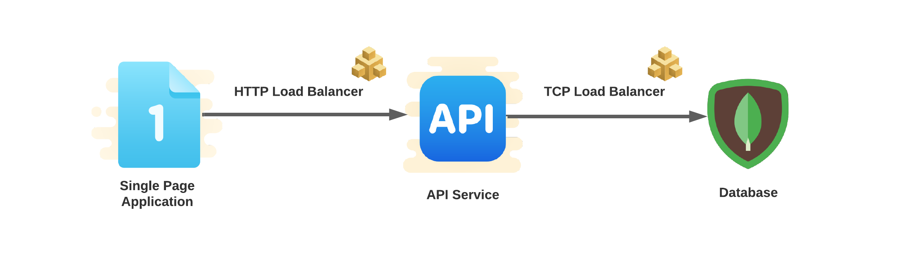
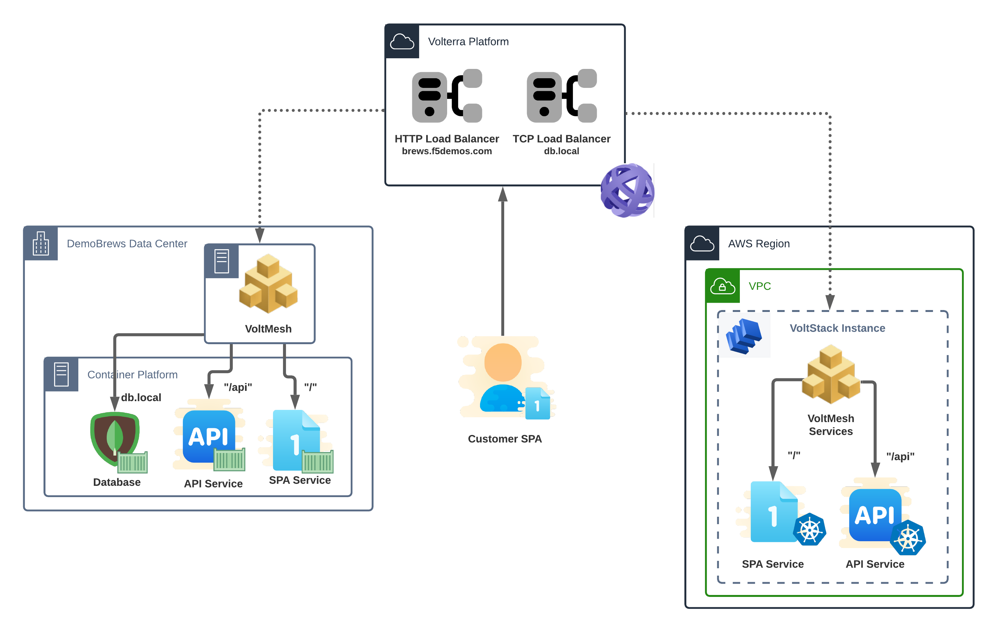

Publish a Service 
===============================
We just learned the DemoBrews marketing division launched an effective viral marketing campaign which included several references 
to the website. The on-premise infrastructure is already running at capacity so we need to help 
the dev team move application components to the AWS site as soon as possible. Ultimately, DemoBrews needs SPA and API traffic 
to ingress to either site. The MongoDB must remain solely at the on-prem location. The first step in building the needed architecture
is making the MongoDB service securely available to either Customer Edge site.

Section Goals
-------------
In this section we'll take the first steps to spanning the customer's application between sites. After verifying
the AWS Customer Edge is ready for configuration, we'll build a TCP Load Balancer to publish the MongoDB service
in each site. In order to accomplish this securely without 1-arm VoltStack implementation, we'll add a Network Policy.

In this section we will configure the following VoltConsole components:

- TCP Load Balancer

Terminology
------------

Virtual Host
   In Volterra terminology, a Virtual Host is the collection of configuration objects that make up a reverse proxy.
   This includes a domain, one of several different types of proxies (TCP, UDP, HTTP, various SNI/mTLS variants), Routing rules, 
   an Advertisement policy, and WAF.

TCP Load Balancer
   A TCP Load Balancer encompasses rules and policies for a given Virtual Host or network routing rules.
   A TCP Load Balancer is used to connect across isolated networks and in load balancing. 

Data Flow and Architecture
--------------------------
The logical application data flow will change subtly from its earlier state.
The SPA and API services will now target services presented to each respective site.

|state2|

The architecture will now be spread across Customer Edge (CE) sites -- the on-premise and AWS sites. Each site will 
host the SPA and API services while the on-premise site will solely host the database.

|arch2|

.. toctree::
   :maxdepth: 1
   :caption: Contents:

   awssite   
   tcpLb

