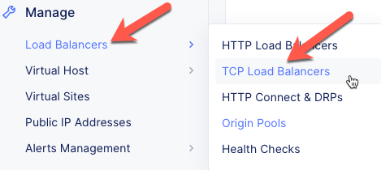
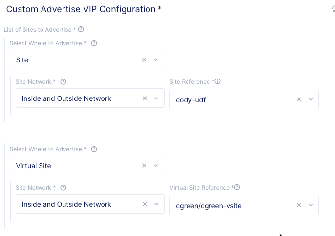
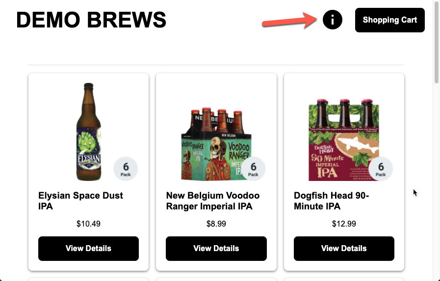
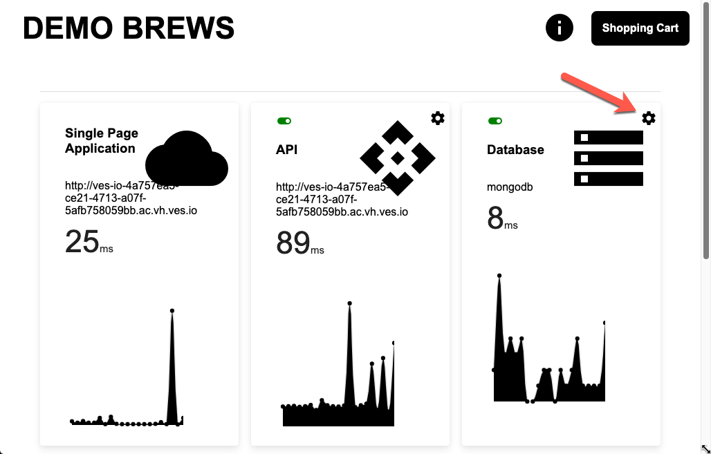
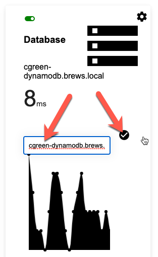

Create a TCP Load Balancer
==========================

In this section we will create a TCP load balancer so we can present the MongoDB in both the UDF and AWS sites.
This will be needed so that the API service running in the AWS site can access the on-premise database.

Exercise 1: Create MongoDB TCP Load Balancer
~~~~~~~~~~~~~~~~~~~~~~~~~~~~~~~~~~~~~~~~~~~~~

#. In VoltConsole ensure you are in the *Application* context

    |app-context| 

#. Navigate the menu to go to *Manage*->*Load Balancer*, then click *TCP Load Balancers*

    |tcp_lb_menu|

#. Click the *Add TCP Load Balancer* button

#. Enter the following variables:

    ==============================  =====
    Variable                        Value
    ==============================  =====
    Name                            brews-mongodb
    Listen Port                     27017
    Where to Advertise the VIP      Advertise Customer
    ==============================  =====

#. Configure Domains

    #. Under the *Domains section click the *Add item* button
    #. Enter a domain 

        ======== =====
        Variable Value
        ======== =====
        Domain   your_namespace-mongodb.brews.local
        ======== =====

        |tcp_lb_config|
#. Configure Origin Pools

    #. Under the *Origin Pools* section, click the *Configure* link
    #. Click the *Add item* button
    #. Select the *brews-mongodb* pool
    #. Click the *Apply* button

#. Configure Advertisement 

    #. Under *Advertise Custom* click the *Configure* link
    #. You will need to add two sites:
        #. Your UDF site
            
            =========================== =====
            Variable                    Value
            =========================== =====
            Select Where to Advertise   Site
            Site Reference              Your UDF site
            =========================== =====

        #. Your AWS site

            =========================== =====
            Variable                    Value
            =========================== =====
            Select Where to Advertise   Virtual Site
            Site Reference              Your Virtual Site
            =========================== =====

        |tcp_lb_advertise|

    #. Click the *Apply* button

#. CLick the *Save and Exit* button

Exercise 2: Configure Demo Application 
~~~~~~~~~~~~~~~~~~~~~~~~~~~~~~~~~~~~~~
Now that we have an internal TCP load balancer for MongoDB we need to configure the demo application to use it.

#. Open the demo application in your browser

    .. note:: If you do not remember the FQDN, you can look under *Manage* -> *Load Balancers* to get it.

#. Click on the information icon

    |demo_app_stats|

#. Click on the gear icon for the database 

    |demo_app_config_db|

#. Enter the TCP load balancer hostname: *your_namespace-mongodb.brews.local*

    |demo_app_config_db_url|

#. Click the button or press Enter

If everything is working correctly, the database cart should not turn red.  You can also add and remove items from your cart for a further test.

.. |app-context| image:: ../_static/app-context.png

.. |tcp_lb_config| image:: ../_static/tcp_lb_config.png

