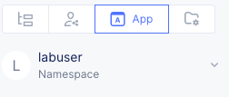
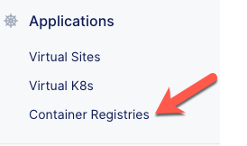
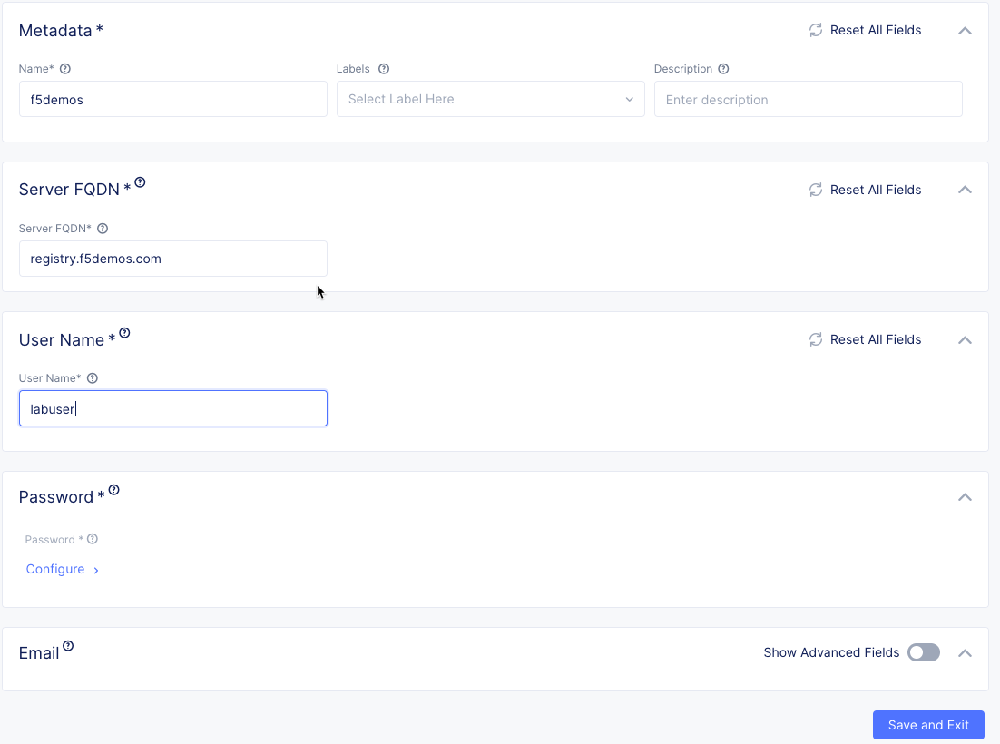
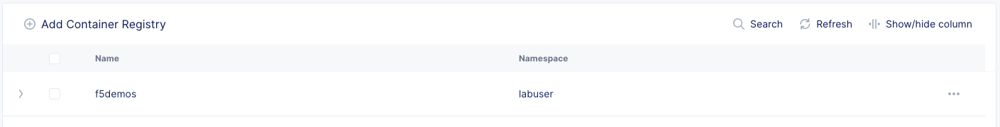

Create Private Container Registry
=================================

The DemoBrews dev team builds their container based services in a private container registry.
In order for vK8s to pull images from this registry we need to specify its location
and authentication information in VoltConsole.

Exercise 1: Create the Container Registry
~~~~~~~~~~~~~~~~~~~~~~~~~~~~~~~~~~~~~~~~~

#. Verify you are in the "App" context and have selected your namespace.

    |ns|

#. Select *Container Registries* under the "Applications" section. Click the *Add* button.

    |cr| |add|

#. Complete the dialogue.

    ================================= =====
    Variable                          Value
    ================================= =====
    Name                              f5demos
    Server FQDN                       registry.f5demos.com
    User Name                         labuser
    Password                          f5demosPass! 
    ================================= =====

    |diag| |blind| |apply| |save|

#. Verify the Container Registry was created.

    |verify|

.. |add| image:: ../_static/cr3-add.png

.. |apply| image:: ../_static/cr3-apply.png
.. |blind| image:: ../_static/cr3-blind.png
.. |save| image:: ../_static/cr3-save.png

