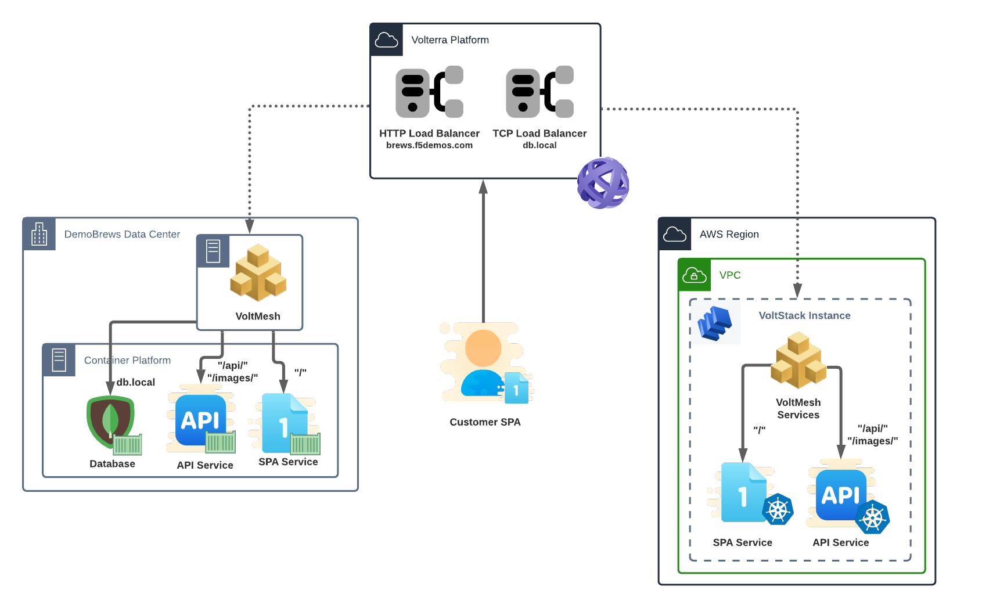

Deploy Workloads to vK8s
========================
With the environment prepped, the DemoBrews dev team is focused on getting the application deployed.
The DemoBrews CTO recently attended a weekend retreat with the local Azure account team. 
She has started engaging engineering teams on what it would take to switch Cloud Service Providers (CSPs) away from AWS.
The Dev team demands that we design a deployment procedure that allows for scaling across sites in different CSPs.

Section Goals
-------------
Initially, we will deploy the SPA and API services to the AWS site using the Virtual Site and Virtual Kubernetes abstractions. 
Next, we will expose the front-end (SPA) service and API services running in the AWS site to the internet along with the on-premise 
versions of those services.

In this section we will configure the following VoltConsole components:

- Virtual Site
- Container Registry
- Virtual k8s (vK8s)
- 2 x vK8s Workloads
- Update existing Origin Pools

Terminology
-----------

Virtual Site
   A Virtual Site is an abstraction for a group of Volterra sites. 
   Instead of performing configuration on each site, a Virtual Site allows for performing a given 
   configuration on a set of site. Virtual Sites are defined by "label expressions" -- ie. tagging.

Container Registry
   A Container Registry object is used to configure a private docker/container image registry from which the application container images are fetched.
   By defining a Container Registry object, you can use private container images in vK8s and Workload deployments.

Virtual Kubernetes (vK8s)
   Volterra supports a Kubernetes compatible API for centralized orchestration of applications across a grouping of sites (Customer Sites or Volterra Regional Edge).
   While not all K8s APIs are supported, the API is compatible with common tasks for deployments.
   This distributed control plane within the Volterra global infrastructure can manage scheduling and scaling of applications across multiple (tens to hundreds of thousands of) sites, 
   where each site in itself is also a Volterra managed physical K8s cluster.

vK8s Workload
   A vK8s Workload can be used to deploy application components in Virtual Kubernetes.
   A Workload encapsulates all the operational characteristics of Kubernetes workload, storage, and network objects 
   (deployments, statefulsets, jobs, persistent volume claims, configmaps, secrets, and services) configuration, 
   as well as configuration related to where the workload is deployed and how it is advertised using L7 or L4 load balancers. 

Data Flow and Architecture
--------------------------
The logical application data flow will change subtly from its earlier state.
The SPA and API services will now target services presented to each respective site.

|state2|

The architecture will now be spread across Customer Edge (CE) sites -- the on-premise and AWS sites. Each site will 
host the SPA and API services while the on-premise site will solely host the database.

|arch2|

.. toctree::
   :maxdepth: 1
   :caption: Contents:

   vsite   
   containerRegistry
   vk8s
   updateOrigPool

.. |state2| image:: ../_static/LabAppFlow2.png

