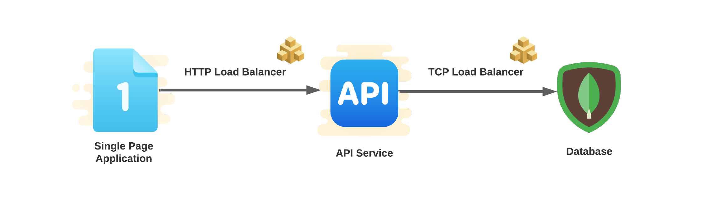
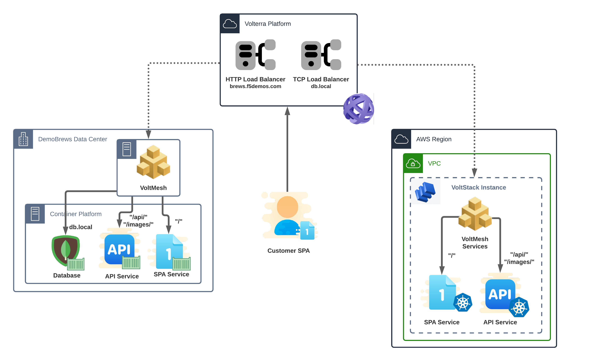

Virtual Kubernetes
==============
We just learned the DemoBrews marketing division launched an effective viral marketing campaign which included several references 
to the client application and website. The on-premise infrastructure is already running at capacity so we need to help 
the dev team move the application to the AWS site as soon as possible.

Section Goals
-------------
In this section we'll take the first steps to spanning the customer's application between sites.
Initially, we will deploy the SPA and API services to the AWS site. 
Next, we will expose the front-end (SPA) service and API services to the internet using both on-premise 
and AWS origin servers. Since the database must stay on-premise we will also need to ensure the API server 
in AWS can securely communicate with the database.

In this section we will configure the following VoltConsole components:

- Virtual Site
- Virtual k8s (vK8s)
- 2 x vK8s Workloads
- editing existing Origin Pools

Data Flow and Architecture
--------------------------
The logical application data flow will change subtly from its earlier state.
The SPA and API services will now target services presented to each respective site.

|state2|

The architecture will now be spread across Customer Edge (CE) sites -- the on-premise and AWS sites. Each site will 
host the SPA and API services while the on-premise site will solely host the database.

|arch2|

.. toctree::
   :maxdepth: 1
   :caption: Contents:

   vsite   
   containerRegistry
   vk8s
   updateHttpLb

