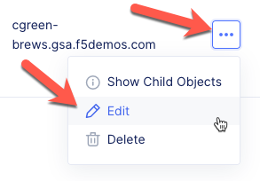
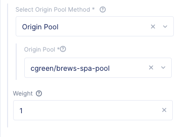
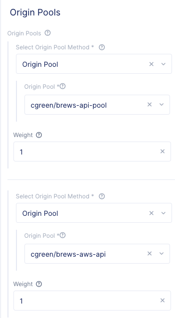

Update HTTP Load Balancer
=========================

In this section we will update the existing HTTP load balancer to include the new vK8S deployment.

Exercise 1: Add SPA Origin Pool to HTTP LB
~~~~~~~~~~~~~~~~~~~~~~~~~~~~~~~~~~~~~~~~~~

#. In VoltConsole ensure you are in the *Application* context

    |app-context| 

#. Navigate the menu to go to *Manage* -> *Load Balancer*, then click *HTTP Load Balancers*

    |http_lb_menu|

#. Select the *...* link for your brew HTTP Load Balancer

#. Click the *Edit* button

    |http_lb_edit|

#. Under the *Default Origin Servers* section, click the *Edit* link

#. Click the *Add item* button

#. For the *Origin Pool*, select your brews-spa-pool

    |http_lb_origin_spa|

#. Click the *Apply* button

Exercise 2: Add API Origin Pool to HTTP LB
~~~~~~~~~~~~~~~~~~~~~~~~~~~~~~~~~~~~~~~~~~

While you still have the HTTP load Balancer configuration up, we need to edit the Routes Configuration.

#. Under the *Routes Configuration* section, click the *Edit* link

#. Perform the following steps for both the /api/ and /images/ routes:

    #. Under *Origin Pools*, click the *Edit* link
    #. Click the *Add item* button
    #. For the *Origin Pool*, select your brews-spa-pool

        |http_lb_routes_update_udf_aws|

#. Click the *Apply* button

#. Click the *Save and Exit* button

.. |app-context| image:: ../_static/app-context.png
.. |http_lb_menu| image:: ../_static/http_lb_menu.png

