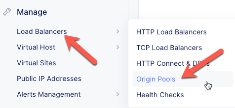
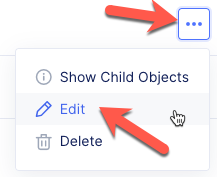
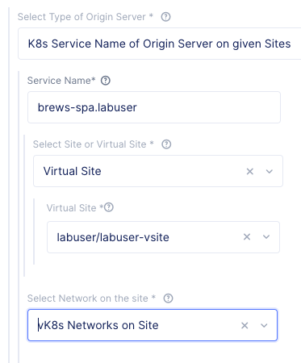
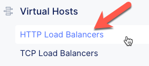
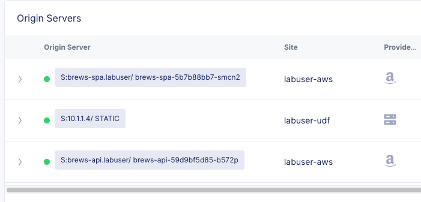
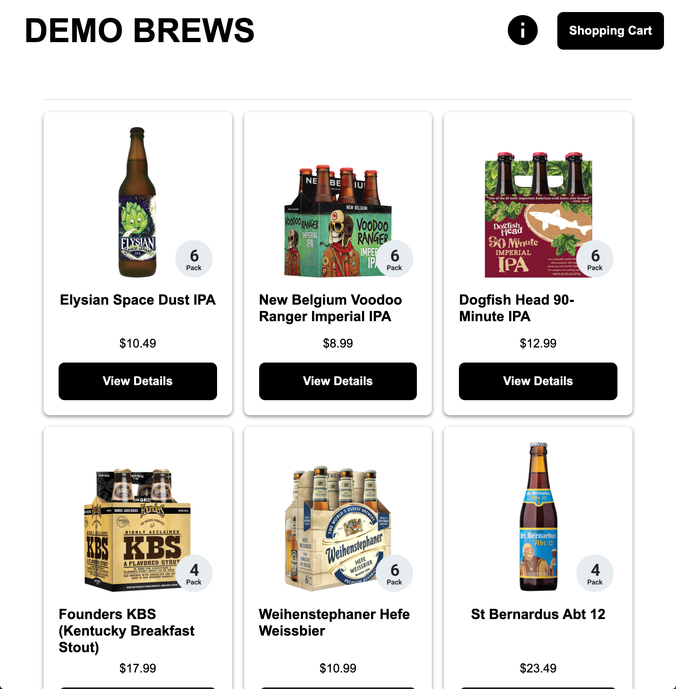

Update Origin Pools
===================

In this section we will update the existing HTTP load balancer to include the SPA and API vK8S deployments.

Exercise 1: Add SPA Origin Pool to HTTP LB
------------------------------------------

In this exercise you will add the new vK8s SPA service to the existing brew-spa origin pool. 

#. In VoltConsole ensure you are in the *Application* context.

    |app-context| 

#. Navigate the menu to *Manage* -> *Origin Pools*.

   .. warning:: Make sure you go to "Manage" and not "Virtual Hosts" (scroll down)

    |origin_pools_menu|

#. Select the *...* link for the *brew-spa* *Origin Pool*.

#. Click the *Edit* button.

    |origin_pools_edit|

#. Under the *Origin Servers* section, click the *Add item* button.
#. Enter the following variables:

    =============================== =====
    Variable                        Value
    =============================== =====
    Select Type of Origin Server    K8s Service Name of Origin Server on given Sites
    Service Name                    brews-spa.your_namespace
    Select Site or Virtual Site     Virtual Site
    Virtual Site                    your_namespace-vsite
    Select Network on the site      vK8s Networks on Site
    =============================== =====

    |origin_pools_vk8s_spa|

#. Click the *Save and Exit* button to close the *Origin Pool* dialogue.

Exercise 2: Add API Origin Pool to HTTP LB
------------------------------------------
In this exercise you will add the new vK8s API service to the existing brew-api origin pool. 

The steps are identical to Exercise 1 except you will choose the *brews-api* origin pool and you will specify the *brews-api* vK8s service.

    =============================== =====
    Variable                        Value
    =============================== =====
    Select Type of Origin Server    K8s Service Name of Origin Server on given Sites
    Service Name                    brews-api.your_namespace
    Select Site or Virtual Site     Virtual Site
    Virtual Site                    your_namespace-vsite
    Select Network on the site      vK8s Networks on Site
    =============================== =====

Exercise 3: Check HTTP LB Origin Servers  
----------------------------------------

Now that we have updated the SPA and API origin pools we need to check the health of the origin pools in the HTTP Load Balancer. 

#. Navigate the menu to *Virtual Hosts* -> *HTTP Load Balancers*

    |virtual_hosts_http_lb_menu|

#. Click on your "brews-lb" load balancer.
#. Click on the *Origin Servers* tab.
#. Click on the *Refresh* link

You should see three origin pools that are green:

- UDF server
- vK8s spa service
- vK8s api service

|http_lb_origin_health|

You should be able to open a browser and check that the demo application looks like the screen shot below:

|demo_app|

.. |app-context| image:: ../_static/app-context.png

