Virtual Kubernetes
==================

In this section we will create a Virtual K8s configuration in VoltConsole.

Exercise 1: Create Virtual K8s 
~~~~~~~~~~~~~~~~~~~~~~~~~~~~~~
#. In VoltConsole ensure you are in the *Application* context and have selected your namespace.

    |app-context| |lu-ns|

#. Navigate the menu to go to *Application*->*Virtual K8s*.

    |vk8s_menu|

#. Click the *Add Virtual K8s* button.

#. Enter the following variables: 

    ======== =====
    Variable Value
    ======== =====
    Name     your_namespace-vk8s
    ======== =====

#. Click the *Select Vsite Ref* button.

#. Select the Virtual Site you created.

#. Click the *Select Vsite Ref* button.

    |vk8s_vsite_ref|

#. Click the *Save and Exit* button.

VoltConsole will now create your Virtual K8s cluster.

|vk8s_cluster| 

Exercise 2: Create Virtual K8s Workload for the Single-page App
~~~~~~~~~~~~~~~~~~~~~~~~~~~~~~~~~~~~~~~~~~~~~~~~~~~~~~~~~~~~~~~

#. Once your Virtual K8s cluster is ready, select the cluster name in the *Virtual K8s* list.

    |vk8s_list|

#. Click the Workloads tab.

    |k8s_workloads_menu|

#. Click the *Add vK8s workload* button.

#. Enter the following variables:

    ======================= =====
    Variable                Value
    ======================= =====
    Name                    brews-spa
    Select Type of Workload Service
    ======================= =====

#. Under the *Service* section, click the *Configure* link.

#. Enter the following variables in the *Containers* section.

    =============================== =====
    Variable                        Value
    =============================== =====
    Name                            brews-spa
    Image Name                      registry.f5demos.com/spa
    Select Container Registry       Private Registry
    Private Registry                Select the private registry you created previously
    =============================== =====

    |vk8s_workloads_containers|

#. Enter the following variables in the *Deploy Options* section.

    =============================== =====
    Variable                        Value
    =============================== =====
    Where to Deploy the workload    Customer Virtual Sites 
    =============================== =====

#. Under *Customer Virtual Sites*, click the *Configure* link.

|vk8s_workloads_deploy|

#. Select the Virtual Site you created in the previous section.

#. Click the *Apply* button.

#. Under *Advertise Option*, choose *Advertise In Cluster*.

    |vk8s_workloads_advertise|

#. Enter the following variables:

    ======================  =====
    Variable                Value
    ======================  =====
    Port                    8081
    Show Advance Fields     Toggle On
    Port Information        Different than Port
    Different than Port     80
    ======================  =====

    |vk8s_advertise_port|

#. Click the *Apply* button.

#. Click the *Apply* button.

#. Click the *Save and Exit* button.

Exercise 3: Create Virtual K8s Workload for the API
~~~~~~~~~~~~~~~~~~~~~~~~~~~~~~~~~~~~~~~~~~~~~~~~~~~~~~~~~~~~~~~

#. Click the *Workloads* tab.

    |k8s_workloads_menu|

#. Click the *Add vK8s workload* button.

#. Enter the following variables:

    ======================= =====
    Variable                Value
    ======================= =====
    Name                    brews-api
    Select Type of Workload Service
    ======================= =====

#. Under the *Service* section, click the *Configure* link.

#. Enter the following variables in the *Containers* section.

    =============================== =====
    Variable                        Value
    =============================== =====
    Name                            brews-api
    Image Name                      registry.f5demos.com/api
    Select Container Registry       Private Registry
    Private Registry                Select the private registry you created previously
    =============================== =====

    |vk8s_workloads_containers_api|

#. Configuration

    #. Under the *Configuration* section click the *Add item* button.
    #. Enter the following variables:

        =================================== =====
        Variable                            Value
        =================================== =====
        Select Configuration Parameter Type Environment Variable
        Name                                MONGO_URL
        Value                               your_namespace-mongodb.brews.local
        =================================== =====

        |vk8s_workloads_env|

#. Enter the following variables in the *Deploy Options* section:

    =============================== =====
    Variable                        Value
    =============================== =====
    Where to Deploy the workload    Customer Virtual Sites 
    =============================== =====

    |vk8s_workloads_deploy|

#. Under *Customer Virtual Sites*, click the *Configure* link.

#. Select the Virtual Site you created in the previous section.

#. Click the *Apply* button to close the "Deploy Options" dialogue.

#. Under *Advertise Option*, choose *Advertise In Cluster*. (default is *Advertise in Cluster*)

    |vk8s_workloads_advertise|

#. Click on *Configure*

#. Enter the following variables:

    ==========  =====
    Variable    Value
    ==========  =====
    Port        8000
    ==========  =====

#. Click the *Apply* button to close the "Advertise Options" dialogue.

#. Click the *Apply* button to close the "Service" dialogue.

#. Click the *Save and Exit* button to create the Workload.

You should now see your two workloads with 1 Running/Completed Pods per workload.

|vk8s_workloads_list|

.. note:: 

    The vK8s Workload target is the Virtual Site abstraction. If DemoBrews spun up a new Customer Edge
    site, regardless of CSP, and tagged the site with the correct site selector the workload would be
    deployed to the new site and the service would be exposed via the HTTP Load Balancer automatically.

.. |app-context| image:: ../_static/app-context.png
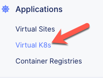
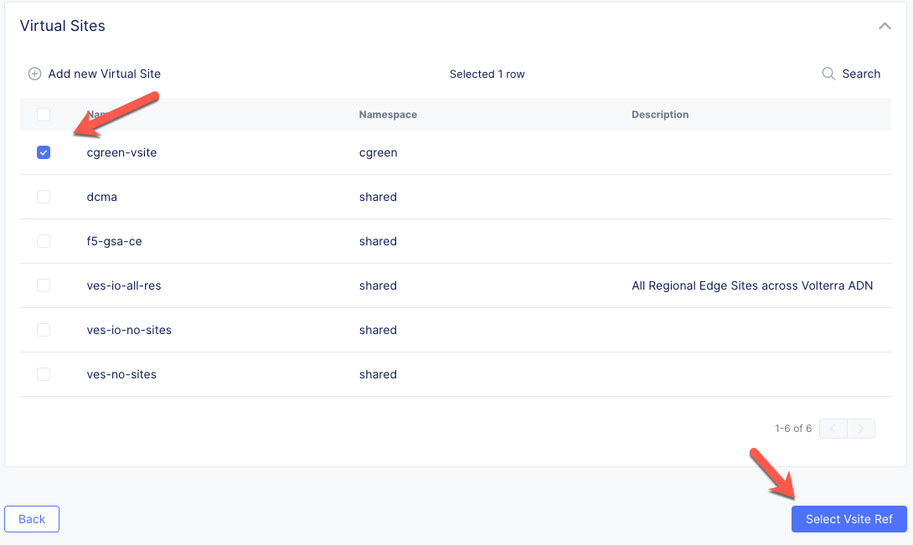
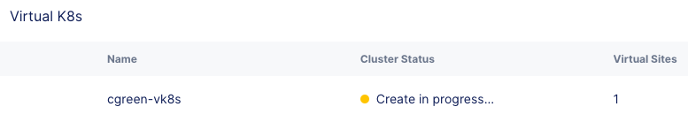
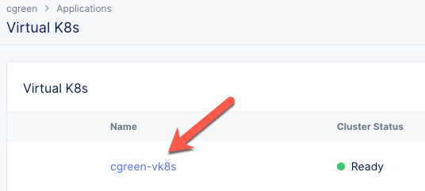
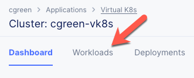
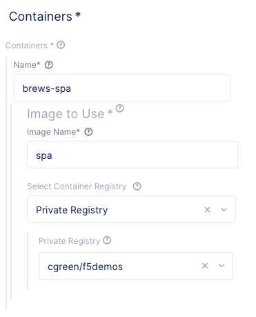
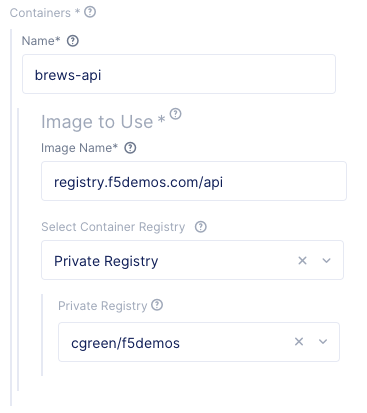
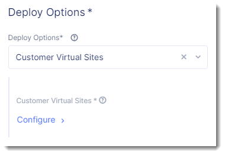
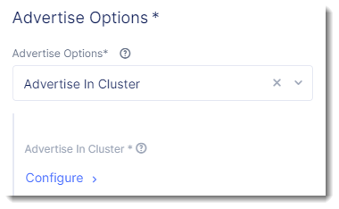
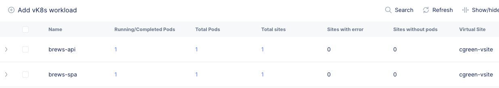
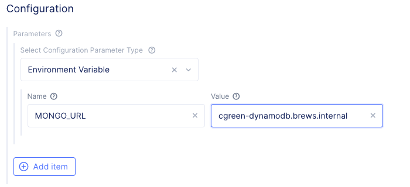
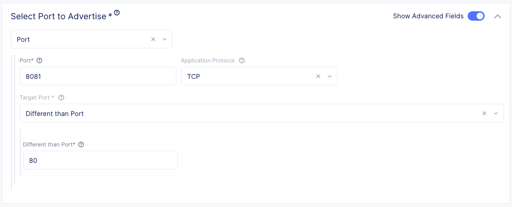
.. |lu-ns| image:: ../_static/lu-ns.png