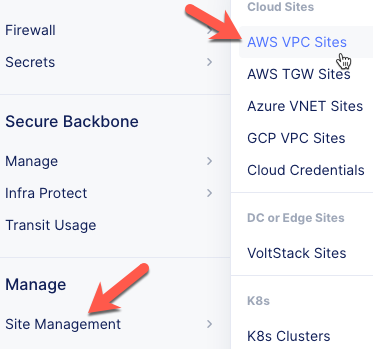
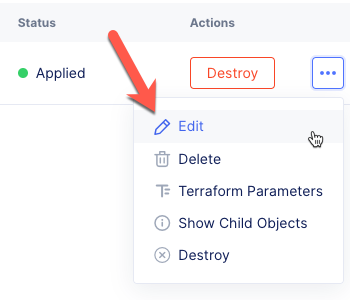
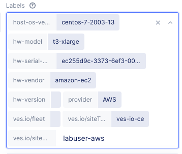
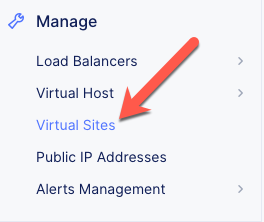
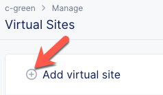
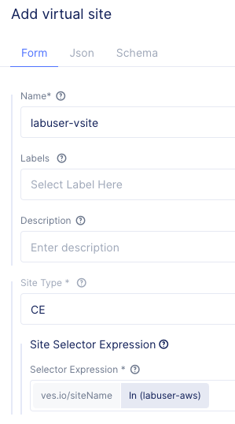
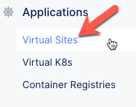
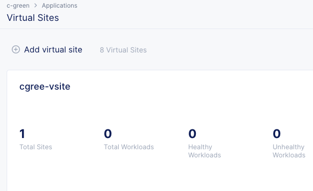

Virtual Site
============
In this section we will deploy a Virtual Site as a prerequisite for the Virtual Kubernetes deployment.

Exercise 1: Tag AWS Site
~~~~~~~~~~~~~~~~~~~~~~~~

#. In VoltConsole switch to the *System* context.

    |system-context|

#. Navigate the menu to go to "Manage"->"Site Management" and click on "AWS VPC Site".

    |aws_vpc_site_menu|

#. Edit the AWS VPC Site:
    #. Click the *...* button for your site.
    #. Click the *Edit* button.

    |aws_vpc_site_edit|

#. Under *Labels*, click the *More* link. 
#. Click in the Labels box:
    #. For the *key*, choose *ves.io/siteName*.
    #. For the Value, type your_namespace-aws. (you will see a select option, but you can type also)

        |aws_vpc_site_label|

#. Click the *Save and Exit* button.

Exercise 2: Create Virtual Site
~~~~~~~~~~~~~~~~~~~~~~~~~~~~~~~
#. In VoltConsole switch to the *Application* context.

    |app-context|

#. Navigate the menu to go to "Manage"->"Virtual Sites".

    |virtual_sites_menu|

#. Click the *Add virtual site* button.

    |virtual_sites_add|

#. Enter the following variables:

    ============================== =====
    Variable                        Value
    ============================== =====
    Name                            your_namespace-vsite
    Site Type                       CE
    Site Selector Expression Key    ves.io/siteName
    Site Selector Expression Value  your AWS VPC Site name (you will see a select option, but you can type also)
    ============================== =====

    |virtual_sites_add_form|

#. Click the *Add virtual site* button.

Exercise 3: Check your Virtual Site Status
~~~~~~~~~~~~~~~~~~~~~~~~~~~~~~~~~~~~~~~~~~

#. Navigate the menu to go to "Applications"->"Virtual Sites".

    |app_virtual_sites_menu|

#. You should see your virtual site listed with a *Total Site* count of *1*.

    |app_virtual_sites_list|

.. |system-context| image:: ../_static/system_context.png

.. |app-context| image:: ../_static/app-context.png

