Deploy the "Recommendations" Service.
=====================================

Exercise 1: Create a Virtual Site with our target REs
~~~~~~~~~~~~~~~~~~~~~~~~~~~~~~~~~~~~~~~~~~~~~~~~~~~~~~
Since we only want to deploy our "recommendations" service to a select number of Region Edges, we must define 
a "virtual site" that contains the REs we want to target.

#. Start in VoltConsole and switch to your "Application" namespace.

    |lu-ns|

#. Using the menu on the left, navigate to "Manage"->"Virtual Sites". Click on *Add virtual site*.

    |menu-vs| |add-vs|

#. Fill out the form.

    ================================= =====
    Variable                          Value
    ================================= =====
    Name                              recs-re
    Description                       virtual site to deploy 'recs' service
    Site Type                         RE
    Site Selector Expression          ves.io/siteName in {ves-io-ny8-nyc, ves-io-wes-sea}
    ================================= =====

    |vs-selector-expression| |add-vs-diag| |add-vs-button|

#. Verify your "recs-re" virtual site was created.

    |vs-check| |verify-vs|

Exercise 2: Deploy the "Recommendations" Workload
~~~~~~~~~~~~~~~~~~~~~~~~~~~~~~~~~~~~~~~~~~~~~~~~~~
We'll use the "workloads" concept to configure all the pieces we need for the "recommendations" service -- 
the k8s deployment, the k8s service exposing the deployment in the cluster, and an HTTP Load Balancer that exposes 
the k8s service to the internet.

#. Navigate to your vK8s cluster from the *Virtual K8s* menu item under "Applications". Click the cluster's name.

    |vk8s-deets|

#. Click the *Workloads* tab followed by the *Add vK8s workload* button.

    |recs-add-wl|

#. Fill out the form:

    ======================= =====
    Variable                Value
    ======================= =====
    Name                    brews-recs
    Select Type of Workload Service
    ======================= =====

#. Under the "Service" section, click the *Configure* link.

#. Enter the following variables in the *Containers* section.

    =============================== =====
    Variable                        Value
    =============================== =====
    Name                            brews-recs
    Image Name                      registry.f5demos.com/recs
    Select Container Registry       Private Registry
    Private Registry                Select the private registry you created previously
    =============================== =====

    |recs-container|

#. Enter the following variables in the *Deploy Options* section. 

    =============================== =====
    Variable                        Value
    =============================== =====
    Where to Deploy the workload    Customer Virtual Sites 
    =============================== =====

#. Under *Customer Virtual Sites*, click the *Configure* link.

#. Select the Virtual Site of REs you created in the previous section.

    |recs-vs|

#. Click the *Apply* button to close the "Deploy" dialogue.

#. Under *Advertise Option*, choose *Advertise On Internet*. Click the *Configure* link.

    |recs-advertise|

#. Enter the port (8001) for the "Recommendations" service.

    |new-recs-advertise-port|

#. Verify that "HTTP/HTTPS Load Balancer" is selected under "Options to Advertise the workload". Click *Configure*.

#. Enter the following variables:

    ================================= =====
    Variable                          Value
    ================================= =====
    Domains                           [unique name]-recs.[supplied domain name for your tenant]
    Select type of Load Balancer      HTTP
    Automatically Manage DNS Records  Yes/Check 
    ================================= =====

    |recs-lb|

#. Click the *Show Advanced Fields* toggle in the "Routes" section. Select 'Disable Host Rewrite' for the default route. 
   
    |recs-lb-advanced| |recs-stupidness|

    .. note:: 
  
        The default route configuration, to rewrite the "Host" header with the name of an upstream server, is not applicable when 
        the service is hosted on Regional Edges. 

#. Click *Apply* to exit the "Routes" dialogue.

#. Click *Apply* to exit the "Advertise" dialogue.

#. Click *Apply* to close the "Service" dialogue.
 
#. Click *Save and Exit* to create the Workload.

#. Verify the workload.

    |recs-wl-verify|    |recs-wl-verify2|

Exercise 3: Reconfigure the SPA to use the "Recommendations" feature.
~~~~~~~~~~~~~~~~~~~~~~~~~~~~~~~~~~~~~~~~~~~~~~~~~~~~~~~~~~~~~~~~~~~~~

Now that "recommendations" service is online, we need to reconfigure the SPA to use it. 

#. Open the demo application in your browser

    .. note:: If you do not remember the FQDN, you can look under *Manage* -> *HTTP Load Balancers* to find it.

#. Click on the information icon

    |demo_app_stats|

#. Click on the gear icon for the "Recommendations" service.

    |demo-app-config-recs|

#. Enter the domain we added to the "brews-recs" HTTP Load Balancer.

    |demo-app-config-recs-url|

#. Click the button or press Enter

If everything is working correctly, your "Recommendations" card should not turn red.
HTTP response time statistics should start being populated in the card.
When you view product details in the main application, you should see additional brew recommendations.

    |recs-recs|

.. |lu-ns| image:: ../_static/lu-ns.png
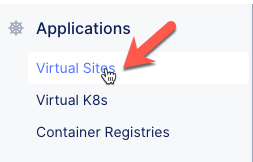
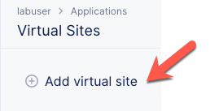
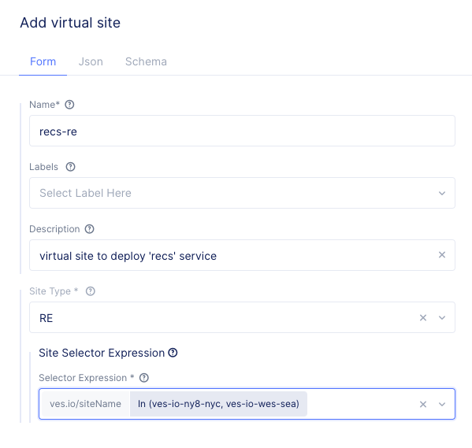
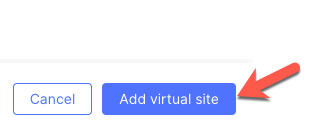
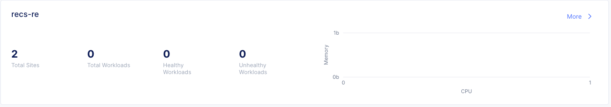
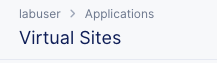
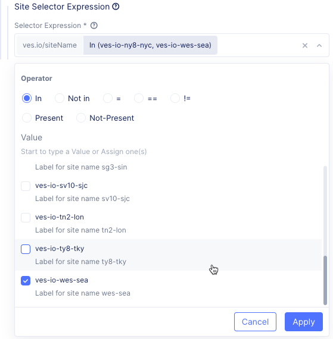
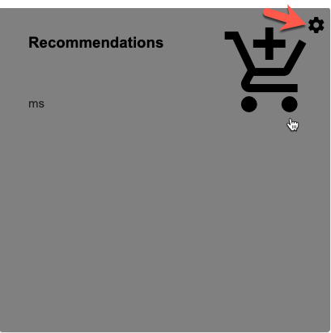
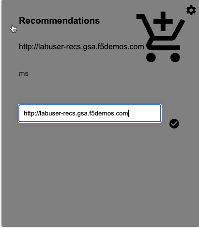
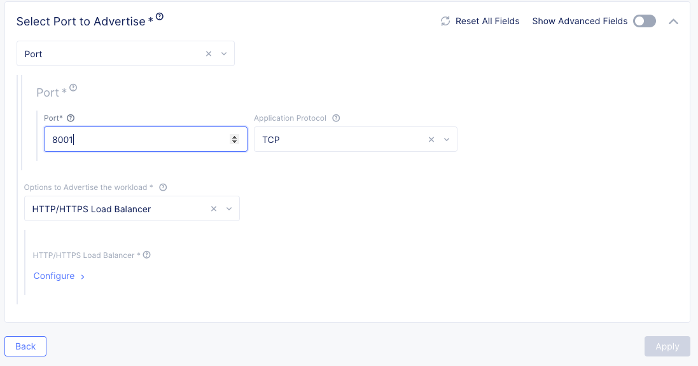
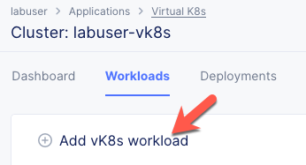
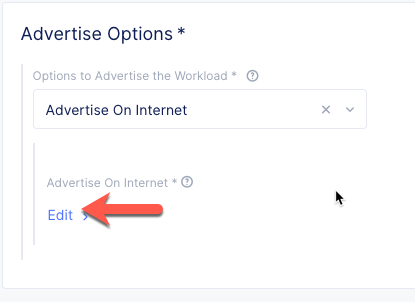
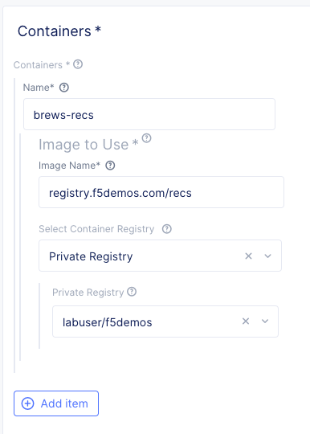
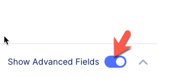
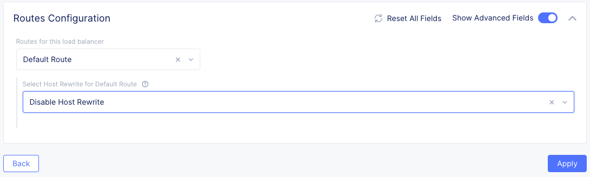
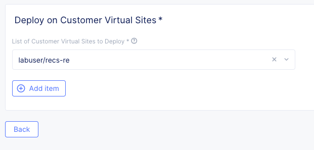
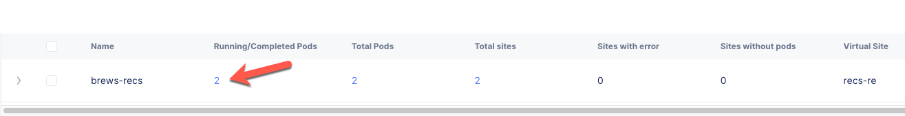
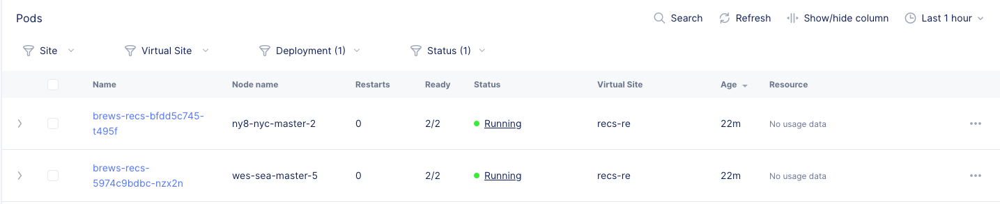
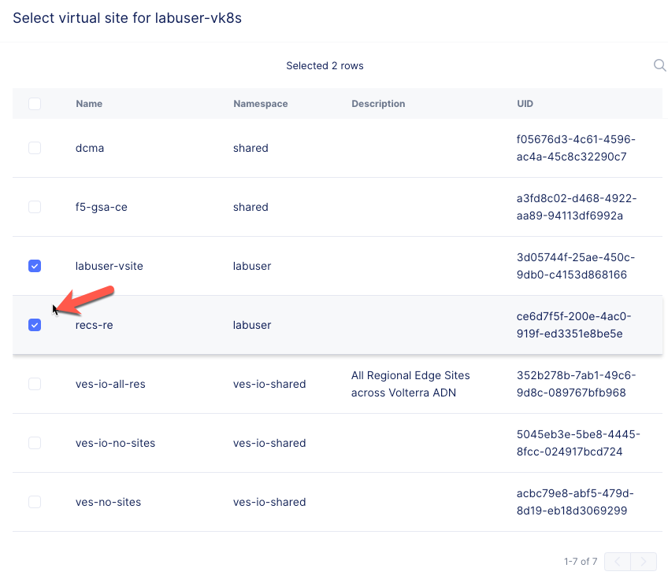
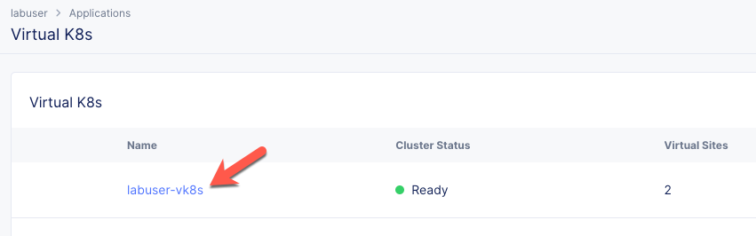
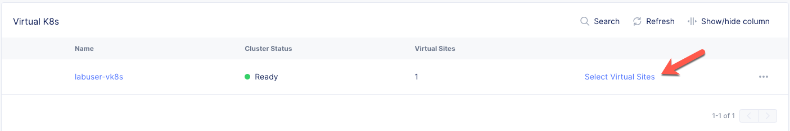
.. |demo_app_stats| image:: ../_static/demo_app_stats.png
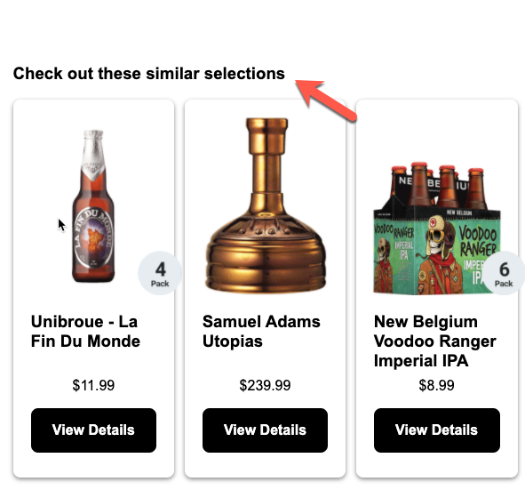
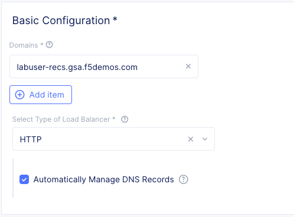
