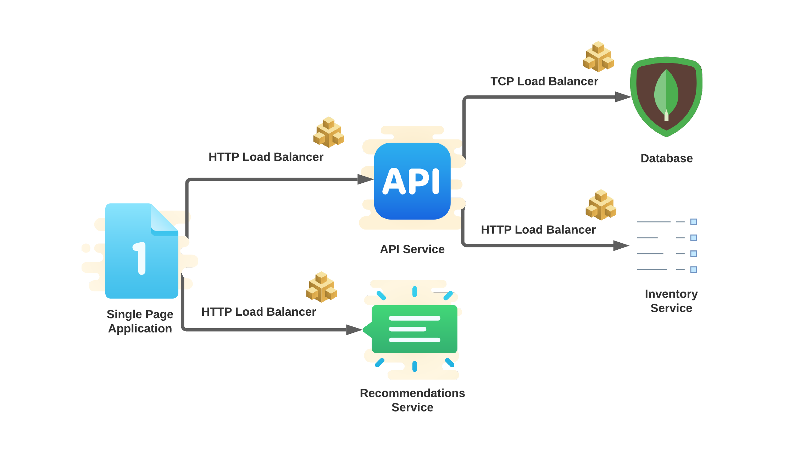
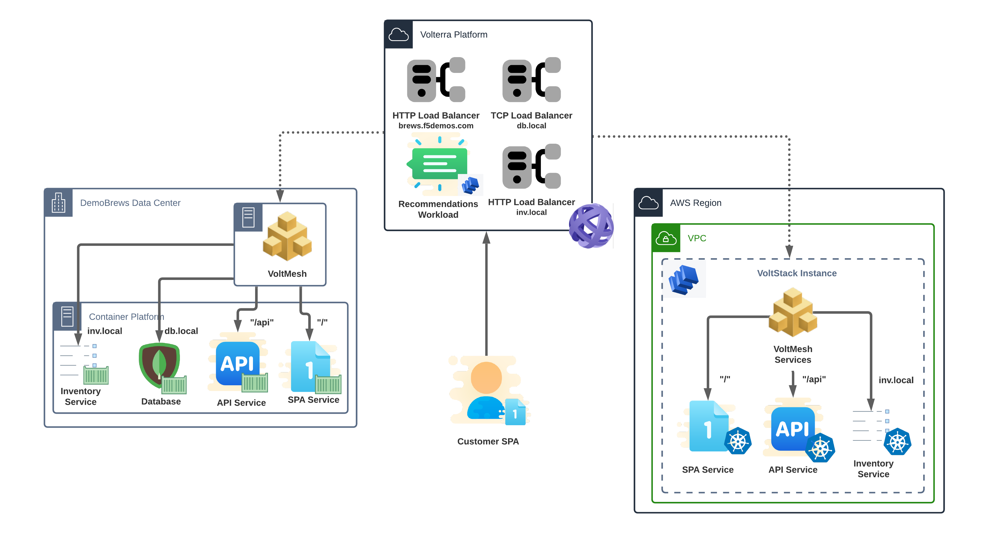

Recommendations Service
========================
The DemoBrews executive team has determined the company can increase 
revenue per transaction by adding a "recommendations" service to the app. 
Being in a rush to launch the service, the dev team skipped the required regression 
and load testing procedures for adding functionality to the API service.
For speed, the service will need to be deployed to two geographically diverse Volterra Regional Edges (REs).

Section Goals
-------------
We will deploy the "recommendations" service to Seattle and New York based Regional Edges.
We will then expose the service to the internet using an HTTP load balancer.

In this section we will configure the following VoltConsole components:

- A virtual site as a deployment target for our vK8s workload
- vk8s workload containing the "recommendations" service
- reconfigured the SPA HTTP load balancer.

Data Flow and Architecture
--------------------------
The logical application data flow will now include the "Recommendations" service.

|state4|

The architecture is now spread across CEs as well as Volterra multiple Volterra Regional Edges.

|arch4|

.. toctree::
   :maxdepth: 1
   :caption: Contents:

   createREsite

