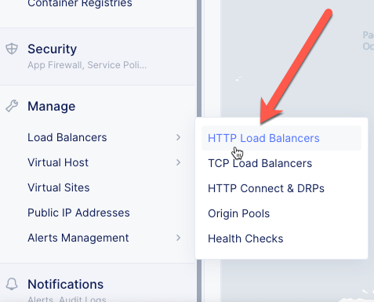
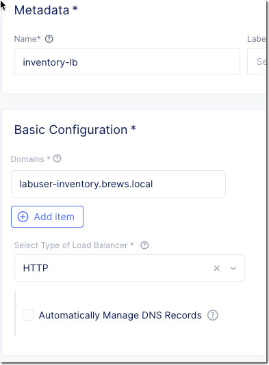
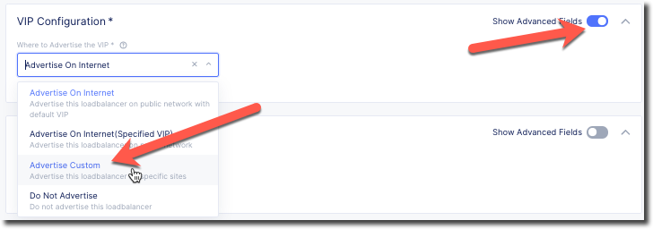
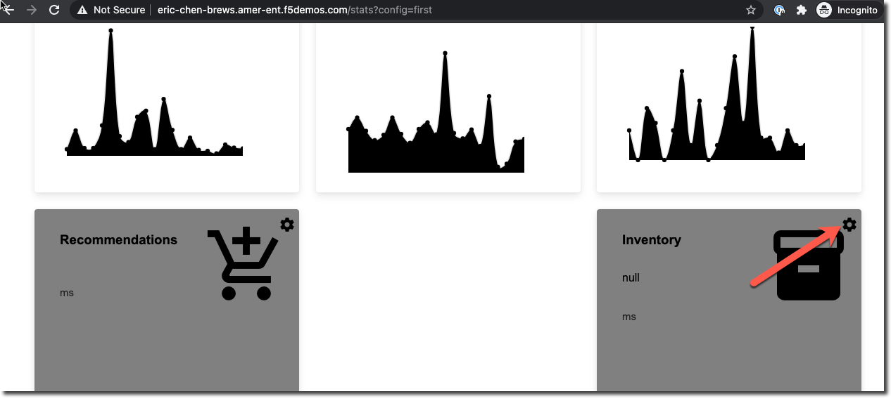
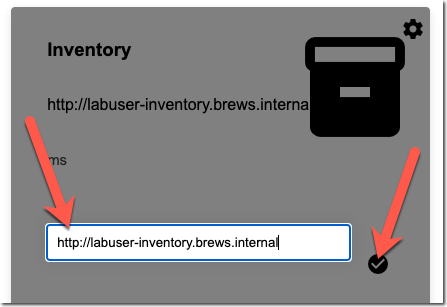

Internal HTTP Load Balancer
===========================

Previously we deployed a public HTTP Load Balancer to direct traffic to the 
single-page application.  Next we will deploy an internal/private HTTP Load
Balancer that will be used to serve the inventory application.

Inventory Application
~~~~~~~~~~~~~~~~~~~~~~~

Now you are ready to set up an HTTP Load Balancer to serve the inventory application.

Exercise 1: Create an HTTP Load Balancer
~~~~~~~~~~~~~~~~~~~~~~~~~~~~~~~~~~~~~~~~

#. Start in VoltConsole and switch to the Application context. 

    |app-context|

#. Navigate the menu to go to "Manage"->"HTTP Load Balancers" and click on "Add HTTP Load Balancers".

    |http_lb_menu| |http_lb_add|

#. Configure HTTP Load Balancer

    Now you will create an HTTP load balancer configuration. Enter the following variables:

    ================================= =====
    Variable                          Value
    ================================= =====
    Name                              inventory
    Domains                           your_namespace-inventory.brews.internal
    Select type of Load Balancer      HTTP
    Automatically Manage DNS Records  No/Un Checked 
    ================================= =====

    |http_lb|

Exercise 2: Configure Origin Server (for UDF)
~~~~~~~~~~~~~~~~~~~~~~~~~~~~~~~~~~~~~~~~~~~~~

    Now you will configure the Default Origin Server used by the load balancer.  
    
    #. Click on the *Configure* link under the *Default Origin Servers* section.

    #. Click the *Add Item* button.

    #. In the Origin Pool drop down, click *Create new pool*. 

    #. Enter the following variables:

      ================================= =====
      Variable                          Value
      ================================= =====
      Name                              inventory-pool
      Select Type of Origin Server      IP address of Origin Server on given Sites
      IP                                10.1.1.4
      Site                              your_namespace-udf
      Select Network on the site        Outside Network
      Port                              8082
      ================================= =====

      |http_lb_origin_pool_config|

#. Configure Origin Pool Health monitor
    #. In the *List of Health Check(s)* section click the *Add item* button.
    #. Click the *Health Check object* dropdown list. 
    #. Click the *Create new healthcheck* button.
    #. Enter the following variables:

        ========= =====
        Variable  Value
        ========= =====
        name      inventory
        ========= =====

    #. Click the *configure* button under HTTP Health Check and enter the following variables:

        ========= =====
        Variable  Value
        ========= =====
        path      /api/stats
        ========= =====
    
    #. Click the *Apply* button.
    #. Click the *Continue* button.
    #. Click the *Continue* button.
    #. Click the *Apply* button.

Exercise 3: Configure Second Origin Pool (for AWS)
~~~~~~~~~~~~~~~~~~~~~~~~~~~~~~~~~~~~~~~~~~~~~~~~~~~

    #. Under "Origin Servers" click on *Add item*
    #. Enter the following variables:

      ================================= =====
      Variable                          Value
      ================================= =====
      Select Type of Origin Server      K8s Service Name of Origin Server on given Sites
      Service Name                      brews-inv.[your namespace]
      Site                              the AWS site name configured in the previous lab
      Select Network on the site        vK8s Networks on Site
      ================================= =====

    .. note:: Be sure to use the value of "[your namespace]" this is how Volterra identifies the resource

    #. Click *Continue*.
    #. Click *Apply* (This should take you back to the main HTTP LB screen, stop here).

Exercise 4: Configure Custom VIP Configuration 
~~~~~~~~~~~~~~~~~~~~~~~~~~~~~~~~~~~~~~~~~~~~~~~~

Unlike when you created a public HTTP LB this needs to be configured
to only listen on the internal network of the UDF and AWS sites.  
    
#. Under VIP Configuration click on *Show Advanced Fields*.
#. From the "Select" menu change the value to "Advertise Custom"
   |http_lb_custom_vip|
#. Click on *Configure* under "Advertise Custom".
#. Enter the following variables:
    ================================= =====
    Variable                          Value
    ================================= =====
    Select Where to Advertise         Site (default value)
    Site Network                      Outside Network
    Site                              [unique name]-udf
    IP address                        [leave blank, default value]
    TCP Listen Port Choice            Use Default TCP Listen Port (default value)
    ================================= =====
#. Click on *Add Item*. 
#. Enter the following variables:
    ================================= =====
    Variable                          Value
    ================================= =====
    Select Where to Advertise         Site (default value)
    Site Network                      Outside Network
    Site                              [unique name]-aws
    IP address                        [leave blank, default value]
    TCP Listen Port Choice            Use Default TCP Listen Port (default value)
    ================================= =====
#. Click on *Apply*.
#. Click on *Save and Exit*.

Exercise 5: Verify Internal LB is working 
~~~~~~~~~~~~~~~~~~~~~~~~~~~~~~~~~~~~~~~~~~

You will need to now reconfigure the "brews" app to use the inventory application.

#. Navigate to the "stats" page of the brews app. Click on the gear icon next to "inventory".

|brews-app-inventory-settings|

#. Enter the value for the internal URL "http://your_namespace-inventory.brews.internal". Click on the checkmark icon.

|brews-app-inventory-config|

The "API" application will now use the internal LB to communicate with the inventory service.  

The configuration of the inventory LB is set to prefer the origin of the site.  This should result in the 
following pattern of traffic.

- AWS API Service -> AWS Inventory Service
- UDF API Service -> UDF Inventory Service

If you disable the Inventory Service in AWS, all traffic will go to the remaining UDF site.

.. |app-context| image:: images/app-context.png

.. |http_lb_add| image:: images/http_lb_add.png

.. |http_lb_origin_pool_config| image:: images/http_lb_origin_pool_config.png

