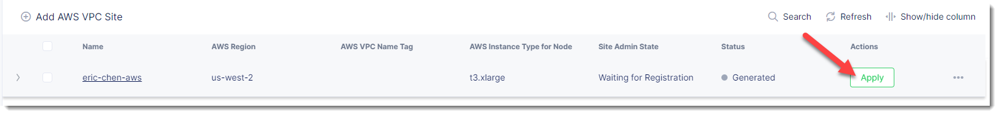
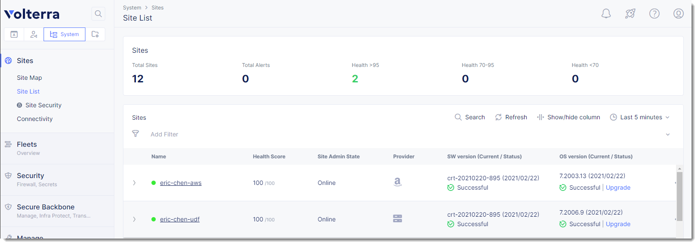

AWS Site
========

Previously for the "on-prem" site you needed to manually provision and configure 
a node for use with VoltConsole.  Deploying a site in AWS, Azure, and Google Cloud Platform
uses a process that automates the steps of deploying the site.  This enables VoltConsole
to perform the deployment on behalf of the end-user (you can also use Terraform to deploy a 
site, but that will be covered in a separate lab).

Exercise 1: Deploy AWS Site
~~~~~~~~~~~~~~~~~~~~~~~~~~~

In your lab environment an AWS VPC site has already been deployed.

You will need to retrieve information about this environment before deploying
your Volterra site.  

From your UDF environment access the "Client" host either via SSH or Web Shell.

Run the following commands to get the necessary information.

.. code-block:: Shell
  
  $ cd f5-volterra-labs-101/terraform/
  $ terraform output
    EXTERNAL_SUBNET_ID = "subnet-0b97da84a39c38aa1"
    INTERNAL2_SUBNET_ID = "subnet-0425edbdd121f0cf0"
    INTERNAL_SUBNET_ID = "subnet-0bb37ea062001b919"
    _VPC_ID = "vpc-0e79ef1cd3b8b86e9"

If you are using the "Web Shell" you can highlight the output to copy it into your 
clipboard.

.. image:: web-shell-copy-terraform-output.png

From the UDF interface click on the "Cloud Accounts" tab.  Copy down the value of API Key/Secret.
You will use these values later to provision the Volterra node from VoltConsole.

.. image:: udf-cloud-accounts-api-key.png

From VoltConsole go to the "System" namespace, "Site Management" -> "AWS VPC Sites".

.. image:: voltconsole-aws-site.png

Under "New AWS Site" you will need to provide the following information:

- AWS Region: us-west-2
- Change from "New VPC Parameters" to "Existing VPC ID"
- Existing VPC ID specify the "_VPC_ID" value that you collected earlier
- Change "Ingress Gateway" to "Ingress/Egress Gateway (Two Interface)"
- Click on "Configure" (appears after "Select Ingress Gateway...)

Under the section for "Nodes" provide the following information

- AWS AZ Name: us-west-2a
- Subnet Choices for Inside Interface change to "Subnet for Inside Interface"
- Change from "New Subnet" to "Existing Subnet ID"
- Enter the value of "INTERNAL_SUBNET_ID"
- Under "Workload Subnet" also change to "Existing Subnet ID" and enter "INTERNAL2_SUBNET_ID"
- Under "Subnet for Outside Interface" also change to "Existing Subnet ID" and enter "EXTERNAL_SUBNET_ID"

Click on "Apply"

Under "Automatic Deployment" use the select list to click on the "Create new aws cred".  Give 
the credential a name (i.e. [unique namespace]-cc)  Enter 
the API Key/Secret that you captured earlier from the UDF Cloud Accounts.  After you fill in the
Secret Key you will need to click on "Blindfold" then "Apply" and then "Continue"

The resulting inputs should look something like the following (do not copy these values, yours will
differ).

.. image:: voltconsole-aws-site-settings.png

Then click on "Save and Exit"

In this state the site is ready to be deployed.  You will need to click on "Apply" to start the 
provisioning of the resource.  You can also use this interface to decommission the resource as well.

In VoltConsole browse to "Sites->Site List" under the "System" namespace to view your sites.

After several minutes you should see both your UDF and AWS sites appear green in VoltConsole.

