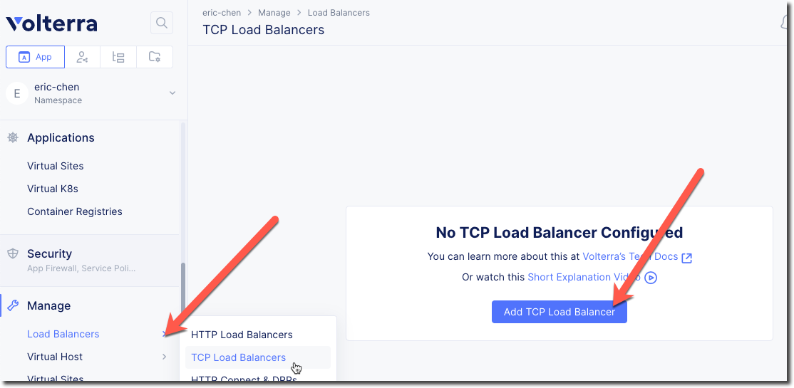

TCP Load Balancer
=================

On of the requirements from the "Narrative" is to enable the frontend application
in AWS to communicate with the backend application that is on-prem.

The frontend application makes use of DNS to determine the IP address of the backend
application.  In the on-prem environment the name "backend.example.local" resolves to
the backend IP of 10.1.1.4.

In the AWS environment we want to resolve the name "backend.example.local" to resolve to
the IP address of the Volterra Gateway (VG).  The VG will host a Virtual IP (VIP) that will
host a TCP Load Balancer that will proxy traffic back to the original backend application.

Application Name Space
~~~~~~~~~~~~~~~~~~~~~~

Up to this point we have been using the "System" namespace to access resources.  We will now 
change to the "Application Namespace".  Start by clicking on the upper right "App" icon.
Click on the first namespace and use the search to find your own namespace.

.. image:: app-namespace-select.png

Navigate the menu to go to "Manage"->"TCP Load Balancers" and click on "Add TCP Load Balancers".

.. note:: This may appear differently if there is an existing LB resource

