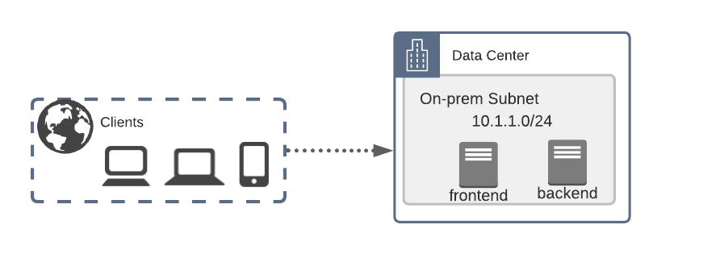
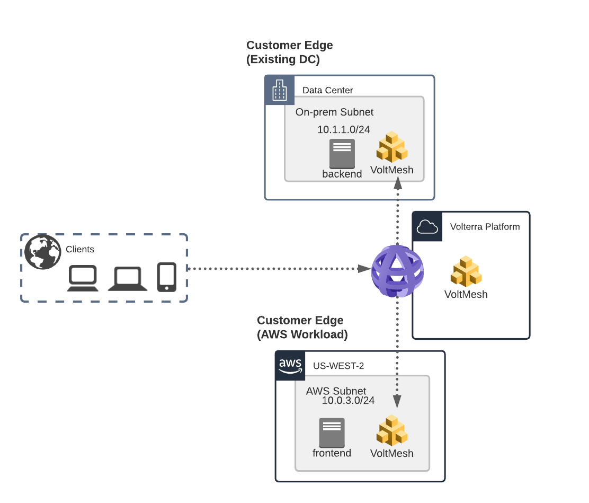
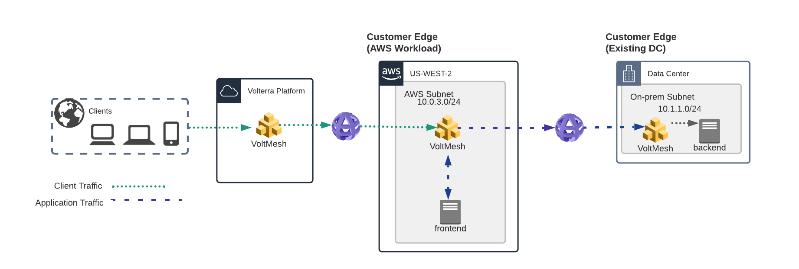

F5 Volterra Networking 101
==========================

This Lab environment highlights some of the basic concepts of VoltMesh.

During the lab you will be emulating a customer that needs to extend an
existing on-premises internal application to a Public Cloud environment.
The goal is to securely extend the application into the cloud environment
and have it highly availabe in both on-prem/cloud simultaneously.

Narrative
~~~~~~~~~

In this example we are starting with an "on-premise" Data Center.

The "frontend" application has a requirement that it must be able to 
communicate with the "backend".  The "backend" could be a database, legacy system, etc.

The goal is to extend the environment into AWS and still allow the "frontend" to
connect to the backend.  The following topology is deployed where VoltMesh is deployed
in both the on-premises and AWS environment.

Once you have deployed the AWS environment and deployed two VoltMesh sites you will utilize
a Volterra TCP Load Balancer to privately connect from AWS to on-premises and a HTTP Load Balancer 
to connect publicly from a Regional Edge (AnyCast IP) to the frontend in AWS.

Lab Environment
~~~~~~~~~~~~~~~

The on-premises environment is emulated by using a UDF environment that contains NGINX
resources.

The cloud environment is emulated by using a UDF Cloud Account in AWS that contains
NGINX resources.

.. toctree::
   :maxdepth: 1
   :caption: Contents:

   lab1/index
   lab2/index
   lab3/index
   lab4/index
   lab5/index

