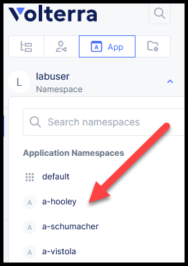
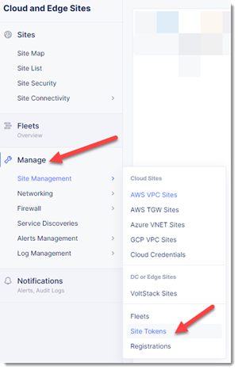
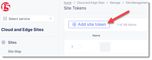
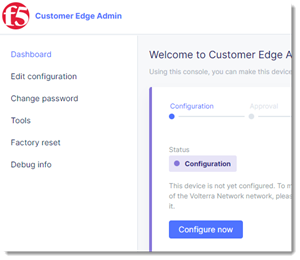
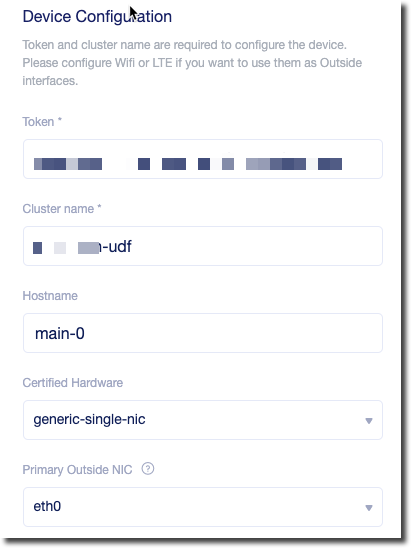
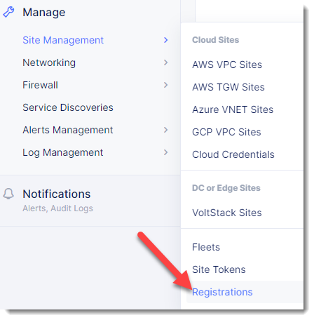

VoltConsole
===========

VoltConsole is a SaaS control-plane for Volterra services that provides a UI and API for managing network, security, and compute services.

It can be used to manage "sites" in existing on-prem data centers as well as manage sites in AWS, Azure, and GCP cloud environments.

Using VoltConsole an end-user can centrally manage a distributed application environment.

Exercise 1: Find your Namespace
~~~~~~~~~~~~~~~~~~~~~~~~~~~~~~~

You should have already been granted access to a Volterra tenant.

After you login you will need to identify the namespace that has been 
allocated to you.  It will be the user part of your F5 email address with "." replaced by "-".  
For example if your email address is a.hooley @ f5.com, there is a namespace of
"a-hooley".  Take note of this name and use it in later steps to make it 
easier for others to distinguish between resources in shared namespaces.

.. note:: Namespace is a term commonly used in Kubernetes.  It can be thought of as a grouping of resources.

Exercise 2: Create a Site Token
~~~~~~~~~~~~~~~~~~~~~~~~~~~~~~~

Next you will need to change to the "System" namespace.

.. image:: system-namespace.png

Once in the "System" namespace you will need to go to the "Site Management"
menu and select "Site Tokens".

Click on "Add Site Token".

Provide a name for the token.  You can use the same unique name that was 
assigned for your namespace (i.e. first initial-lastname).

Record the "UID" that is created.  You will later use this when you add a site.

Exercise 3: Add a Site
~~~~~~~~~~~~~~~~~~~~~~~~

From your UDF Deployment find your "volterra" component and click on "Site UI".

.. image:: udf-site-ui.png

The local Volterra Node UI will prompt you to login:

        =================== =====
        Variable            Value
        =================== =====
        Username            admin
        Password            Volterra123
        =================== =====
    
Change the default password 

You will next need to click on "Configure Now".

You will need to provide the following information.

- Token: [use one created previously]
- Cluster Name: [unique name]+udf
- Hostname: main-0
- Certified Hardware: kvm-multi-nic-voltmesh
- Primary Outside NIC: eth0
- Latitude/Longitude

.. note:: 
        
        Volterra uses the latitude/longitude of a site to assist in finding the closest
        geographic Regional Edge locations.  The following is meant to help you find
        a location that is close to the UDF deployment location that you selected.

        One method of finding a location is to search Google Maps, right click and 
        highlight the GPS coordinates.  This will copy the values into your clipboard.

        .. image:: geolocation.png

        Pick a location that is geographically similar to where you selected your UDF
        deployment (i.e. for Virginia, USA search for Washington Monument, DC)

        You could also use a regional office (vs. your home address) as a location
        https://www.f5.com/company/contact/regional-offices

        Once you have a reasonable set of latitude/longitude you can proceed.

        FYI the F5 Seattle office coordinates:  47.6, -122.3

You can then click on "Save Configuration". 

You will then need to go back to VoltConsole to "Accept" the registration.

You will need to go under "System->Site Management->Registrations".

Click on the "checkmark" icon to accept the registration.

.. image:: registrations-accept.png

You can then click on "Accept" to use the default values (we will modify
these in a later lab).

This will start the process of loading the Volterra software that is 
necessary to connect the site to a Volterra Regional Edge site.

It will take several minutes
for this to complete.  You can continue to the next lab while you wait for
it to complete.

