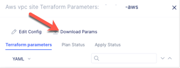

.. _Assisted Deployment:

Assisted Deployment
===================

This is an optional lab exercise that goes through an "Assisted Deployment".  This
allows you to deploy a Volterra site without the need to share your AWS credentials
with the Volterra Console.  Instead you will deploy a site from the Volterra terraform
container that can be run on your local workstation.

The following is adapted from: https://www.volterra.io/docs/how-to/site-management/create-aws-site

Download Terraform Parameters
~~~~~~~~~~~~~~~~~~~~~~~~~~~~~

When creating an AWS VPC Site make sure that you select "Assisted Deployment" instead of "Automated Deployment".

After you save the site you will need to download the Terraform parameters.

- Download the terraform variables in case of assisted deployment. Navigate to the created AWS VPC site object using the Manage -> Site Management -> AWS VPC Site path.
- Find your AWS VPC site object and click ... -> Terraform Parameters for it. Copy the parameters to a file in your local machine.

.. image:: voltconsole-download-tf-params.png

API Certificate
~~~~~~~~~~~~~~~

From the top right of the Volterra Console click on the "Account" icon.

Click on "My Account"

On the menu on the left click on "Credentials".

.. image:: volterra-console-credentials-menu.png

Click on "Create Credentials"

Enter the requested information for

- Name: [unique name]-api
- Credential type: API Certificate
- Password: [this password will be used to encrypt the certificate]
- Expiry Date: Desired expiration Date

.. image:: volterra-console-labuser-credentials.png
  

Click on "Download" to download the certificate as a .p12 file.

Docker container
~~~~~~~~~~~~~~~~

.. note:: This assumes that you have already installed Docker on your workstation/server.

Next you will want to run the latest version of the Volterra terraform container.

.. code-block:: shell
  
  $ docker pull gcr.io/volterraio/volt-terraform:latest

After this completes you can run 

.. code-block:: shell
  
  $ docker run --entrypoint tail --name terraform-cli -d -it -w /terraform/templates -v ${HOME}/.ssh:/root/.ssh gcr.io/volterraio/volt-terraform:latest -f /dev/null

You can next run the following command to enter the docker container.

.. code-block:: shell
  
  $ docker exec -it terraform-cli sh

You can run some commands to explore what is in the container.

.. code-block:: shell
  
  $ /terraform/templates #
    /terraform/templates # ls
    ce-multi-2nic-azure   ce-single-2nic-aws    ce-single-aws         ce-single-vsphere     quickstart-webapp
    ce-multi-aws          ce-single-2nic-azure  ce-single-azure       hello-cloud           self-serve
    ce-multi-azure        ce-single-2nic-gcp    ce-single-gcp         hello-edge            views

In a different terminal window you can copy into the container your API Certificate and terraform parameters file.

.. code-block:: shell
  
  $ docker cp /Users/labuser/Downloads/[tenant name].console.ves.volterra.io.api-creds.p12 terraform-cli:/var/tmp
  $ docker cp /Users/labuser/Downloads/system-labuser-aws.json terraform-cli:/var/tmp

You can then change into the desired template to deploy the site.

.. code-block:: shell
    
    /terraform/templates # cd views/aws-volt-node/
    /terraform/templates/views/aws-volt-node # terraform init
    /terraform/templates/views/aws-volt-node # terraform plan -var-file=/var/tmp/system-labuser.json
    /terraform/templates/views/aws-volt-node # terraform apply -var-file=/var/tmp/system-labuser.json

Note that you may need to specify an existing S3 bucket that will be used to store the terraform state files.

Once the terraform completes you should be able to the nodes appear in VoltConsole.