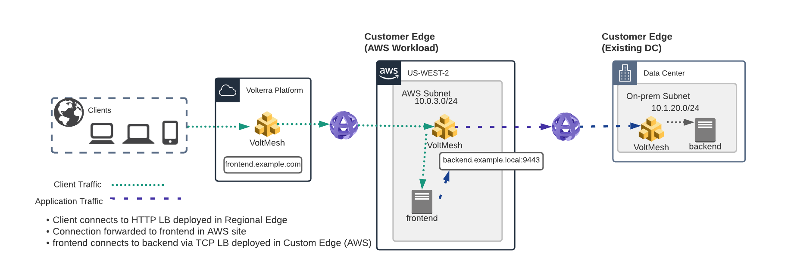
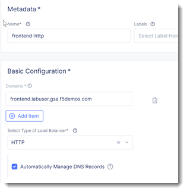
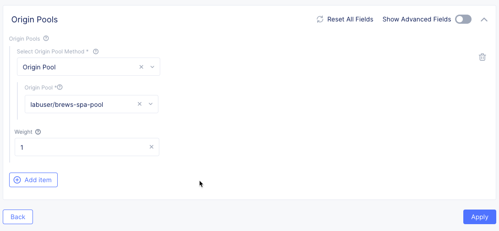
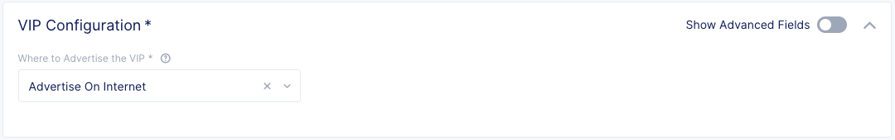
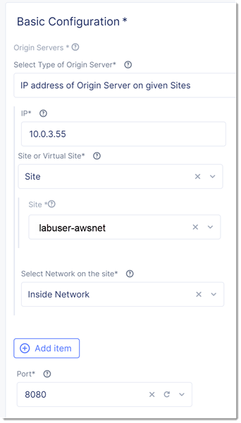
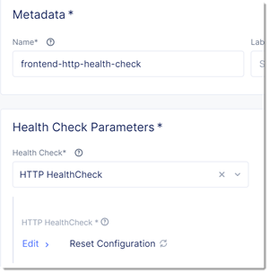

HTTP Load Balancer
==================

In the previous steps you created the necessary connection for the frontend
application to securely communicate with the backend application.  The next
steps will expose the frontend service to the public through a Volterra 
Regional Edge.

You will first create an origin pool for your frontend application in AWS.

Afterwards you will create a HTTP Load Balancer that will reference your origin pool 
and expose the service on Volterra's Regional Edge.

Regional Edge
~~~~~~~~~~~~~

A Regional Edge (RE) is part of Voltera Global Network that provides connectivity 
to services.  Previously when we deployed the UDF / AWS sites these were considered
"Customer Edge (CE)" and they make use of RE to communicate (each CE is associated with 
two RE).

Exercise 1:  Origin Pool
~~~~~~~~~~~~~~~~~~~~~~~~~~~~~~~~~~~
We will first create an Origin Pool that refers to the frontend application service running in our AWS site.

#. Start in VoltConsole and switch to the Application context. 

    |app-context|

#. Navigate the menu to go to "Manage"->"Load Balancers"->"Origin Pools". Click on *Add Origin Pool*.
 
    |op-add-pool|

#. Enter the following variables:

    Use the private IP address for the workload instance that you created in the previous exercise.

    ================================= =====
    Variable                          Value
    ================================= =====
    Name                              frontend-http
    Select Type of Origin Server      IP address of Origin Server on given Sites
    IP                                10.0.3.XX
    Site                              [unique name]-awsnet
    Select Network on the site        Inside Network
    Port                              8080
    ================================= =====

    |op-pool-basic|

#. Under the *List of Health Check(s)* section, click the *Add item* button.

#. Click the *Health Check object* dropdown list. Click the *Create new healthcheck* button.

#. Enter the following variables:

    ========= =====
    Variable  Value
    ========= =====
    name      frontend-http-health-check
    ========= =====

    |op-spa-check|

#. Click the *configure* button under "HTTP Health Check"

#. Click *Apply* to exit the "Health Check HTTP Parameters" dialogue.
#. Click *Continue* to return to the "Origin Pool" configuration.
#. Click the *Save and Exit* button to create the Origin Pool.

Exercise 2: HTTP Load Balancer Configuration
~~~~~~~~~~~~~~~~~~~~~~~~~~~~~~~~~~~~~~~~~~~~

#. Start in VoltConsole and switch to the Application context. 

    |app-context|

#. Navigate the menu to go to "Manage"->"HTTP Load Balancers" and click on "Add HTTP Load Balancers".

    |http_lb_menu| |http_lb_add|

#. Enter the following variables:

    ================================= =====
    Variable                          Value
    ================================= =====
    Name                              frontend-http
    Domains                           frontend.[unique name].[supplied domain name for your tenant]
    Select type of Load Balancer      HTTP
    Automatically Manage DNS Records  Yes/Check 
    ================================= =====

    |lb-basic|

    .. note::
      If your tenant does not use a delegated domain you can disable the option to automatically manage DNS records.
      You can supply an arbitrary domain (example.com) and later you can use the supplied ves.io name to verify.

Exercise 3: Configure Default Origin Server
~~~~~~~~~~~~~~~~~~~~~~~~~~~~~~~~~~~~~~~~~~~
We'll next configure the "Default Origin Servers". 
    
#. Click on the *Configure* link under the *Default Origin Servers* section.

#. Click the *Add Item* button.

#. The "Select Origin Pool Method" will be set to "Origin Pool". Under the "Origin Pool" dropdown menu select the "brews-spa-pool" you created earlier.
 
#. Click the *Apply* button to exit the "Origin Pools" dialogue.

#. Notice that in the "VIP Creation" section *Advertise On Internet* has been selected by default.

    |lb-vip|

#. Click "*Save and Exit* to create the HTTP Load Balancer.

Once the HTTP Load Balancer has been deployed, you should now be able to go to the DNS name that you entered 
previously in a web browser.  The FQDN we used in our example is http://frontend.labuser.gsa.f5demos.com.  
Your FQDN should follow the format of frontend.[unique name].[supplied domain name for your tenant].

The demo app should look like the following:

.. code-block::
    
    ================================================
    ___ ___   ___                    _
    | __| __| |   \ ___ _ __  ___    /_\  _ __ _ __
    | _||__ \ | |) / -_) '  \/ _ \  / _ \| '_ \ '_ \ 
    |_| |___/ |___/\___|_|_|_\___/ /_/ \_\ .__/ .__/
                                        |_|  |_|
    ================================================

        Node Name: AWS Environment
        Short Name: ip-10-0-3-14

        Server IP: 10.0.3.14
        Server Port: 8080

        Client IP: 10.0.3.29
        Client Port: 51201

    Client Protocol: HTTP
    Request Method: GET
        Request URI: /

        host_header: frontend.[unique name].[tenant domain]
        user-agent: Mozilla/5.0 (Macintosh; Intel Mac OS X 11_2_0) AppleWebKit/537.36 (KHTML, like Gecko) Chrome/88.0.4324.192 Safari/537.36
    x-forwarded-for: 192.0.2.10

If you append "/backend/" to the URL you should see the following output 
that shows how the "frontend" application is able to connect to the "backend"
via the TCP Load Balancer.

.. code-block::
    
    ================================================
    ___ ___   ___                    _
    | __| __| |   \ ___ _ __  ___    /_\  _ __ _ __
    | _||__ \ | |) / -_) '  \/ _ \  / _ \| '_ \ '_ \ 
    |_| |___/ |___/\___|_|_|_\___/ /_/ \_\ .__/ .__/
                                        |_|  |_|
    ================================================

        Node Name: UDF Environment (Backend App)
        Short Name: ubuntu

        Server IP: 10.1.1.4
        Server Port: 8443

        Client IP: 10.1.1.6
        Client Port: 52595

    Client Protocol: HTTPS
    Request Method: GET
        Request URI: /txt

        host_header: backend.example.local
        user-agent: Frontend App/1.0
    x-forwarded-for: 10.0.3.29

.. |app-context| image:: app-context.png
.. |http_lb_menu| image:: http_lb_menu.png
.. |http_lb_add| image:: http_lb_add.png
.. |http_lb| image:: http_lb.png
.. |http_lb_origin_pool_config| image:: http_lb_origin_pool_config.png
.. |http_lb_origin_pool_health_check| image:: http_lb_origin_pool_health_check.png

.. |lb-route1| image:: lb-route1.png
.. |lb-op-api| image:: lb-op-api.png
.. |lb-route2| image:: lb-route2.png

.. |op-add-pool| image:: op-add-pool.png

.. |origin_pools_menu| image:: origin_pools_menu.png
.. |origin_pools_add| image:: origin_pools_add.png
.. |origin_pools_config| image:: origin_pools_config.png
.. |origin_pools_config_api| image:: origin_pools_config_api.png
.. |origin_pools_config_mongodb| image:: origin_pools_config_mongodb.png
.. |origin_pools_show_child_objects| image:: origin_pools_show_child_objects.png
.. |origin_pools_show_child_objects_status| image:: origin_pools_show_child_objects_status.png
.. |http_lb_origin_pool_health_check| image:: http_lb_origin_pool_health_check.png
.. |http_lb_origin_pool_health_check2| image:: http_lb_origin_pool_health_check2.png