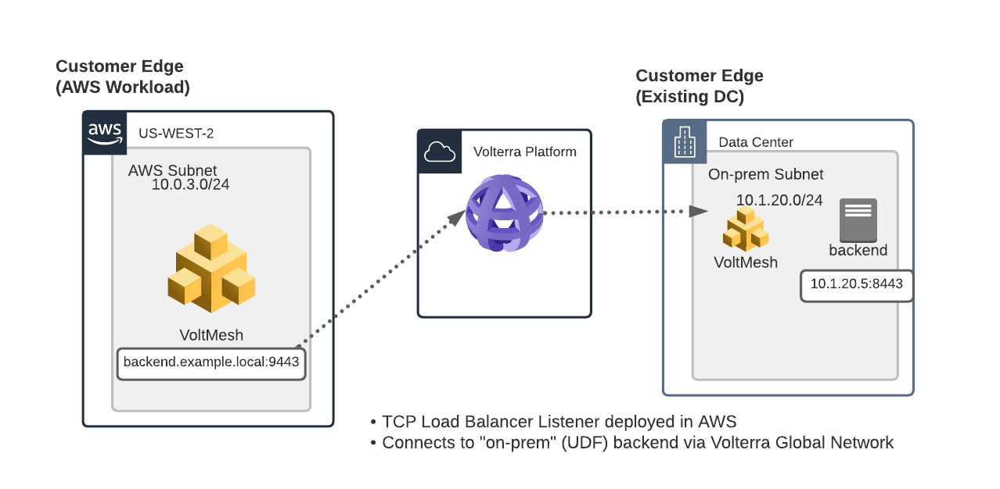
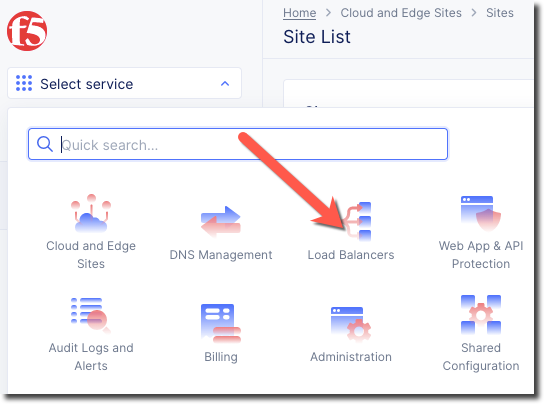
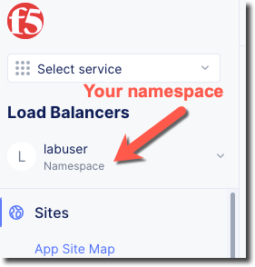
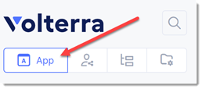
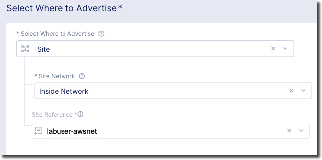

TCP Load Balancer
=================

On of the requirements from the "Narrative" is to enable the frontend application
in AWS to communicate with the backend application that is on-prem.

The frontend application makes use of DNS to determine the IP address of the backend
application.  In the on-prem environment the name "backend.example.local" resolves to
the backend IP of 10.1.20.5.

In the AWS environment we want to resolve the name "backend.example.local" to resolve to
the IP address of the Volterra Gateway (VG).  The VG will host a Virtual IP (VIP) that will
host a TCP Load Balancer that will proxy traffic back to the original backend application.

Load Balancers
~~~~~~~~~~~~~~

Next we will change to the "Load Balancers" menu.

Ensure that you are still in your assigned namespace.

Exercise 1: Origin Pool
~~~~~~~~~~~~~~~~~~~~~~~~~~~~~~~~~~~~~~~

#. Navigate the menu to go to *Manage* -> *Load Balancer*, then click *Origin Pools*.

    |origin_pools_menu|

#. Click the *Add Origin Pool* button.

    |origin_pools_add|

    
#. Enter the following variables:

=============================== ===============
Variable                        Value
=============================== ===============
Origin Pool Name                backend-tcp
Port                            8443
=============================== ===============

#. Click on "Add Item" under "Origin Servers*"

#. Enter the following variables 

=============================== ===============
Variable                        Value
=============================== ===============
Select Type of Origin Server    IP address of Origin Server on given Sites
IP address                      10.1.20.5
Site                            Your UDF site
Select Network on the site      Inside Network
=============================== ===============

#. Under the *List of Health Check(s)* section, click on "Add Item"

#. Click the *Select healthcheck* dropdown.

#. Click the *Create new Healthcheck* button.

#. Enter the following variables:

=============================== ===============
Variable                        Value
=============================== ===============
Name                            backend-tcp-health-check
Health Check                    TCP HealthCheck
=============================== ===============

#. Click on the "Configure" button to open the dialog to adjust timeout settings then click "Apply"
#. Click the *Continue* button to close the *Health Check Parameters* dialogue. 

#. Click the *Save and Exit* button to close the *Origin Pool* dialogue.

Exercise 2: Create Backend TCP Load Balancer
~~~~~~~~~~~~~~~~~~~~~~~~~~~~~~~~~~~~~~~~~~~~~

#. Navigate the menu to go to *Manage* -> *Load Balancer*, then click *TCP Load Balancers*.

    |tcp_lb_menu|

#. Click the *Add TCP Load Balancer* button.

#. Enter the following variables:

    ==============================  =====
    Variable                        Value
    ==============================  =====
    Name                            backend
    ==============================  =====

#. Under "Domains" click on "Add item"

#. Enter the following variables:

    ==============================  =====
    Variable                        Value
    ==============================  =====
    Domain                          backend.example.local
    ==============================  =====    

#. After "Domains" enter the following variables

    ==============================  =====
    Variable                        Value
    ==============================  =====
    Listen Port                     9443
    Where to Advertise the VIP      Advertise Custom
    ==============================  =====

#. Configure Origin Pools

    #. Under the *Origin Pools* section, click the *Configure* link.
    #. Click the *Add item* button.
    #. Select the *backend-tcp* pool.
    #. Click the *Apply* button to close the *Origin Pools* dialogue.

#. Configure Advertisement 

    #. Under *Advertise Custom* click the *Configure* link.
    #. You will need to add a site:
            
            =========================== =====
            Variable                    Value
            =========================== =====
            Select Where to Advertise   Site
            Site Network                Inside Network
            Site Reference              [unique name]-awsnet
            =========================== =====

        |tcp_lb_advertise|

    #. Click the *Apply* button to exit the *Advertise Custom* dialogue.

    |tcp_lb_config|

#. Click the *Save and Exit* button to exit the *TCP Load Balancer* dialogue.

.. |tcp_lb_menu| image:: tcp_lb_menu.png
.. |tcp_lb_config| image:: tcp_lb_config.png

.. |origin_pools_menu| image:: origin_pools_menu.png
.. |origin_pools_add| image:: origin_pools_add.png
.. |origin_pools_config_mongodb| origin_pools_config_mongodb.png
