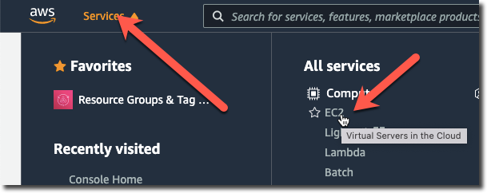
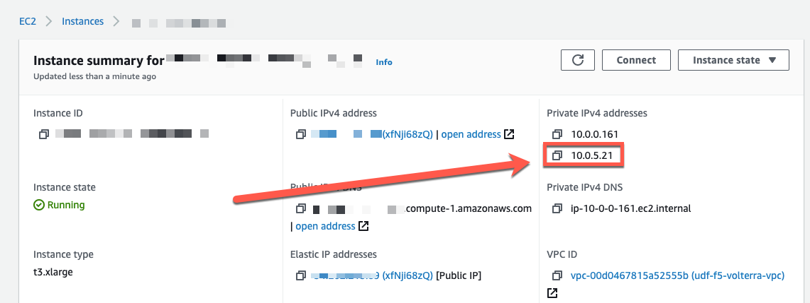

Deploy Workload (frontend)
==========================

In the previous step you created a TCP Load Balancer object that made the backend 
service available via the Volterra Gateway.  You will next deploy a "frontend"
application that will use the TCP Load Balancer to access the backend service.

AWS Console
~~~~~~~~~~~

Before we can deploy the frontend application we will need to identify the IP address
of the Volterra Gateway.  This IP address will be used for internal DNS resolution as
well as the IP address of the VIP that was configured on the TCP Load Balancer previously.

From the UDF console you will need to find the "Cloud Accounts" tab that contains  the
username/password that you will be using to access the AWS Console.

.. image:: aws-console-password.png

From your UDF environment access the "Client" host either via SSH or Web Shell.

Run the following commands to get the URL for your AWS Console (note that the URL
from the "Cloud Accounts" tab may be set for the incorrect region).

.. code-block:: Shell
  
  $ cd ~/f5-volterra-labs-101/networking/terraform/
  $ terraform output
    ...
    AWS_CONSOLE = "https://XXXXX.signin.aws.amazon.com/console?region=us-east-1"
    AWS_INSTANCE = "192.0.2.10"
    EXTERNAL_SUBNET_ID = "subnet-0f8ec509e82e4d3f5"
    INTERNAL2_SUBNET_ID = "subnet-06c3611948fc6fc83"
    INTERNAL_SUBNET_ID = "subnet-066c974f0e37f0326"
    _VPC_ID = "vpc-05767b378021fdc6c"  

Open up the AWS Console URL (recommend using a private browsing window to avoid any existing AWS 
console sessions you may have) and enter the provided username/password.

Click on "EC2" under "Services".

Click on "Instances" and you should see two instances running.  Select the instance that is 
of type "t3.xlarge".  This is the primary node of your Volterra Gateway (in an HW deployment 
there would be multiple instances).

.. note:: 
  
  If you do not see any instances you may be in the incorrect AWS region.  The "AWS_CONSOLE" value 
  from running "terraform output" previously should contain the region (i.e. us-east-1).  You can
  also try "us-west-2" (fallback value).

Take note of the private ip of the internal interface.  It should be on the 10.0.3.0/24 network.
You will use the IP address next to configure your workload instance.

Deploy Workload
~~~~~~~~~~~~~~~

On the Ubuntu Client (via webshell or SSH) access the following directory.

.. code-block:: shell
  
  $ cd ~/f5-volterra-labs-101/networking/workload

This directory contains Terraform code that will deploy the frontend resource.  In 
the previous run of Terraform it also updated this directory to specify the VPC/Subnet
to deploy the workload resource.  You will need to provide the Private IP address of
the Volterra Gateway on the subnet that you deploy your workload.  The Private IP is the 
one that you previously captured while looking at the AWS Console.

run "terraform apply" and enter the private IP when prompted for the Volterra Gateway.

.. code-block:: shell
  
  ubuntu@ubuntu:~/f5-volterra-labs-101/networking/workload$ terraform apply
  var.volterra_gateway
    Enter a value: 10.0.3.XX

Enter "yes" when prompted.

You will then see an output that includes the IP address of the workload instance.
Record this IP address, you will need it in the next step when you configure the HTTP 
Load Balancer.

.. code-block:: shell
  
  Apply complete! Resources: 1 added, 0 changed, 0 destroyed.
  
  Outputs:
  
  workload_ip = "10.0.3.14"
