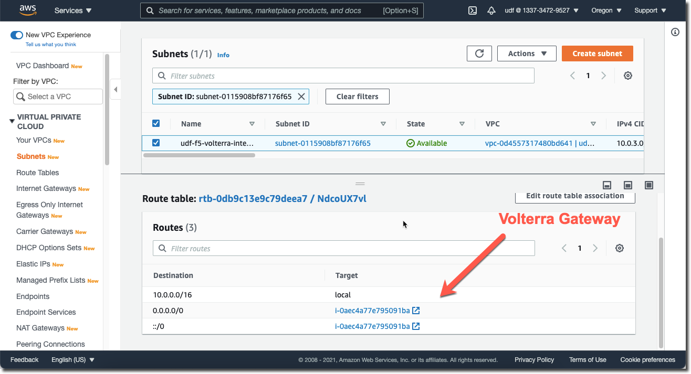

AWS Routing
===========

When you deploy an AWS Site it will automatically configure the "Internal" 
subnet to use the Volterra Gateway as its default gateway.

As an optional exercise you can verify this in the AWS Console by looking 
at the Route Table associated with the Internal Subnet.

Modify AWS Site Network Config
~~~~~~~~~~~~~~~~~~~~~~~~~~~~~~

We need to connect the AWS site to the "Global Network" that we previously 
created.  By default it will SNAT all traffic that originates from the AWS
site.

Under the System namespace go to Manage -> Site Management -> AWS VPC Sites 

Scroll to the right of your AWS site and click on the three dots "..." to 
select "Edit"

Under "Network Config" click on "Edit" and click on "Show Advanced Settings"

Change "Select Global Networks to Connect" to "Connect Global Networks".

Click on "Edit Global Network Connections".

- Select Network Connection Type: Direct, Site Local Inside to a Global Network
- Global Virtual Network: system/[unique name]-global

Click on Apply and save your changes.