Lab 2: Volterra Application Security: Service Policy
====================================================

The purpose of this lab is to extend the participant's ability to navigate the 
Volterra console, configure, and apply an application-level policy using service policy 
rules and service policy sets.  This an entry-level security configuration.   

PreRequisites:
--------------

-  Completed Security 101 Lab 1

-  A Volterra HTTP Load Balancer configured in Security 101 Lab 1

Objective:
----------

-  Gain an navigational understanding of Volterra Console and its key menus

-  Gain an initial understanding of Volterra's Application-Level Service Policies

-  Deploy and verfiy security configuration within Volterra Console 

Lab Requirements:
-----------------

-  All Lab requirements will be noted in the tasks that follow

-  Estimated completion time: 20 minutes

Configuration:
--------------
|image001| 

Lab 2 Tasks:
-----------------

TASK 1: Quick Intro - Intent Based Service Policy (Concept Review)
~~~~~~~~~~~~~~~~~~~~~~~~~~~~~~~~~~~~~~~~~~~~~~~~~~~~~~~~~~~~~~~~~~
(Block and Allow: IP Prefix, ASN, Geo)

Traditionally application policies are attached to a proxy construct like a load balancer. 
However, our approach is to decouple policy configuration from connectivity configuration. 
This allows the user to define intent rather than worry about packet flows and also makes 
it easier to reuse policies.

Service Policy set consists of many Services Policies and each Service Policy is comprised 
of many Rules. These Policies have two main concepts:

-  Server and Client - Server here is from the point of view of the policy. Server is a set of domains for which the policy is being written for. Client is a set that is consuming this service and at the other end of the connection. For example, server can be a domain in virtual host. Client can be set of ip address, a specific IP address, or a subnet/prefix, service name, or an arbitrary set.

-  Rules - Rules are applied to all requests to the Server from the Client. In the case of TCP Proxy with SNI, only server domain and Client can be matched. In case of HTTP and HTTPS proxies - domain, path, query parameters and HTTP headers can be matched. Requests can be allowed or denied based on this match.

An application may be comprised of many microservices or VMs. As a result, an application can be defined in terms of a set of virtual hosts with each application with its own service policy set.

Service policy works at request level for HTTP/HTTPS proxy, SNI level for TCP proxy with SNI, and IP level for TCP/UDP proxy. Policy is designed from the point of view of the proxy. The policy can be designed for a single proxy or a set of proxies or all proxies matching a given label expression.

TASK 3: Volt Console (General Navigation)
~~~~~~~~~~~~~~~~~~~~~~~~~~~~~~~~~~~~~~~~~
+----------------------------------------------------------------------------------------------+
| 1. Login to the Volterra Console: **https://www.volterra.io** and complete authentication.   |
|                                                                                              |
| 2. **Log In** > **Teams or Organization Plans** (This is specfic to region) > **Next**       |
|                                                                                              |
| 3. **Log in with Azure** (You must have completed your account onboarding process.)          |
|                                                                                              |
| *Note: Logging on as Tenant Owner provides tenant-wide administration priviledges.*          |
|                                                                                              |
| **Volterra Tenants**                                                                         |
|                                                                                              |
| ================================= ===================                                        |
| Name                              Volterra Tenant ID                                         |
| ================================= ===================                                        |
| GSA                               f5-gsa                                                     |
| SA                                f5-sa                                                      |
| Americas Enterprise               f5-amer-ent                                                |
| Americas Service Provider         f5-amer-sp                                                 |
| EMEA Enterprise                   f5-emea-ent                                                |
| EMEA Service Provider             f5-emea-sp                                                 |
| APCJ Enterprise                   f5-apac-ent                                                |
| APCJ Service Provider             f5-apac-sp                                                 |
| ================================= ===================                                        |
+----------------------------------------------------------------------------------------------+
| |image002|                                                                                   |
|                                                                                              |
| |image003|                                                                                   |
|                                                                                              |
| |image004|                                                                                   |
+----------------------------------------------------------------------------------------------+

+----------------------------------------------------------------------------------------------+
| 4. Review the **Volt Console** as presented. Your focused view maybe different.              |
|                                                                                              |
| 5. Click the **App** tab at the top of the left navigation. It is the **App View** and is    |
|    more centric to **Devops** **Personas**.                                                  |
+----------------------------------------------------------------------------------------------+
| |image005|                                                                                   |
+----------------------------------------------------------------------------------------------+

TASK 4: Creating a Service Policy
~~~~~~~~~~~~~~~~~~~~~~~~~~~~~~~~~
+----------------------------------------------------------------------------------------------+
| 1. The following describes the configuration workflow for creating an appplication firewall  |
|    which fundametally involves the following key steps:                                      |
|                                                                                              |
|    **Create Service Policy**: In case of client coming from public internet, implicit        | 
|    labels like Geo-IP Country or Geo-IP City Geo-IP Region can be used. The Geo-IP data is   | 
|    sourced from the MaxMind free database. Geo-IP label can be used with the keys            | 
|    geoip.ves.io/country or geoip.ves.io/city or geoip.ves.io/region and the value as the     | 
|    selected from the choices.                                                                |
|                                                                                              |
| 2. In the Volterra Console, select the **App** view top left and select your namespace from  |
|    the *namespace* dropdown.                                                                 |
|                                                                                              |
| 3. Select **Security** > **Service Policy** > **Service Policies** from left navigation      |
|    flyout menu.                                                                              |
|                                                                                              |
| 4. Click **Add service policy** in the right-side, updated panel.                            |
+----------------------------------------------------------------------------------------------+
| |image006|                                                                                   |
+----------------------------------------------------------------------------------------------+

+----------------------------------------------------------------------------------------------+
| 5. In the **New: Service policy** window, enter the following values in the **Metadata** and |
|                                                                                              |
|    **Select Policy Rules** sections respectively.                                            |
|                                                                                              |
|    **Name**: Unique name (ex <username>-service-policy)                                      |
|                                                                                              |
|    **Attachment**: Any Server                                                                |
|                                                                                              |
| 6. In the **Select Policy Rules** section:                                                   |
|                                                                                              |
|    **Select Policy Rules**:  Allowed Sources                                                 |
|                                                                                              |
|    **Country List**:  United States (Or Country appropriate to your location), **Apply**     |
|                                                                                              |
| 7. Click the **Save and Exit** button.                                                       |
+----------------------------------------------------------------------------------------------+
| |image007|                                                                                   |
|                                                                                              |
| |image008|                                                                                   |
|                                                                                              |
| |image009|                                                                                   |
+----------------------------------------------------------------------------------------------+

TASK: 5: Attaching Service Policy to Load Balancer
~~~~~~~~~~~~~~~~~~~~~~~~~~~~~~~~~~~~~~~~~~~~~~~~~~
.. note:: We are going to use the load balancer created in Lab 01, but we will have to disable the WAF policy first.

+----------------------------------------------------------------------------------------------+
| 1. Remaining in the **App** view, select **Manage** > **Load Balancers** from left           |
|    navigation then select **HTTP Load Balancers** from the flyout menu.                      |
|                                                                                              |
| 2. Click **...** in the right-side of your previously created load balancer.                 |
|                                                                                              |
| 3. Click **Edit** in the resulting pop-up window.                                            |
+----------------------------------------------------------------------------------------------+
| |image010|                                                                                   |
+----------------------------------------------------------------------------------------------+

+----------------------------------------------------------------------------------------------+
| 4. In the **Edit: Load Balancer** window, scroll down to Security Configuration and set the  |
|     following:                                                                               |
|                                                                                              |
|    **Select Web Application Firewall (WAF) Config**: Disable WAF                             |
|                                                                                              |
|    **Service Policies**: Apply Specified Service Policies                                    |
|                                                                                              |
|    **Apply Specified Service Policies**: Click **Configure >**                               |
|                                                                                              |
+----------------------------------------------------------------------------------------------+
| |image011|                                                                                   |
|                                                                                              |
| |image012|                                                                                   |
+----------------------------------------------------------------------------------------------+

+----------------------------------------------------------------------------------------------+
| 5. In the updated window, set the **Policies** to the previously created Service Policy, then|
|    click **Apply**.                                                                          |
|                                                                                              |
| 6. Back on the updated **Edit: Load Balancer** window, click **Save and Exit**.              |
+----------------------------------------------------------------------------------------------+
| |image013|                                                                                   |
|                                                                                              |
| |image014|                                                                                   |
+----------------------------------------------------------------------------------------------+

TASK: 6: Testing
~~~~~~~~~~~~~~~~
.. note::  I am assuming you have some form of VPN that will allow you to test your site form
           Geographic regions outside of your own; Tor Browser, Hola, CyberGhost, etc. If you
           don't have a working VPN, you can always modify the allowed Country List in your 
           service policy.

+----------------------------------------------------------------------------------------------+
| 1. In a new browser window, navigate to the hostname previously defined.  This               |
|    should be **http://<username>-app.<delegated domain>**. Confirm its successful.           |
|                                                                                              |
| 2. Now turn on the VPN of your choice, select a region outside of your selection in the      |
|    service policy, and attempt to access your site again.                                    |
+----------------------------------------------------------------------------------------------+
| |image015|                                                                                   |
|                                                                                              |
| |image016|                                                                                   |
+----------------------------------------------------------------------------------------------+

TASK: 7: Clean-Up & End of Lab
~~~~~~~~~~~~~~~~~~~~~~~~~~~~~~
+----------------------------------------------------------------------------------------------+
| 1. In the Volterra Console, use the left navigation menu to naigate to **Manage** > **Load** |
|    **Balancers** and select **HTTP Load Balancers**.                                         |
|                                                                                              |
| 2. In the updated right window, locate the row of the HTTP Load Balancer created in Task 5,  |
|    Step 3 of Lab 1 and click the three dots **...** at the far right of the row, and then    |
|    click **Delete** in the resulting pop-up window.                                          |
+----------------------------------------------------------------------------------------------+
| |image017|                                                                                   |
+----------------------------------------------------------------------------------------------+

+----------------------------------------------------------------------------------------------+
| 3. In the Volterra Console, use the left navigation menu to navigate to **Manage** > **Load**|
|    **Balancers** and select **Origin Pools**.                                                |
|                                                                                              |
| 4. In the updated right window, locate the row of the Origin Pool created in Task 6, Step 7  |
|    of Lab 1 and click the three dots **...** at the far right of the row, and then click     |
|    **Delete** in the resulting pop-up window.                                                |
+----------------------------------------------------------------------------------------------+
| |image018|                                                                                   |
+----------------------------------------------------------------------------------------------+

+----------------------------------------------------------------------------------------------+
| 5. In the Volterra Console, use the left navigation menu to navigate to **Security** >       |
|    **Service Policy** and select **Service Policies**.                                       |
|                                                                                              |
| 6. In the updated right window, locate the row of the Service Policy created in              |
|    Task 4, Step 7 and click the three dots **...** at the far right of the row, and then     |
|    click **Delete** in the resulting pop-up window.                                          |
+----------------------------------------------------------------------------------------------+
| |image019|                                                                                   |
+----------------------------------------------------------------------------------------------+

+----------------------------------------------------------------------------------------------+
| 7. If you didn't delete the WAF policy that you created in Lab 1, please delete that as well |
|                                                                                              |
| 8. In the Volterra Console, use the left navigation menu to navigate to **Security** >       |
|    **App Firewall** and select **App Firewalls**.                                            |
|                                                                                              |
| 9. In the updated right window, locate the row of the App Firewall created in Task 5, Step 5 |
|    in Lab 1 and click the three dots **...** at the far right of the row, and then click     |
|    **Delete** in the resulting pop-up window.                                                |
+----------------------------------------------------------------------------------------------+
| |image020|                                                                                   |
+----------------------------------------------------------------------------------------------+

+----------------------------------------------------------------------------------------------+
| 10. This concludes this Lab, feel free to run through the lab again as needed.               |
+----------------------------------------------------------------------------------------------+
| |imageEND|                                                                                   |
+----------------------------------------------------------------------------------------------+

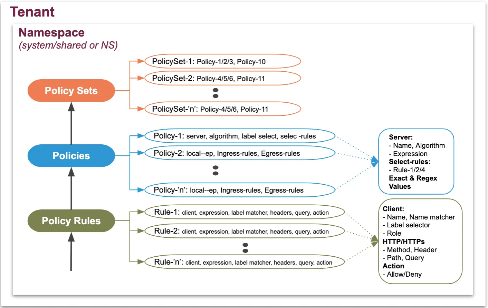
.. |image002| image:: media/lab02-002.png
   :width: 800px
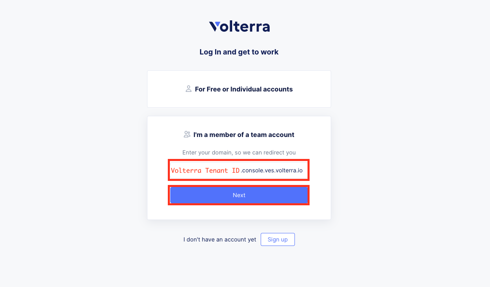
.. |image004| image:: media/lab02-004.png
   :width: 800px
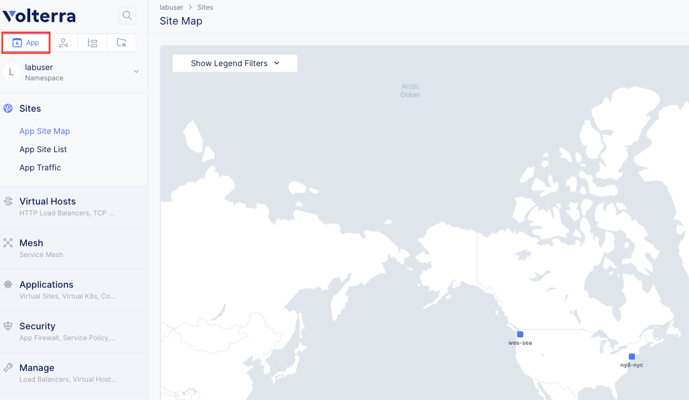
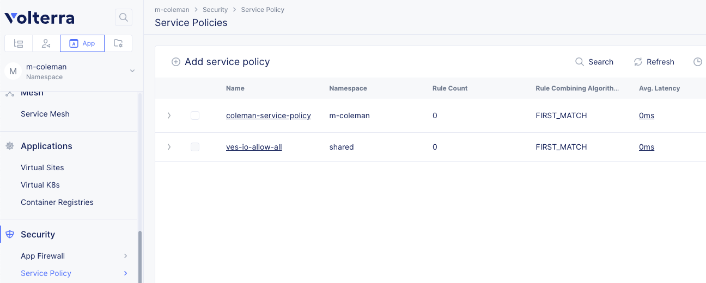
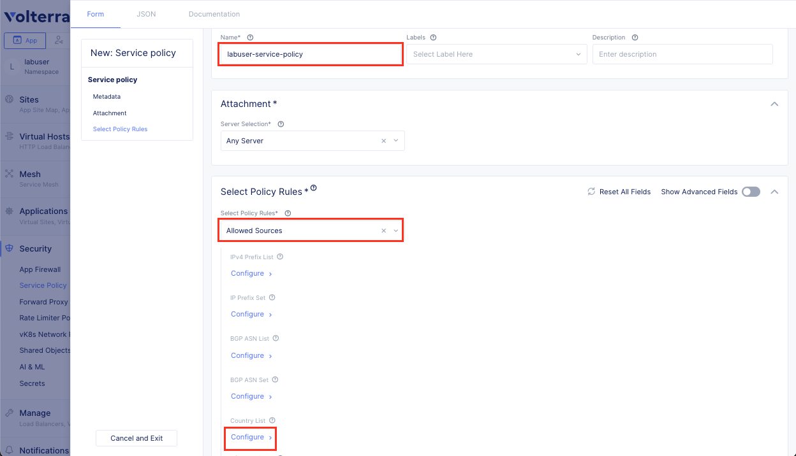
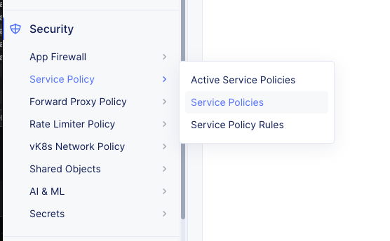
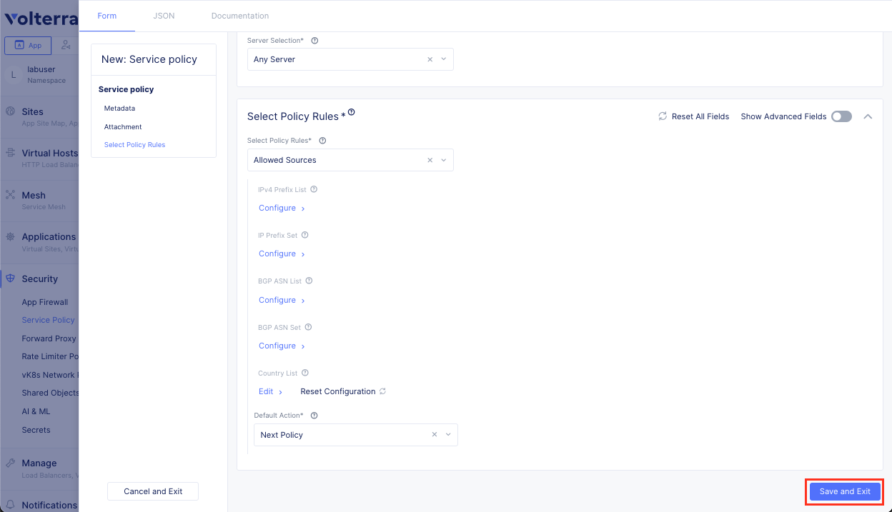
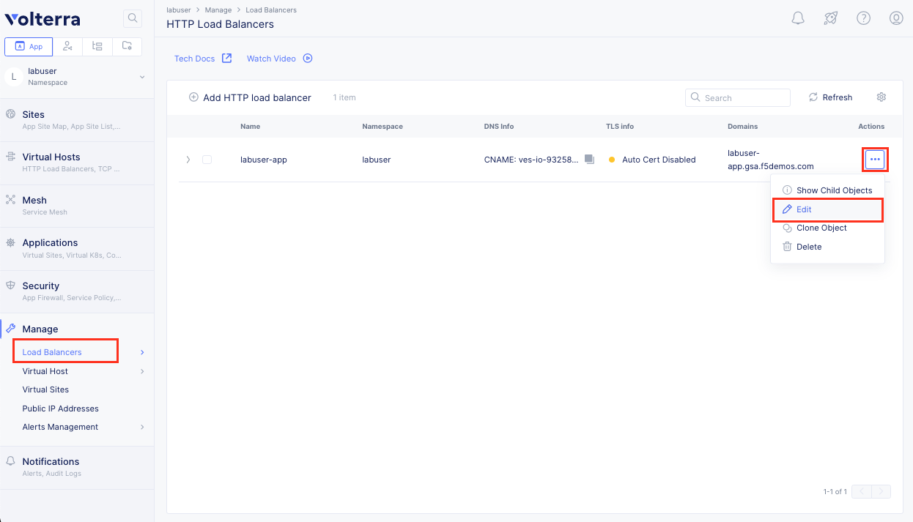
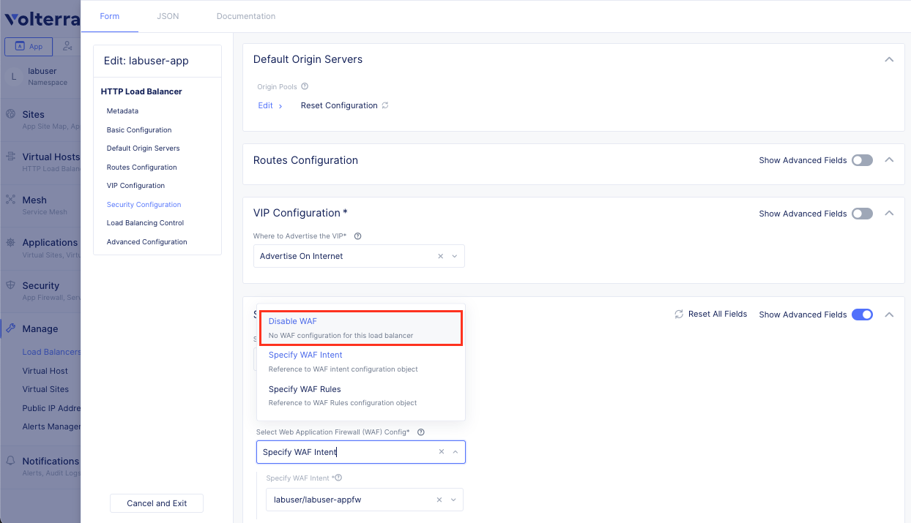
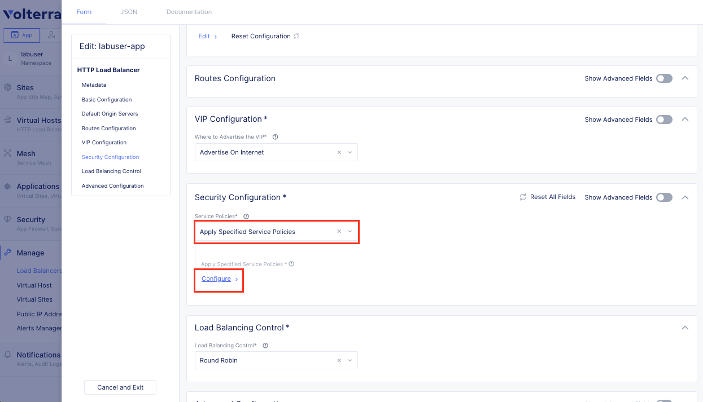
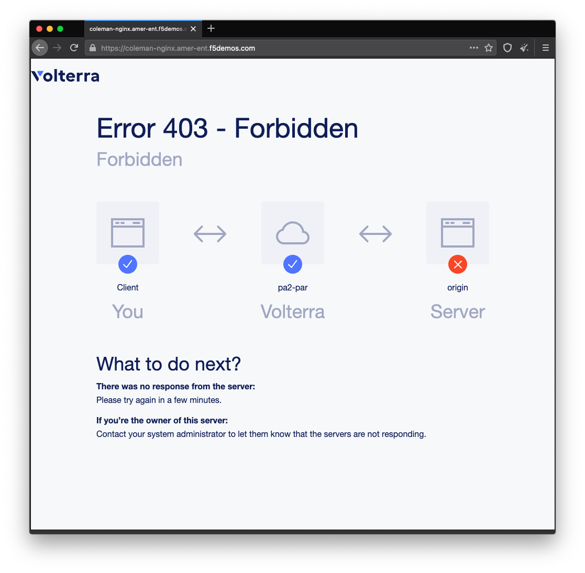
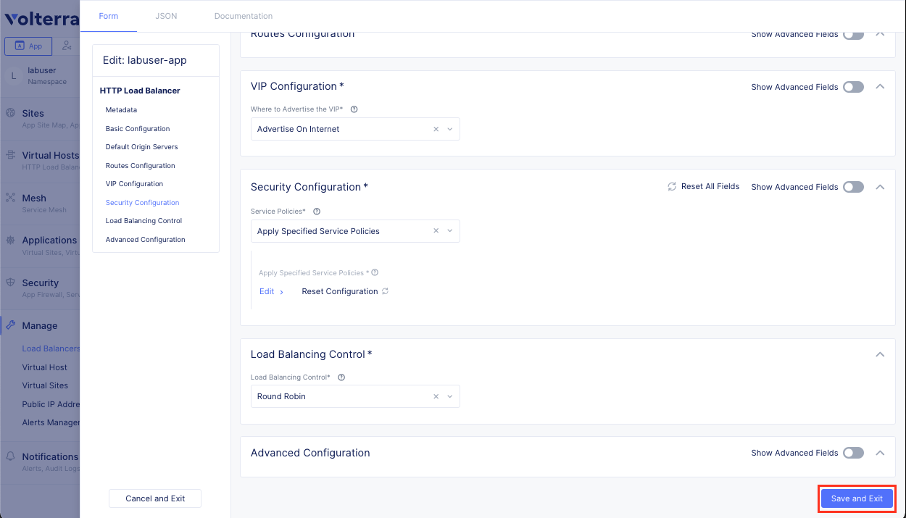
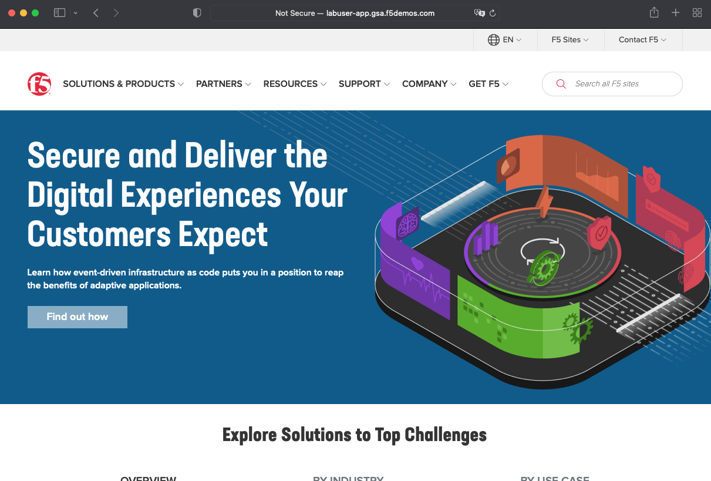
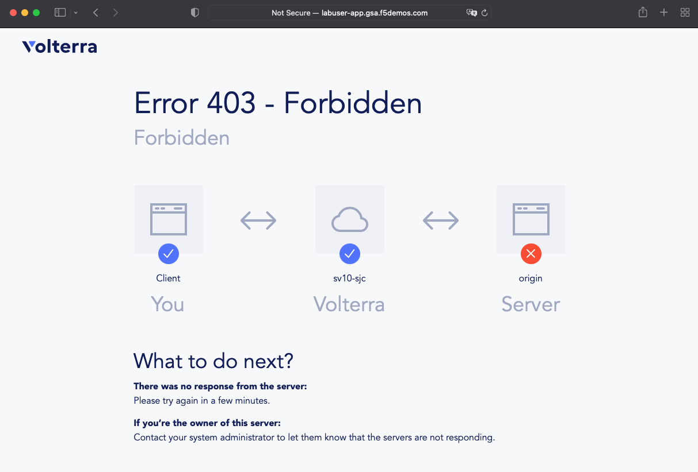
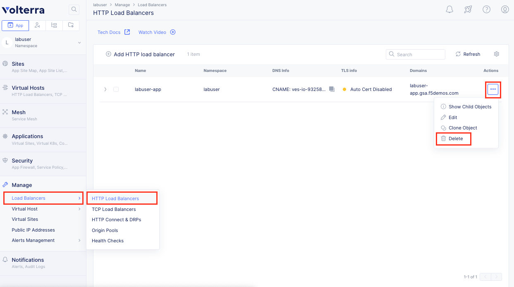
.. |image018| image:: media/lab02-018.png
    :width: 800px
.. |image019| image:: media/lab02-019.png
    :width: 800px
.. |image020| image:: media/lab02-020.png
    :width: 800px
.. |imageEND| image:: media/imageEND.png
   :width: 800px