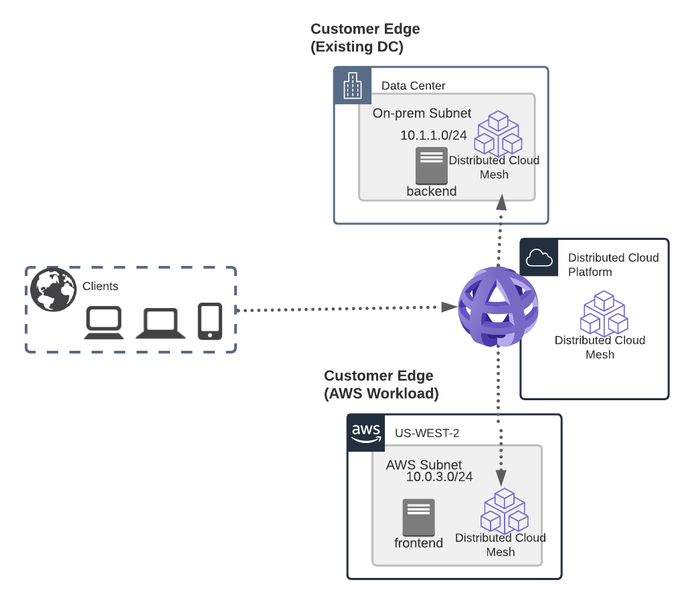

F5 Volterra Networking 101
==========================

This Lab environment highlights some of the basic concepts of VoltMesh.

The first part of the Lab will make use of F5 Volterra Simulators to emulate the process
of setting up two different sites (one in AWS, one in Azure).

We will then transition to using a "live" lab environment where you can experience using 
Volterra to setup 2 different deployment topologies and learn how Volterra can discover 
where your applications live.

During the lab you will be emulating a customer that needs to extend an
existing on-prem internal application to a Public Cloud environment.
The goal is to securely extend the application into the cloud environment
and have it highly available in both on-prem/cloud simultaneously.

Narrative
~~~~~~~~~

In this example we are starting with an "on-prem" Data Center.

.. image:: on-prem.png

The "frontend" application has a requirement that it must be able to 
communicate with the "backend".  The "backend" could be a database, legacy system, etc.

The goal is to extend the environment into AWS and still allow the "frontend" to
connect to the backend.  The following topology is deployed where VoltMesh is deployed
in both the on-prem and AWS environment.

Once you have deployed the AWS environment and deployed two VoltMesh sites you will utilize
a Volterra TCP Load Balancer to privately connect from AWS to on-prem and a HTTP Load Balancer 
to connect publicly from a Regional Edge (AnyCast IP) to the frontend in AWS.

.. image:: lab-flow.png

Lab Environment
~~~~~~~~~~~~~~~

The on-prem environment is emulated by using a UDF environment that contains NGINX
resources.

The cloud environment is emulated by using a UDF Cloud Account in AWS that contains
NGINX resources.

.. toctree::
   :maxdepth: 1
   :caption: Contents:

   lab1/index
   lab3/index

Video resources
~~~~~~~~~~~~~~~

The following are optional resources that you can use to help you complete the lab.

Joining Volterra tenant

.. raw:: html
  
  <iframe width="560" height="315" src="https://www.youtube.com/embed/onKw3aKSdIA" title="YouTube video player" frameborder="0" allow="accelerometer; autoplay; clipboard-write; encrypted-media; gyroscope; picture-in-picture" allowfullscreen></iframe>

Walk-through of the lab

This is a narrated walk-through of the lab

.. raw:: html

   <iframe width="560" height="315" src="https://www.youtube.com/embed/rgnjuPqsOcQ" title="YouTube video player" frameborder="0" allow="accelerometer; autoplay; clipboard-write; encrypted-media; gyroscope; picture-in-picture" allowfullscreen></iframe>

The following are bookmarks to specific sections of the video that correspond to the lab.

- `To use the simulator <https://www.youtube.com/watch?v=rgnjuPqsOcQ&t=77s>`_
- `Logging into VoltConsole <https://www.youtube.com/watch?v=rgnjuPqsOcQ&t=220s>`_
- `Create Public origin pool <https://www.youtube.com/watch?v=rgnjuPqsOcQ&t=323s>`_
- `Create Private origin pool <https://www.youtube.com/watch?v=rgnjuPqsOcQ&t=519s>`_
- `Create TCP origin pool <https://www.youtube.com/watch?v=rgnjuPqsOcQ&t=834s>`_
- `Create TCP Load Balancer <https://www.youtube.com/watch?v=rgnjuPqsOcQ&t=890s>`_