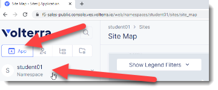

Shared Lab Environment
=======================

Previously you should have received an email to access the shared Volterra Lab Environment.

Start by logging into VoltConsole.  You should have previously received an email to create an account.

https://f5-sales-public.console.ves.volterra.io/

The following video will also review the process: https://youtu.be/onKw3aKSdIA

Once you login you will find your student number by clicking on the "App" tab (top left).

Your student number will your namespace.  For example in this image "student01" is the 
value that you should be used when prompted to create studentxx.sales-public.f5demos.com.

