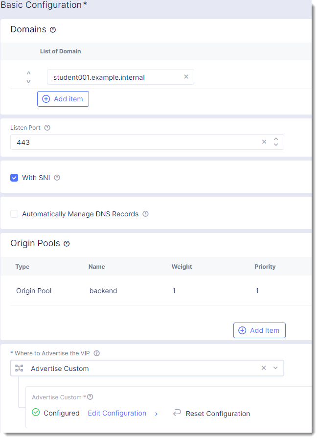

TCP Load Balancer
=================

On of the requirements from the "Narrative" is to enable the frontend application
in AWS to communicate with the backend application that is on-prem.

The frontend application makes use of DNS to determine the IP address of the backend
application.  In the on-prem environment the name "studentXX.example.internal" resolves to
the backend IP of 10.1.20.5.

In the AWS environment we want to resolve the name "studentXX.example.internal" to resolve to
the IP address of the Volterra Gateway (VG).  The VG will host a Virtual IP (VIP) that will
host a TCP Load Balancer that will proxy traffic back to the original backend application.

.. image:: tcplb-lab.png

Exercise 1: Verify DNS 
~~~~~~~~~~~~~~~~~~~~~~~~~~~~~~~~~

In the previous lab exercise we made a "In Container Diagnostic Services" service available.

This is small application that allows you to run tools to verify DNS and run commands like "curl"
to simulate HTTP/HTTPS connections from inside the AWS environment.

#. Click on DNS Lookup
#. Enter "jumphost.lab.f5demos.internal"
#. Click on Lookup

   .. image:: dns-lookup-jumphost.png

You'll see that the private IP of the jumphost is returned.  The Volterra Gateway used the 
internal DNS of your AWS site to resolve the IP of the private jumphost and made use of the 
secure tunnel to the Volterra Regional Edge to expose the service.

Next we will verify that we do not have a DNS record for studentXX.example.internal

#. Click on DNS Lookup
#. Enter "studentXX.example.internal" (replace studentXX with your student ID i.e. student01)
#. Click on Lookup

You should receive an error.  You should look for "NXDOMAIN" that indicates the name does not exist.

.. code-block::
    
    ; <<>> DiG 9.16.1-Ubuntu <<>> @10.0.5.56 studentXXX.example.internal A
    ; (1 server found)
    ;; global options: +cmd
    ;; Got answer:
    ;; ->>HEADER<<- opcode: QUERY, status: NXDOMAIN, id: 21936
    ;; flags: qr rd ra; QUERY: 1, ANSWER: 0, AUTHORITY: 1, ADDITIONAL: 1

    ;; OPT PSEUDOSECTION:
    ; EDNS: version: 0, flags:; udp: 4096
    ;; QUESTION SECTION:
    ;studentXXX.example.internal.	IN	A

    ;; AUTHORITY SECTION:
    .			743	IN	SOA	a.root-servers.net. nstld.verisign-grs.com. 2021120100 1800 900 604800 86400

    ;; Query time: 7 msec
    ;; SERVER: 10.0.5.56#53(10.0.5.56)
    ;; WHEN: Wed Dec 01 15:49:40 UTC 2021
    ;; MSG SIZE  rcvd: 131

Exercise 2: Origin Pool
~~~~~~~~~~~~~~~~~~~~~~~~~~~~~~~~~~~~~~~

#. In VoltConsole ensure you are in the *Application* context.

    |app-context| 

#. Navigate the menu to go to *Manage* -> *Load Balancer*, then click *Origin Pools*.

    |origin_pools_menu|

#. Click the *Add Origin Pool* button.

    |origin_pools_add|
    
#. Enter the following variables:

=============================== ===============
Variable                        Value
=============================== ===============
Origin Pool Name                backend
Select Type of Origin Server    IP address of Origin Server on given Sites
IP address                      10.1.20.5
Site                            Your UDF site
Select Network on the site      Inside Network
Port                            8443
=============================== ===============

#. Under the *List of Health Check(s)* section, click the *Select healthcheck* dropdown.

#. Click the *Create new Healthcheck* button.

#. Enter the following variables:

=============================== ===============
Variable                        Value
=============================== ===============
Name                            backend-tcp-health-check
Health Check                    TCP HealthCheck
=============================== ===============

#. Click on the "Configure" button to open the dialog to adjust timeout settings then click "Apply"
#. Click the *Continue* button to close the *Health Check Parameters* dialogue. 

#. Click the *Save and Exit* button to close the *Origin Pool* dialogue.

Exercise 3: Create Backend TCP Load Balancer
~~~~~~~~~~~~~~~~~~~~~~~~~~~~~~~~~~~~~~~~~~~~~

#. In VoltConsole ensure you are in the *Application* context.

    |app-context| 

#. Navigate the menu to go to *Manage* -> *Load Balancer*, then click *TCP Load Balancers*.

    |tcp_lb_menu|

#. Click the *Add TCP Load Balancer* button.

#. Enter the following variables:

    ==============================  =====
    Variable                        Value
    ==============================  =====
    Name                            backend
    Domain                          studentXX.example.internal
    Listen Port                     443
    With SNI                        Checked
    Where to Advertise the VIP      Advertise Custom
    ==============================  =====

    |tcp_lb_config|

#. Configure Origin Pools

    #. Under the *Origin Pools* section, click the *Configure* link.
    #. Click the *Add item* button.
    #. Select the *backend-tcp* pool.
    #. Click the *Apply* button to close the *Origin Pools* dialogue.

#. Configure Advertisement 

    #. Under *Advertise Custom* click the *Configure* link.
    #. You will need to add a site:
            
            =========================== =====
            Variable                    Value
            =========================== =====
            Select Where to Advertise   Site
            Site Network                Inside Network
            Site Reference              student-awsnet
            =========================== =====

        |tcp_lb_advertise|

    #. Click the *Apply* button to exit the *Advertise Custom* dialogue.

#. CLick the *Save and Exit* button to exit the *TCP Load Balancer* dialogue.

Exercise 4: Verify DNS Again
~~~~~~~~~~~~~~~~~~~~~~~~~~~~~

Volterra Gateway provides a recursive DNS resolver.  You can either point a client
directly at the gateway or forward DNS queries that you would like Volterra to process.

Using the "In Container Diagnostic Services"

#. Click on DNS Lookup
#. Enter "studentXX.example.internal" (replace studentXX with your student ID i.e. student01)
#. Click on Lookup

You should no longer get an error.

Exercise 5: Connect to the backend
~~~~~~~~~~~~~~~~~~~~~~~~~~~~~~~~~~

In this exercise we will emulate how a distributed application could access a resource that 
resides in another remote network via the Volterra Global Network.

Using the "In Container Diagnostic Services"

#. Click on "Run Command"
#. Enter "curl -sk https://studentXX.example.internal" (replace studentXX with your student ID i.e. student01)
#. Click on Run Command

You should see an output.  Now try repeating the same but using the IP address that you retrieved in Exercise 4.

#. Click on "Run Command"
#. Enter "curl -sk https://10.0.3.XX" (replace XX with the value your retrieved in Exercise 4)
#. Click on Run Command

You should see an error.  This is because Volterra is expecting an SNI value.  This allows you to re-use
the same IP address for multiple different services.

This concludes showing how we can solve Multi Cloud Networking with the use of Volterra Load Balancer resources.

We can also make use of Volterra "Global Networks" to provide routed connectivity between networks (requires non-overlapping IP space).

If you are interested in learning more about Global Networks you can use the following Volterra simulator: https://simulator.f5.com/s/cloud2cloud_via_sites

Thank you for completing the lab!

.. |app-context| image:: app-context.png
.. |tcp_lb_menu| image:: tcp_lb_menu.png

.. |tcp_lb_advertise| image:: tcp_lb_advertise.png
.. |origin_pools_menu| image:: origin_pools_menu.png
.. |origin_pools_add| image:: origin_pools_add.png
.. |origin_pools_config_mongodb| origin_pools_config_mongodb.png
