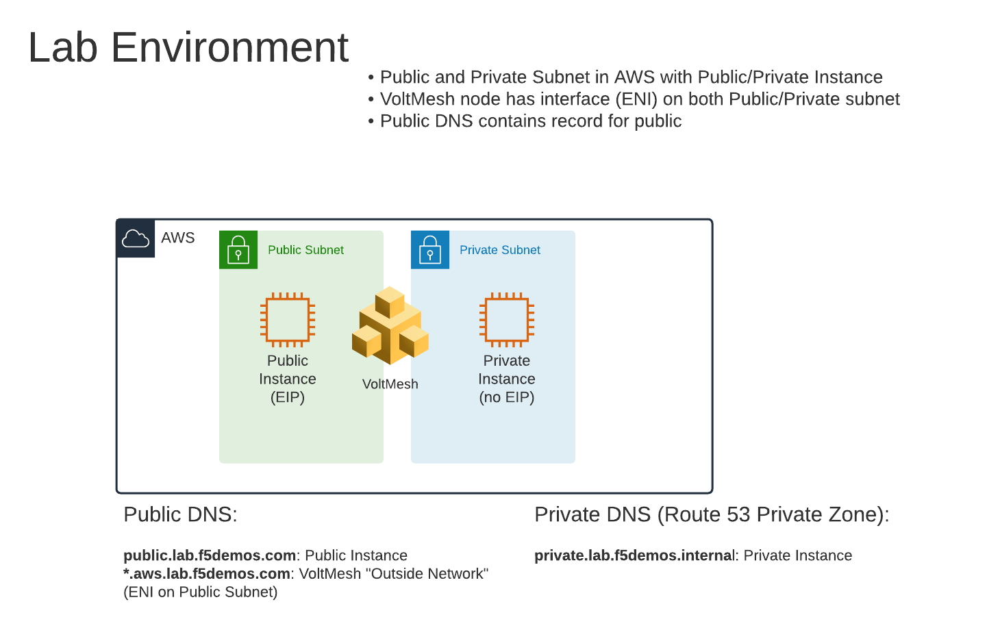

Lab Environment
===============

During the lab you will be accessing a shared AWS Lab Environment.

There are 3 EC2 instances that are deployed.

#. Public EC2 Instance (with an Elastic IP attached)
#. Private EC2 Instance (using VoltMesh for NAT GW)
#. VoltMesh Instance (interface/ENI on both public/private subnets)

There are also both public/private DNS records that have been created.

