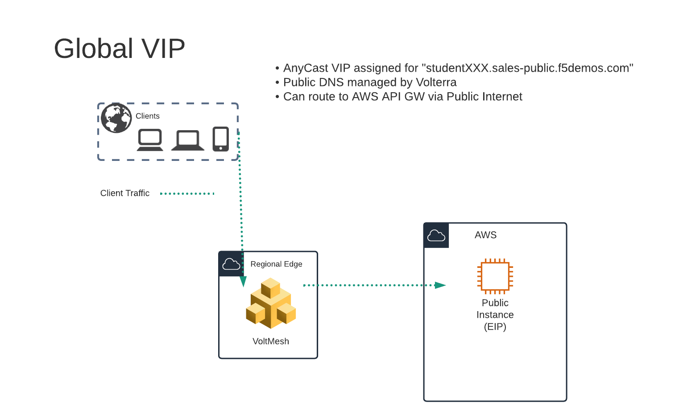
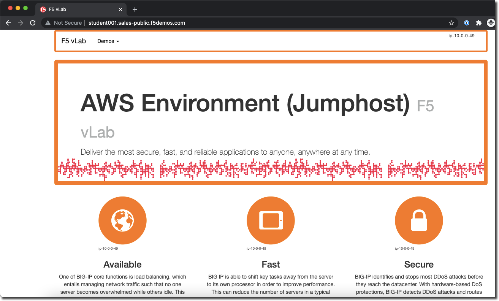
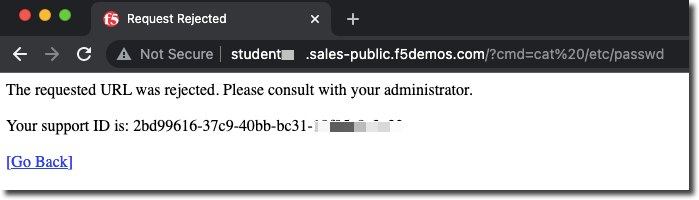
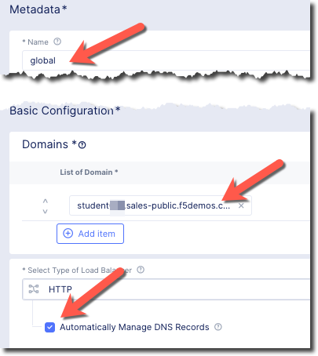

Creating HTTP Load Balancer on Volterra Regional Edge
=====================================================

In this exercise we will be creating a "Global VIP" that will exist on the Volterra Global Network.

It will protect a public resource that exists in the lab's AWS Lab Environment.

Exercise 1: HTTP Load Balancer Configuration
~~~~~~~~~~~~~~~~~~~~~~~~~~~~~~~~~~~~~~~~~~~~

#. Start in VoltConsole and switch to the "Web App & API Protection" context. [You should already be here from previous lab]

#. Navigate the menu to go to "Manage"->"Load Balancers" -> "HTTP Load Balancers" and click on "Add HTTP Load Balancer".

#. Enter the following variables:

    ================================= =====
    Variable                          Value
    ================================= =====
    Name                              global
    Domains                           studentXXX.sales-public.f5demos.com
    Select type of Load Balancer      HTTP
    Automatically Manage DNS Records  Yes/Check 
    ================================= =====

    |lb-basic|

Exercise 2: Configure Default Origin Server
~~~~~~~~~~~~~~~~~~~~~~~~~~~~~~~~~~~~~~~~~~~
We'll next configure the "Default Origin Servers". 
    
#. Click on the *Add Items* link under the *Default Origin Servers* section.

#. The "Select Origin Pool Method" will be set to "Origin Pool". Under the "Origin Pool" dropdown menu select the "public" pool you created earlier.

   .. image:: /_static/lb-pool-public.png
 
#. Click the *Add Item* button to exit the "Origin Pools" dialogue.

#. Notice that in the "VIP Configuration" section *Advertise On Internet* has been selected by default.

Exercise 3: Configure WAF Policy
~~~~~~~~~~~~~~~~~~~~~~~~~~~~~~~~

#. Under the *Security Configuration* section 

#. Enter the following variables:

    ============================================= =====================
    Variable                                      Value
    ============================================= =====================
    Select Web Application Firewall (WAF) Config  App Firewall
    App Firewall                                  blocking-app-firewall
    ============================================= =====================

#. Click "*Save and Exit* to create the HTTP Load Balancer.

Once the HTTP Load Balancer has been deployed, you should now be able to go to the DNS name that you entered 
previously in a web browser.  The FQDN we used in our example is http://studentXX.sales-public.f5demos.com.  
Your FQDN should follow the format of [unique name].[supplied domain name for your tenant].

.. note:: If you are having challenges connecting to the "f5demos.com" name you can also try connecting to the "ves.io" name.

Exercise 4: Verify Configuration
~~~~~~~~~~~~~~~~~~~~~~~~~~~~~~~~

The public demo app should look like the following:

In this topology we are sending traffic to an AnyCast IP that is hosted in Volterra's Regional Edge.

We then connect to the AWS resource via it's Public IP address.  

Try adding the following to the URL "/?cat%20/etc/passwd".

You should see a block page.

Exercise 5: Performance and Security 
~~~~~~~~~~~~~~~~~~~~~~~~~~~~~~~~~~~~

#. Start in VoltConsole and switch to the "Web App & API Protection" context. [You should already be here from previous lab]

We can view details of successful requests and blocks by navigating to "Apps & APIs"

#. Click on "Apps & APIs"->"Performance" and click on your "global" Load Balancer (bottom right)

   .. image:: ../_static/performance-overview.png
       :width: 50%

   You will see a  health score of your application as well as end to end latency of the connection.

   .. image:: ../_static/screenshot-global-vip-performance-dashboard.png
       :width: 50%

#. Click on "Requests" in the upper page navigation

   You should be able to view logs for individual requests.

   .. image:: ../_static/screenshot-global-vip-public-requests.png
       :width: 50%

#. Click on "Apps & APIs"->"Security" and click on your "global" Load Balancer (bottom right)
#. Click on "Security Events"
   You will be able to see details of the security events.

   .. image:: ../_static/screenshot-global-vip-public-security-events.png

   Clicking on the arrow to the left of a security event will expand the details.

   .. image:: ../_static/screenshot-global-vip-public-security-events-details.png
       :width: 50%

Next we will demonstrate how we 
can securely connect to your private AWS resources via a VoltMesh node.

Video Walkthrough 
~~~~~~~~~~~~~~~~~
Optional Video you can watch if you get stuck

.. raw:: html
   
   <iframe width="560" height="315" src="https://www.youtube.com/embed/s-BHH0Qayfc?start=108" title="YouTube video player" frameborder="0" allow="accelerometer; autoplay; clipboard-write; encrypted-media; gyroscope; picture-in-picture" allowfullscreen></iframe>

.. |app-context| image:: ../_static/app-context.png

