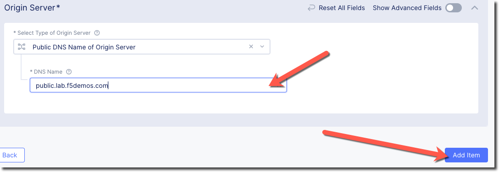

Create Origin Pools
====================

Before we create an HTTP load balancer to expose our services on the internet, 
we'll define "Origin Pools" for our application's services.

This initial Origin Pool will use the Public DNS record of our target webserver 
to locate the IP address of the Origin Pool members.  This is an example of using 
the Public Internet to route traffic to our services.  In later examples we will 
look at routing traffic via VoltMesh to our services.

Exercise 1: Create Public Origin Pool
~~~~~~~~~~~~~~~~~~~~~~~~~~~~~~~~~~~~~~
We will first create an Origin Pool that refers to the "Public Endpoint" site in our lab environment.

#. Start in VoltConsole and switch to the "Web App & API Protection" context. [You should already be here from previous lab]

#. Navigate the menu to go to "Manage"->"Load Balancers"->"Origin Pools". Click on *Add Origin Pool*.

#. Enter the following variables:

    ================================= =====
    Variable                          Value
    ================================= =====
    Name                              public
    ================================= =====

#. Click on "Add Item" under the section "Origin Servers"

   Enter the following variables: 

    ================================= =====
    Variable                          Value
    ================================= =====
    Select Type of Origin Server      Public DNS Name of Origin Server [default]
    DNS Name                          public.lab.f5demos.com
    ================================= =====
    
    |op-pool-basic|

    Click on "Add Item" to return to the previous screen.

#. Below the "Origin Servers" section fill in the Port information

    ================================= =====
    Variable                          Value
    ================================= =====
    Port                              80
    ================================= =====

#. Under the *List of Health Check(s)* section, click the *Add item* button.

#. Click the *Health Check object* dropdown list. Click the *Create new healthcheck* button.

#. Enter the following variables:

    ========= =====
    Variable  Value
    ========= =====
    name      http
    ========= =====

#. Click the *Configure* button under "HTTP Health Check" and enter the following variables ("/" is the default):

    ========= =====
    Variable  Value
    ========= =====
    path      /
    ========= =====

#. Click *Apply* to exit the "Health Check HTTP Parameters" dialogue.
#. Click *Continue* to return to the "Origin Pool" configuration.
#. Click the *Save and Exit* button to create the Origin Pool.

.. |app-context| image:: ../_static/app-context.png
.. |origin_pools_menu| image:: ../_static/origin_pools_menu.png
.. |origin_pools_add| image:: ../_static/origin_pools_add.png
.. |origin_pools_config| image:: ../_static/origin_pools_config.png
.. |origin_pools_config_api| image:: ../_static/origin_pools_config_api.png
.. |origin_pools_config_mongodb| image:: ../_static/origin_pools_config_mongodb.png
.. |origin_pools_show_child_objects| image:: ../_static/origin_pools_show_child_objects.png
.. |origin_pools_show_child_objects_status| image:: ../_static/origin_pools_show_child_objects_status.png
.. |http_lb_origin_pool_health_check| image:: ../_static/http_lb_origin_pool_health_check.png
.. |http_lb_origin_pool_health_check2| image:: ../_static/http_lb_origin_pool_health_check2.png

.. |op-add-pool| image:: ../_static/op-add-pool.png
.. |op-api-pool| image:: ../_static/op-api-pool.png

.. |op-spa-check| image:: ../_static/op-spa-check.png
.. |op-tshoot| image:: ../_static/op-tshoot.png
