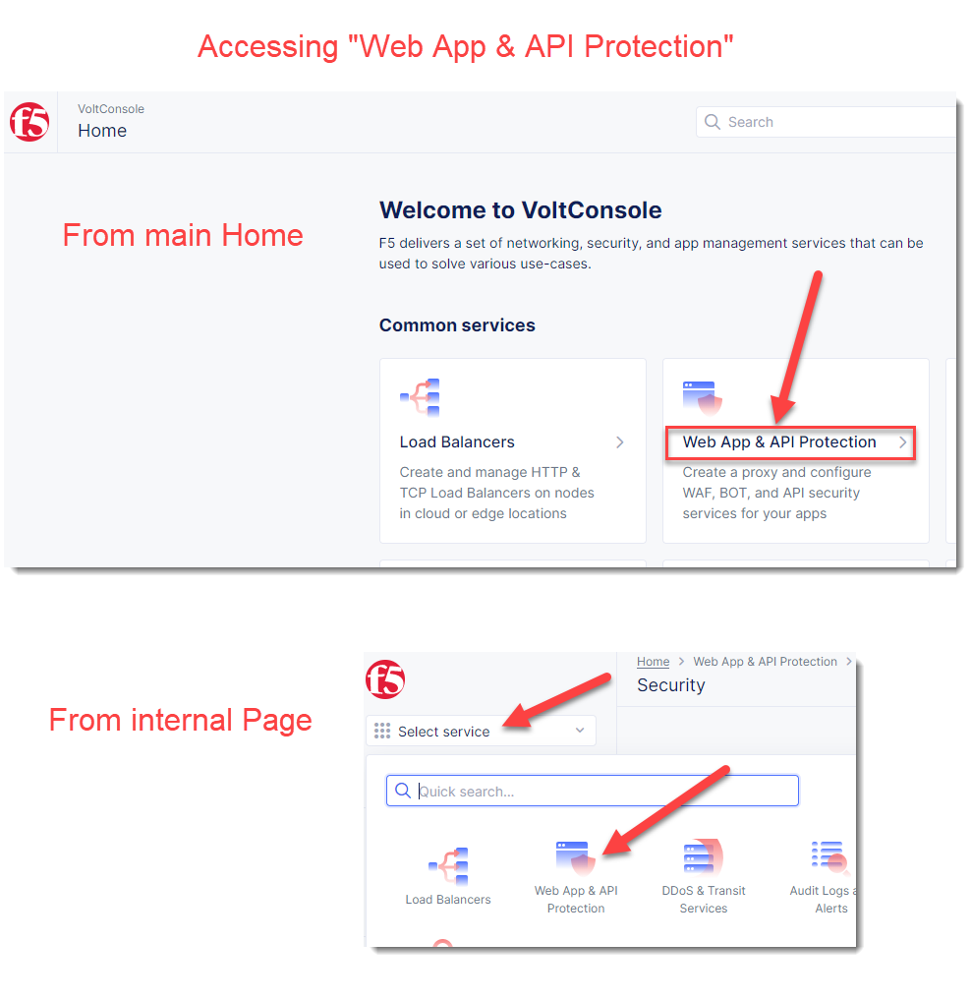

Create WAF Policy
=================

Volterra WAF shares the same WAF engine that is used by F5 BIG-IP WAF and F5 NGINX App Protect.

The Volterra WAF engine provides preset categories of rules to protect your web 
applications, provides the ability to run in a monitor or blocking mode, prevent 
false positives by excluding individual rules, IP addresses, or web application paths

In the next exercise you will configure a basic WAF policy 

Exercise 1: Create WAF Policy
~~~~~~~~~~~~~~~~~~~~~~~~~~~~~~~~~~~~~~

We will create a blocking WAF policy.

#. Start in VoltConsole and switch to the "Web App & API Protection" context. 

   It can be access either from the main Home page or via the "Select Service" menu on a Page 

    |app-context|

#. Navigate the menu to go to "Manage"->"App Firewall". Click on *Add App Firewall*.

#. Enter the following variables:

    ================================= ============================================
    Variable                          Value
    ================================= ============================================
    Name                              blocking-app-firewall
    Enforcement Mode                  Blocking
    ================================= ============================================

    In this mode we have change the policy to block attacks that are included in 
    the default policy.  Later we will look at how we can customize these settings.

    .. image:: ../_static/blocking-app-firewall-policy.png

#. Click the *Save and Exit* button to create the policy

Video Walkthrough 
~~~~~~~~~~~~~~~~~
Optional Video you can watch if you get stuck

Note that each of the videos will start at a specific timestamp.  

The entire video is 10 minutes total from start to finish.

.. raw:: html
   
   <iframe width="560" height="315" src="https://www.youtube.com/embed/s-BHH0Qayfc?start=41" title="YouTube video player" frameborder="0" allow="accelerometer; autoplay; clipboard-write; encrypted-media; gyroscope; picture-in-picture" allowfullscreen></iframe>

