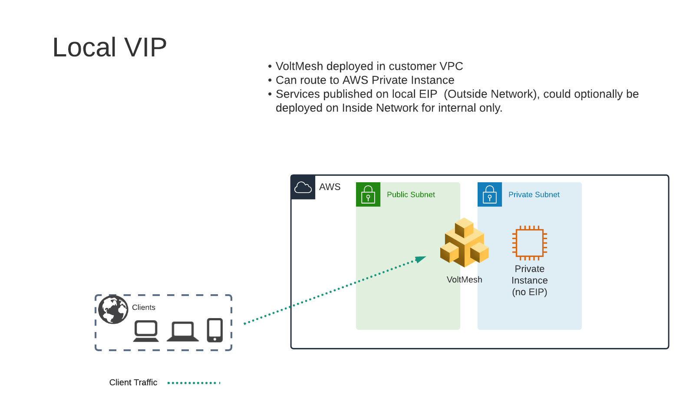

Creating HTTP Load Balancer on Volterra Customer Edge
=====================================================

In the previous lab exercises we were connecting to a Volterra Load Balancer that was deployed in a Regional Edge.

In the next lab exercise we will deploy a Load Balancer on the VoltMesh node that was deployed in the AWS VPC (Customer Edge location).

Exercise 1: HTTP Load Balancer Configuration
~~~~~~~~~~~~~~~~~~~~~~~~~~~~~~~~~~~~~~~~~~~~

#. Start in VoltConsole and switch to the "Web App & API Protection" context. [You should already be here from previous lab]

#. Navigate the menu to go to "Manage"->"HTTP Load Balancers" and click on "Add HTTP Load Balancers".

#. Enter the following variables:

    ================================= =====
    Variable                          Value
    ================================= =====
    Name                              local
    Domains                           studentXX.aws.lab.f5demos.com
    Select type of Load Balancer      HTTP
    Automatically Manage DNS Records  No/Unchecked 
    ================================= =====

Exercise 2: Configure Default Origin Server
~~~~~~~~~~~~~~~~~~~~~~~~~~~~~~~~~~~~~~~~~~~
We'll next configure the "Default Origin Servers".   
    
#. Click on the *Add Items* link under the *Default Origin Servers* section.

#. The "Select Origin Pool Method" will be set to "Origin Pool". Under the "Origin Pool" dropdown menu select the "private" pool you created earlier.
 
#. Click the *Add Item* button to exit the "Origin Pools" dialogue.

Exercise 3: Configure Local VIP
~~~~~~~~~~~~~~~~~~~~~~~~~~~~~~~~

Previously we configured a VIP that was advertised on F5's Regional Edge (PoP) locations.
We will modify this configuration to expose the service on the "Outside" interface of the VoltMesh
node that is deployed in AWS.  This will allow us to access the VIP via the Public IP Address (AWS Elastic IP)
that is attached to that interface.  If we wished to only have the service available within the AWS VPC
we could opt to use the "Inside" interface that does not have an AWS EIP attached.

#. Under "VIP Configuration" click on "Show Advanced Fields".
#. From "Where to Advertise the VIP" select "Advertise Custom"
   
   .. image:: ../_static/screenshot-local-vip-advertise-custom.png
#. Click on "Configure" under "Advertise Custom"
#. Next to "Custom Advertise VIP Configuration" click on "Show Advanced Fields"
#. Click on "Add Item"
#. For "Site Network" click on "Outside Network" 
#. For "Site Reference" select `student-awsnet`

   .. image:: ../_static/lb-local-vip-advertise.png
      :width: 75%
#. Click on "Add Item" 
#. Click on "Apply" to return to previous screen

Exercise 4: Configure WAF Policy
~~~~~~~~~~~~~~~~~~~~~~~~~~~~~~~~

#. Under the *Security Configuration* section 

#. Enter the following variables:

    ============================================= =====================
    Variable                                      Value
    ============================================= =====================
    Select Web Application Firewall (WAF) Config  App Firewall
    App Firewall                                  blocking-app-firewall
    ============================================= =====================

#. Click "*Save and Exit* to create the HTTP Load Balancer.

Once the HTTP Load Balancer has been deployed, you should now be able to go to the DNS name that you entered 
previously in a web browser.  The FQDN we used in our example is http://studentXX.aws.lab.f5demos.com.  
This is a wildcard DNS entry that points to the Public IP (AWS Elastic IP) that is attached to the VoltMesh node.

Exercise 5: Verify Configuration
~~~~~~~~~~~~~~~~~~~~~~~~~~~~~~~~

The private demo app should look like the following:

.. image:: ../_static/screenshot-local-vip-private.png
    :width: 50%

Exercise 6: Verify DNS
~~~~~~~~~~~~~~~~~~~~~~

You can verify that you are connecting directly to AWS by comparing the DNS of the two hosts.

.. code-block:: 

    dig +short student001.aws.lab.f5demos.com
    192.0.2.10
    $ dig -x 192.0.2.10 +short
    ec2-192-0-2-10.compute-1.amazonaws.com.

In this topology we are sending traffic to the AWS EIP that attached to the VoltMesh node in the AWS VPC.

We then connect to the AWS resource via it's Private IP address.  

Try adding the following to the URL "?cat%20/etc/passwd".

You should see a block page.  This is similar behavior to what we saw in the previous lab,
but in this case the enforcement of the WAF policy is occurring on the VoltMesh node
that is deployed in the AWS Lab Environment and not in the Volterra Regional Edge.

In the next lab we will look at how to customize our WAF policy.

.. raw:: html
   
   <iframe width="560" height="315" src="https://www.youtube.com/embed/s-BHH0Qayfc?start=400" title="YouTube video player" frameborder="0" allow="accelerometer; autoplay; clipboard-write; encrypted-media; gyroscope; picture-in-picture" allowfullscreen></iframe>
